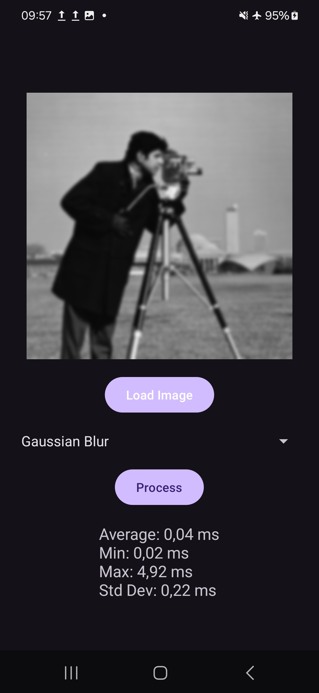
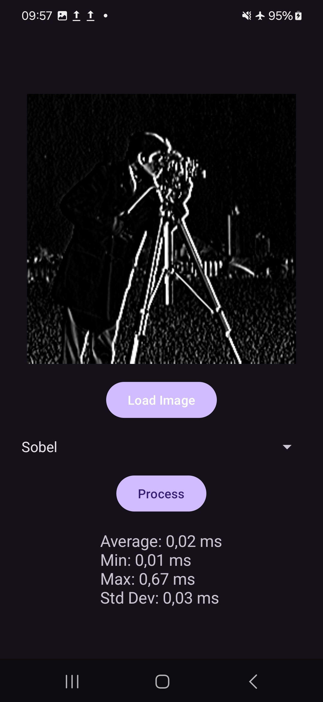
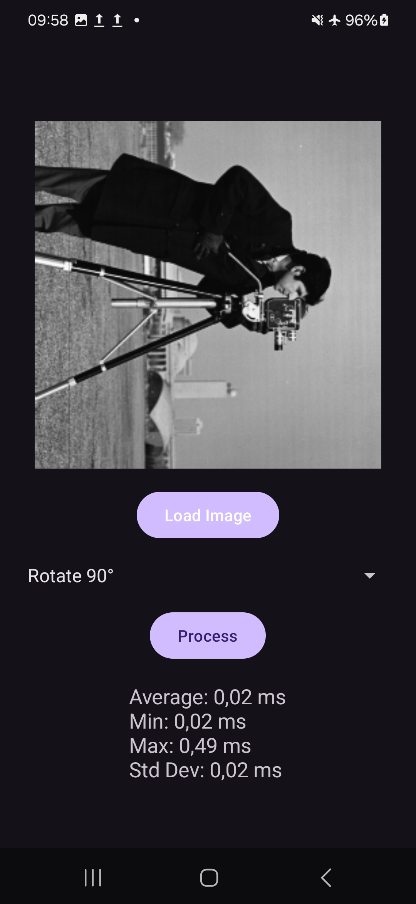

---
# User change
title: "Processing the Images"

weight: 5

layout: "learningpathall"
---

## Set up
In this final step, you will learn how to implement the application logic to process the images. 

Start by adding an `assets` folder under `src/main`. 

Then, under the `assets` folder, add an `img.png` image file. This image can be any kind of image file, as the app will convert it to a specified image  type through the image processing stage. 

This Learning Path uses a [cameraman image](https://github.com/antimatter15/cameraman).

For easier navigation between files in Android Studio, use the **Project** menu option from the project browser pane.

## Create the ImageOperation class

You will now create an enum class, which is an enumeration, for a set of image processing operations in an application that uses the OpenCV library. 

In the `src/main/java/com/arm/arm64kleidicvdemo` file directory, add the `ImageOperation.kt` file, and modify it as follows:

```Kotlin
package com.arm.arm64kleidicvdemo

import org.opencv.core.Core
import org.opencv.core.CvType
import org.opencv.core.Mat
import org.opencv.core.Size
import org.opencv.imgproc.Imgproc

enum class ImageOperation(val displayName: String) {
    GAUSSIAN_BLUR("Gaussian Blur") {
        override fun apply(src: Mat, dst: Mat) {
            Imgproc.GaussianBlur(src, dst, Size(7.0, 7.0), 0.0)
        }
    },
    SOBEL("Sobel") {
        override fun apply(src: Mat, dst: Mat) {
            Imgproc.Sobel(src, dst, CvType.CV_16S, 1, 0, 3
                , 1.0, 0.0, Core.BORDER_REPLICATE)
        }
    },
    RESIZE("Resize") {
        override fun apply(src: Mat, dst: Mat) {
            Imgproc.resize(
                src,
                dst,
                Size(src.cols() / 2.0, src.rows() / 2.0)
            )
        }
    },
    ROTATE_90("Rotate 90°") {
        override fun apply(src: Mat, dst: Mat) {
            Core.rotate(src, dst, Core.ROTATE_90_CLOCKWISE)
        }
    };

    abstract fun apply(src: Mat, dst: Mat)

    companion object {
        fun fromDisplayName(name: String): ImageOperation? =
            values().find { it.displayName == name }
    }
}
```

The `ImageOperation` enum represents a collection of predefined image processing operations. 

Each enum constant is associated with a `displayName`, which is a user-friendly string describing the operation, and a unique implementation of the `apply` method to perform the operation on an image (Mat). 

The processing results are available in the `dst` parameter of the `apply` method.

Here we have four constants:

* `GAUSSIAN_BLUR`. This constant applies a Gaussian blur to the image using a 7x7 kernel and a standard deviation of 0.0.
* `SOBEL`. This constant applies the Sobel filter to detect edges in the image. It computes the gradient in both x and y directions with an 8-bit unsigned data type (CvType.CV_16S).
* `RESIZE`. This constant resizes the image to half its original width and height.
* `ROTATE_90`. This constant rotates the image 90 degrees clockwise.

To define its specific image processing logic, each enum constant must override the abstract method applied. 

The processing operations defined here are written to align with the current KleidiCV specification. Specifically, in-place changes are not currently supported, so the source and destination images must be different. 

Generally, only single-channel images are supported; with Gaussian blur being an exception. Sobel's output type must be 16SC1; dx and dy must be either (1,0) or (0,1); and the border mode must be replicated. Gaussian blur supports a non-zero sigma, but its performance is best with sigma 0.0. Its uplift is most noticeable with a kernel size of 7×7.

There is also the companion object that provides a utility method `fromDisplayName`. This function maps the string `displayName` to its corresponding enum constant by iterating through the list of all enum values, and returns null if no match is found.

## Create the ImageProcessor class

Now add the `ImageProcessor.kt`:

```Kotlin
package com.arm.arm64kleidicvdemo

import org.opencv.core.Mat

class ImageProcessor {
    fun applyOperation(src: Mat, dst: Mat, operation: ImageOperation) {
        operation.apply(src, dst)
    }
}
```

The Kotlin code defines a simple utility class; `ImageProcessor`, which applies a specified image processing operation on an OpenCV Mat object. The `ImageProcessor` class is a utility class that provides a method to process images. It does not store any state or have additional properties, making it lightweight and efficient.

The `ImageProcessor` class acts as a simple orchestrator for image processing tasks. It delegates the actual processing logic to the `ImageOperation` enum, which encapsulates various image processing techniques. This separation of tasks ensures that the `ImageProcessor` class remains focused and it makes it easy to extend or modify operations by updating the `ImageOperation` enum.

This design is clean and modular, allowing developers to easily add new processing operations or reuse the `ImageProcessor` in different parts of an application. It aligns with object-oriented principles by promoting encapsulation and reducing processing logic complexity.

## Create the PerformanceMetrics class
Now supplement the project with the `PerformanceMetrics.kt` file:

```Kotlin
package com.arm.arm64kleidicvdemo

import kotlin.math.pow
import kotlin.math.sqrt

data class PerformanceMetrics(private val durationsNano: List<Long>) {
    private val toMillis = 1_000_000.0

    val average: Double
        get() = durationsNano.average() / toMillis

    val min: Double
        get() = durationsNano.min() / toMillis

    val max: Double
        get() = durationsNano.max() / toMillis

    val standardDeviation: Double
        get() {
            val mean = durationsNano.average()
            return sqrt(durationsNano.map { (it - mean).pow(2) }.average()) / toMillis
        }

    override fun toString(): String = buildString {
        append("Average: %.2f ms\n".format(average))
        append("Min: %.2f ms\n".format(min))
        append("Max: %.2f ms\n".format(max))
        append("Std Dev: %.2f ms".format(standardDeviation))
    }
}
```

The `PerformanceMetrics` class analyzes and summarizes performance measurements, such as execution times or latency values. It accepts a list of durations in nanoseconds, computes key metrics like average, minimum, maximum, and standard deviation, and presents them in milliseconds.

By encapsulating the raw data `durationsNano` and exposing only meaningful metrics through computed properties, the class ensures clear separation of data and functionality. The overridden `toString` method makes it easy to generate a human-readable summary for reporting or debugging purposes. You can use this method to report the performance metrics to the user.

## Create the MainActivity

You can now move on to modify `MainActivity.kt` as follows:

```Kotlin
package com.arm.arm64kleidicvdemo

import android.graphics.Bitmap
import android.graphics.BitmapFactory
import android.os.Bundle
import android.widget.ArrayAdapter
import android.widget.Toast
import androidx.activity.enableEdgeToEdge
import androidx.appcompat.app.AppCompatActivity
import com.arm.arm64kleidicvdemo.databinding.ActivityMainBinding
import org.opencv.android.OpenCVLoader
import org.opencv.android.Utils
import org.opencv.core.CvType
import org.opencv.core.Mat
import org.opencv.imgproc.Imgproc

class MainActivity : AppCompatActivity() {
    private lateinit var viewBinding: ActivityMainBinding
    private lateinit var imageProcessor: ImageProcessor

    private var originalMat: Mat? = null

    companion object {
        private const val REPETITIONS = 500
        private const val TEST_IMAGE = "img.png"
    }

    override fun onCreate(savedInstanceState: Bundle?) {
        super.onCreate(savedInstanceState)
        setupUI()
        initializeOpenCV()
        setupListeners()
    }

    private fun setupUI() {
        enableEdgeToEdge()
        viewBinding = ActivityMainBinding.inflate(layoutInflater)
        setContentView(viewBinding.root)
        setupSpinner()
    }

    private fun setupSpinner() {
        ArrayAdapter(
            this,
            android.R.layout.simple_spinner_item,
            ImageOperation.values().map { it.displayName }
        ).also { adapter ->
            adapter.setDropDownViewResource(android.R.layout.simple_spinner_dropdown_item)
            viewBinding.spinnerOperation.adapter = adapter
        }
    }

    private fun initializeOpenCV() {
        if (!OpenCVLoader.initLocal()) {
            showToast("Unable to load OpenCV")
        }
        imageProcessor = ImageProcessor()
    }

    private fun setupListeners() {
        with(viewBinding) {
            buttonLoadImage.setOnClickListener { loadImage() }
            buttonProcess.setOnClickListener { processImage() }
        }
    }

    private fun loadImage() {
        try {
            assets.open(TEST_IMAGE).use { inputStream ->
                val bitmap = BitmapFactory.decodeStream(inputStream)
                val src = convertBitmapToMat(bitmap)
                originalMat = src
                displayProcessedImage(src)
            }
        } catch (e: Exception) {
            showToast("Error loading image: ${e.message}")
        }
    }

    private fun convertBitmapToMat(bitmap: Bitmap): Mat {
        return Mat(bitmap.height, bitmap.width, CvType.CV_8UC1).also { mat ->
            bitmap.copy(Bitmap.Config.ARGB_8888, true).let { tempBitmap ->
                Utils.bitmapToMat(tempBitmap, mat)
                Imgproc.cvtColor(mat, mat, Imgproc.COLOR_RGBA2GRAY)                
            }
        }
    }

    private fun processImage() {
        if (originalMat == null) {
            showToast("Load an image first!")
            return
        }

        val selectedOperationName = viewBinding.spinnerOperation.selectedItem.toString()
        val operation = ImageOperation.fromDisplayName(selectedOperationName)
            ?: run {
                showToast("Invalid operation selected")
                return
            }

        val src = Mat()
        originalMat?.copyTo(src)
        val dst = Mat()

        val durations = mutableListOf<Long>()

        repeat(REPETITIONS) {
            val duration = measureOperationTime {
                imageProcessor.applyOperation(src, dst, operation)
            }
            durations.add(duration)
        }

        val metrics = PerformanceMetrics(durations)
        viewBinding.textViewTime.text = metrics.toString()
        displayProcessedImage(dst)
    }

    private fun measureOperationTime(block: () -> Unit): Long {
        val start = System.nanoTime()
        block()
        return System.nanoTime() - start
    }

    private fun displayProcessedImage(mat: Mat) {
        val processedMat = Mat()
        mat.copyTo(processedMat)
        processedMat.convertTo(processedMat, CvType.CV_8U)
        assert(processedMat.channels() == 1)

        Imgproc.cvtColor(processedMat, processedMat, Imgproc.COLOR_BGR2RGBA)

        val resultBitmap = Bitmap.createBitmap(
            processedMat.cols(),
            processedMat.rows(),
            Bitmap.Config.ARGB_8888
        )

        Utils.matToBitmap(processedMat, resultBitmap)
        viewBinding.imageView.setImageBitmap(resultBitmap)
    }

    private fun showToast(message: String) {
        Toast.makeText(this, message, Toast.LENGTH_SHORT).show()
    }
}
```

This Kotlin code defines the main activity for our application. 

The `MainActivity` class extends `AppCompatActivity`, serving as the entry point for the app's user interface. It manages the lifecycle of the activity and orchestrates the image processing logic.

There are several members of this class:
* `viewBinding` - manages UI components through the `ActivityMainBinding` class, simplifying access to views in the layout.
* `imageProcessor` - an instance of the `ImageProcessor` class that applies selected image operations.
* `originalMat` - a Mat object representing the original image loaded from the app's assets.
* `currentBitmap` - stores the current image as a Bitmap for display.
* `REPETITIONS` - number of times each operation is performed for performance measurement.
* `TEST_IMAGE` - name of the test image located in the app's assets.

When the activity starts, it sets up the user interface, initializes OpenCV, and sets up UI listeners:

The activity also implements several helper methods:
1. `setupSpinner` - populates the spinner with the names of available ImageOperation enums.
2. `showToast` - displays a short toast message for user feedback.
3. `loadImage` - loads the test image (img.png) from the app's assets. Then, the method converts the image into a Bitmap and stores it for display. The bitmap is also converted to an OpenCV Mat object and changed its color format to grayscale, which is used in OpenCV.
4. `displayAndStoreBitmap` - updates the app's ImageView to display the loaded image.
5. `convertBitmapToMat` - converts the Bitmap to a Mat using OpenCV utilities.
6. `processImage` - this method performs the following:
	•	Validates if an image is loaded.
	•	Retrieves the selected operation from the spinner.
	•	Repeats the processing operation multiple times `REPETITIONS` to measure performance.
	•	Calculates statistical metrics (average, min, max, and standard deviation) using `PerformanceMetrics`.
	•	Updates the UI with the processed image and metrics.
7. `measureOperationTime` - Measures the execution time of an operation in nanoseconds using System.nanoTime().
8. `displayProcessedImage`. This method converts the processed Mat back to a Bitmap for display and updates the ImageView with the processed image.

## Add Databinding

Finally, modify `build.gradle.kts` by adding the databinding under build features:

```JSON
plugins {
    alias(libs.plugins.android.application)
    alias(libs.plugins.kotlin.android)
}

android {
    namespace = "com.arm.arm64kleidicvdemo"
    compileSdk = 35

    defaultConfig {
        applicationId = "com.arm.arm64kleidicvdemo"
        minSdk = 24
        targetSdk = 34
        versionCode = 1
        versionName = "1.0"

        testInstrumentationRunner = "androidx.test.runner.AndroidJUnitRunner"
    }

    buildTypes {
        release {
            isMinifyEnabled = false
            proguardFiles(
                getDefaultProguardFile("proguard-android-optimize.txt"),
                "proguard-rules.pro"
            )
        }
    }
    compileOptions {
        sourceCompatibility = JavaVersion.VERSION_11
        targetCompatibility = JavaVersion.VERSION_11
    }
    kotlinOptions {
        jvmTarget = "11"
    }
    buildFeatures {
        viewBinding = true
        dataBinding = true
    }
}

dependencies {

    implementation(libs.androidx.core.ktx)
    implementation(libs.androidx.appcompat)
    implementation(libs.material)
    implementation(libs.androidx.activity)
    implementation(libs.androidx.constraintlayout)
    testImplementation(libs.junit)
    androidTestImplementation(libs.androidx.junit)
    androidTestImplementation(libs.androidx.espresso.core)
    implementation("org.opencv:opencv:4.11.0")
}
```

## Running the application
You can now launch the application in an emulator, or on the actual device. 

When you do so, click the **Load image** button, select the image processing operation, and then click **Process**. 

You will see the processing results and a detailed performance analysis as Figures 3-6 show. As a reminder, this Learning Path was tested on a Samsung Galaxy S22.






## Performance uplift
To appreciate the performance uplift offered by KleidiCV, now switch to one of the earliest OpenCV versions, which does not have KleidiCV. 

Version 4.9.0 is an example of one that works here. 

To rerun the application open `build.gradle.kts`, and modify this line, from:
```XML
implementation("org.opencv:opencv:4.11.0")
```

To: 
```XML
implementation("org.opencv:opencv:4.9.0")
```

Now click the **Sync Now** button, and deploy the app to the Android device. 


This particular example achieves the following performance uplift:

| Operation | Average computation time [ms]       | Performance Uplift  |
|-----------|------------------|------------------|---------------------|
| Gaussian  | 0,04             | 0,16             | 4x                  |
| Sobel     | 0,02             | 0,08             | 4x                  |
| Resize    | 0,02             | 0,04             | 2x                  |
| Rotate    | 0,02             | 0,06             | 3x                  |

As shown above, this has achieved a performance uplift of 4× faster computations for the Gaussian blur and the Sobel filter, 3× faster for rotation, and 2× faster for resizing. 

{} These numbers are noise (large standard deviation), and measurements for another device might vary.{}
