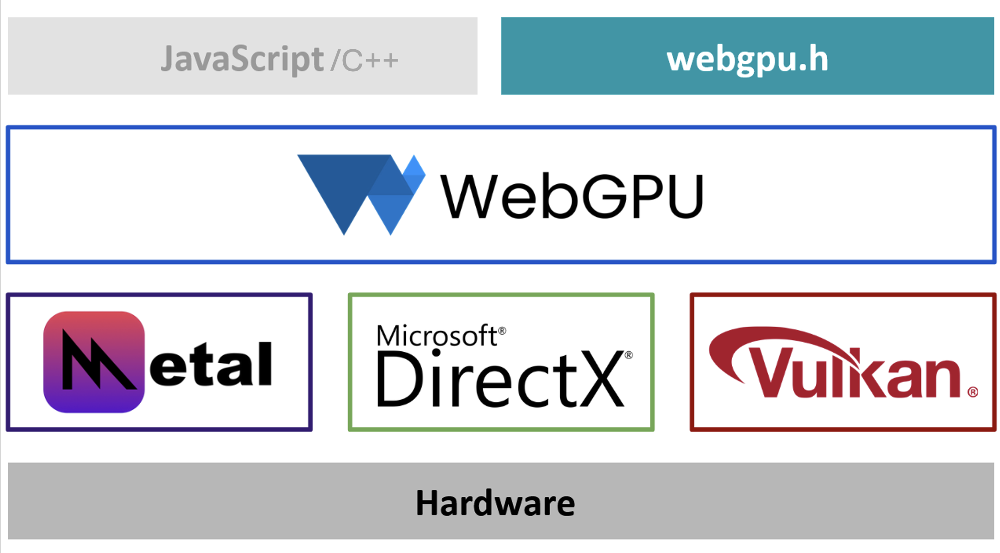

## What is WebGPU?

WebGPU is the successor to WebGL, a well-adopted modern API standard for interfacing with GPUs. 

WebGPU offers the following benefits:

* Improved compatibility with modern GPUs.
* Support for general-purpose GPU computations.
* Fast operations.
* Access to advanced GPU features. 
* Unified access to GPUs, which is both GPU vendor-agnostic and OS-agnostic.

WebGPU is a render hardware interface built on top of various backend APIs such as Vulkan, DirectX, and Metal, though this is OS-dependent. 

WebGPU is available through web browsers using the webgpu.h header file. 

The high-level view of WebGPU is shown below in Figure 1:

## What are the benefits of WebGPU?

WebGPU uses lessons learned from earlier standards such as WebGL and OpenGL to develop an improved offering, and provides the following benefits: 

* A reasonable level of abstraction.
* Improved performance.
* Cross-platform functionality.
* Backing from the W3C standards group.
* A future-proof design.

It is important to note that WebGPU is a standard, and not a true API, so the implementation can be adopted and developed as an interface between native applications developed in any programming language.

The performance requirements for web pages are the same as for native applications.

{}
When designing an API for the Web, the two key constraints are portability and privacy. 

Any limitations of the API caused by privacy constraints can be disabled when using WebGPU as a native API.
{}

## What are the benefits of using C++ for WebGPU?

The initial focus for WebGPU was JavaScript.  The initial `webgpu.h` header file is written in C. 

This Learning Path uses C++ rather than JavaScript or C, for the following reasons:

* C++ remains the primary language used for high performance graphics applications, such as video games, render engines, and modeling tools.
* The level of abstraction and control of C++ is well-suited for interacting with graphics APIs in general.
* Graphics programming is a good way to improve skills in C++.

## Dawn: the Google WebGPU implementation

Since WebGPU is a standard and not an implementation itself, there are various possible options for implementation. 

[Dawn](https://github.com/google/dawn) is an open-source, cross-platform implementation of the WebGPU standard. It implements the WebGPU functionality specified in `webgpu.h`. 

Dawn is designed to be integrated as part of a larger system such as Chromium or a native Android Application.

Dawn provides several WebGPU building blocks:

* WebGPU C/C++ headers that applications and other building blocks use, including a header file and a C++ wrapper.
* A "native" implementation of WebGPU using appropriate APIs, such as D3D12, Metal, Vulkan, and OpenGL. 
* A client-server implementation of WebGPU, for applications that are in a sandbox without access to native drivers.
* Tint, a compiler for the WebGPU Shader Language (WGSL), that converts shaders to and from WGSL.

As it is written in C++, Dawn provides enhanced error message reporting and logging. The fact that it is open source, also means that it is easier to inspect stack traces when applications crash.

Dawn is usually ahead of `wgpu-native`, another WebGPU implementation, in terms of new functionality developments and standards changes. 
