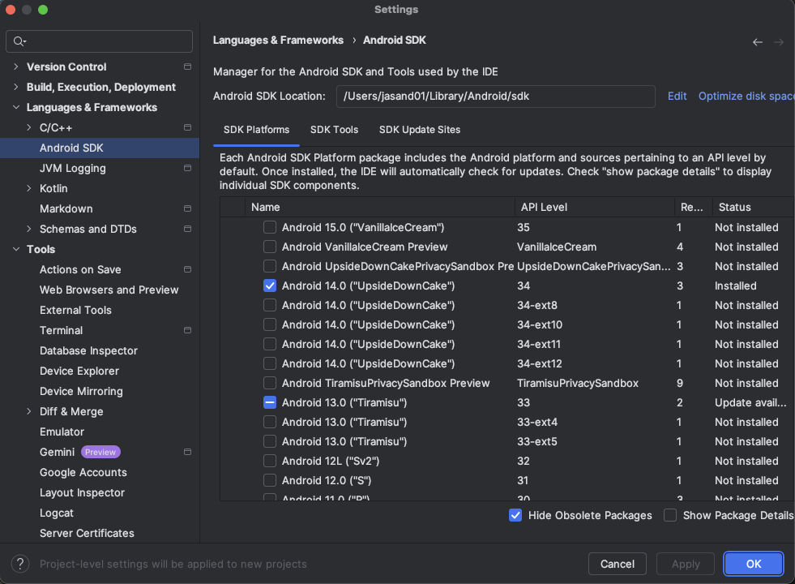
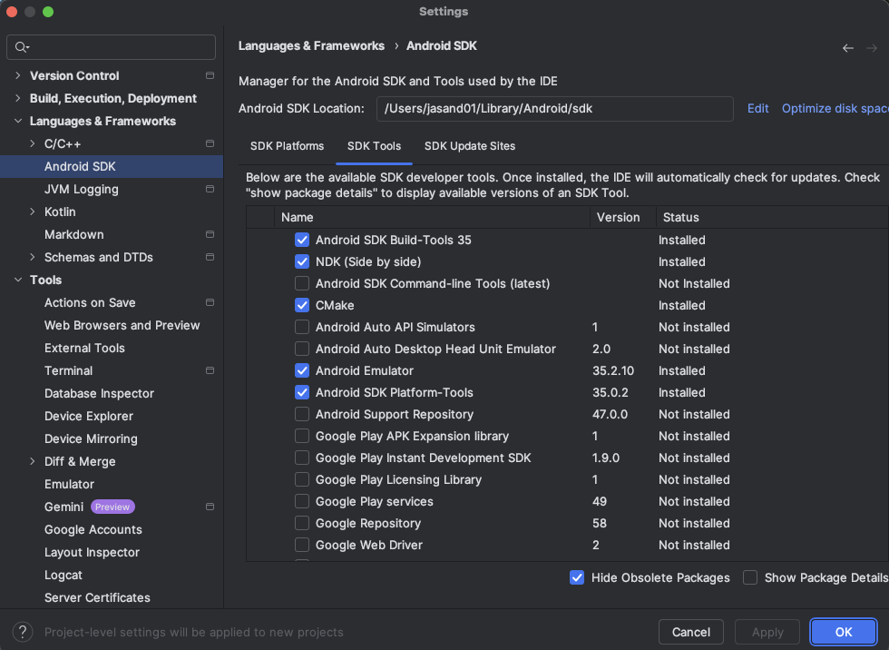

The first step is to prepare a development environment with the required software:

* Android Studio.
* Arm Performance Studio.
* Python 3.10 or later.

You can use any computer and operating system that supports this software. 

## Install Android Studio and the Android NDK

1. Download and install the latest version of [Android Studio](https://developer.android.com/studio/).

2. Start Android Studio.

3. Open the **Settings** dialog.

4. Navigate to **Languages & Frameworks**, then select **Android SDK**.

5. In the **SDK Platforms** tab, select the checkbox **Android 14.0** ("UpsideDownCake").

6. In the **SDK Tools** tab, select the following:
    
    * **Android SDK Build-Tools 35**.
    * **NDK (Side by side)**.
    * **CMake**.

Click **OK** to install and update the selected components. 

## Install Arm Performance Studio

Profiling is an important step in the Android application development cycle. 

The default profiler in Android Studio is great to profile CPU-related metrics, but it does not provide GPU details. 

Arm Performance Studio is a comprehensive profiling tool to profile both CPUs and GPUs. 

One of the components of Performance Studio is Streamline. Streamline captures data from multiple sources, including:

* Program Counter (PC) samples from running application threads.
* Samples from the hardware Performance Monitoring Unit (PMU) counters in Arm CPUs, Arm Mali GPUs, and Arm Immortalis GPUs.
* Thread-scheduling information from the Linux kernel.
* Software-generated annotations and counters from running applications.

Install Arm Performance Studio using the [Arm Performance Studio Install Guide](/install-guides/ams/).

{}
To learn more about Arm Performance Studio and Streamline, see [Get started with Arm Performance Studio for mobile](https://learn.arm.com/learning-paths/mobile-graphics-and-gaming/ams/ams/).
{}

Android Studio and Arm Performance Studio are now installed, and you are ready to create a WebGPU Android application. 
