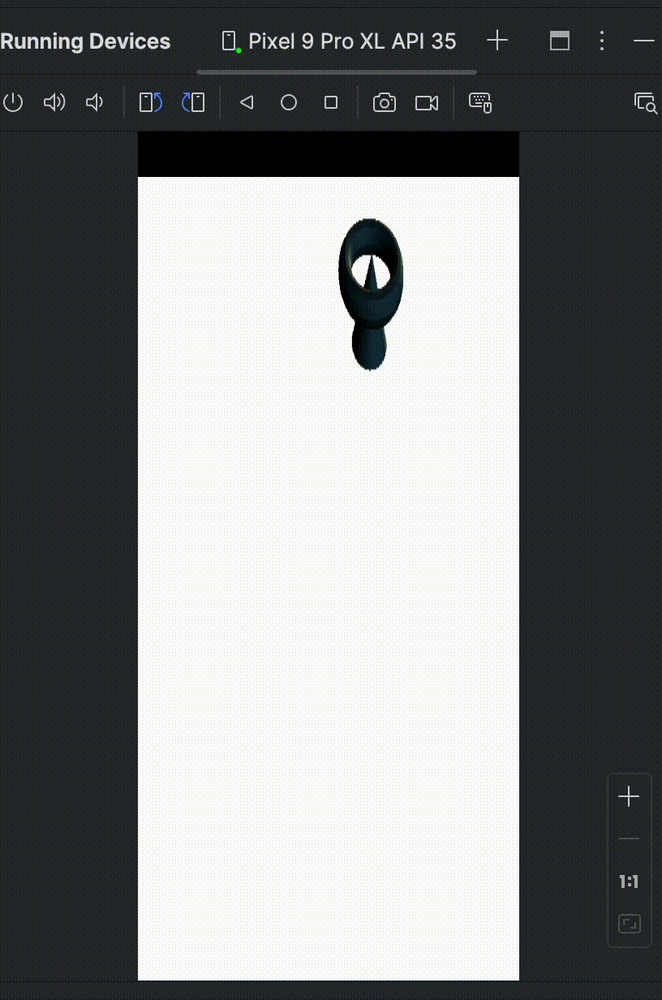

## 3D meshes

Once a Render Pipeline is created, you can use WebGPU APIs to create and render a 3D mesh. This is similar to other graphics APIs. 

The steps are listed below:

* Create the Vertex Buffer(s).
* Create the Index Buffer(s).
* Create the Uniform Buffer(s).
* Create a Depth Buffer (Z-Buffer algorithm).
* Create the Depth Texture and TextureView.
* Create a Depth Stencil.
* Create the Transformation and Projection matrices.

All these steps are common in graphics programming, and WebGPU allows you to perform these same operations. 

It is a good idea to read the individual chapters in the [3D Rendering](https://eliemichel.github.io/LearnWebGPU/basic-3d-rendering/index.html) section to learn more.

### Loading 3D objects

In this Learning Path you can use OBJ files to define 3D meshes. 

Instead of manually parsing OBJ files, you can use the [TinyOBJLoader](https://github.com/tinyobjloader/tinyobjloader) library. 

The file format is not complex, but parsing files is out of the scope of this Learning Path. 

You can use open-source software such as Blender to create your own 3D objects.

{}
Only one of your source files must define `TINYOBJLOADER_IMPLEMENTATION` before including it:

```C++
#define TINYOBJLOADER_IMPLEMENTATION // add this to exactly 1 of your C++ files
#include "tiny_obj_loader.h"
```
{}

There is a helper function [`loadGeometryFromObj`](https://github.com/varunchariArm/Android_DawnWebGPU/blob/main/app/src/main/cpp/webgpuRenderer.cpp#L475) available to load objects.

You are now ready to render a 3D object.

## Rendering using WebGPU

You can run a rendering pass and *draw* something onto our *surface*. 

To encode any commands to be issued to GPU, you need to create a `CommandEncoder`. Modern APIs record commands into command buffers, rather than issuing commands one by one, and submit all of them at once. 

In WebGPU, this is done through a `CommandEncoder` as shown below:

```C++
wgpu::CommandEncoderDescriptor commandEncoderDesc;
commandEncoderDesc.label = "Command Encoder";
wgpu::CommandEncoder encoder = device.createCommandEncoder(commandEncoderDesc);
```

The next step is to create a `RenderPassEncoder`. 

It encodes commands related to controlling the vertex and fragment shader stages, as issued by RenderPipeline. 

It forms part of the overall encoding activity of a CommandEncoder. A render pipeline renders graphics to Texture attachments, typically intended for displaying on a surface, but it could also render to textures used for other purposes that never appear onscreen. 

It has two main stages:

* A vertex stage, in which a vertex shader takes positioning data fed into the GPU and uses it to position a series of vertices in 3D space by applying specified effects like rotation, translation, or perspective.
* A fragment stage, in which a fragment shader computes the color for each pixel covered by the primitives produced by the vertex shader.

You can create a RenderPassEncoder using the `encoder.beginRenderPass()` API:

```C++
wgpu::RenderPassDescriptor renderPassDesc{};

wgpu::RenderPassColorAttachment renderPassColorAttachment{};
renderPassColorAttachment.view = nextTexture;
renderPassColorAttachment.resolveTarget = nullptr;
renderPassColorAttachment.loadOp = wgpu::LoadOp::Clear;
renderPassColorAttachment.storeOp = wgpu::StoreOp::Store;
renderPassColorAttachment.clearValue = Color{ 1, 1, 1, 1.0 };
renderPassColorAttachment.depthSlice = WGPU_DEPTH_SLICE_UNDEFINED;
renderPassDesc.colorAttachmentCount = 1;
renderPassDesc.colorAttachments = &renderPassColorAttachment;
renderPassDesc.timestampWrites = nullptr;
wgpu::RenderPassEncoder renderPass = encoder.beginRenderPass(renderPassDesc);
```

{}
`ColorAttachment` is the only mandatory field. Make sure you have specified `renderPassColorAttachment.depthSlice`. 

It is recommended to go through the ColorAttachment [members](https://gpuweb.github.io/gpuweb/#color-attachments).
{}

You can invoke the following APIs to draw 3D object:

* `renderPass.setPipeline(...);`
* `renderPass.setVertexBuffer(...)`
* `renderPass.setBindGroup(...)`
* `renderPass.draw(...)`

To finish encoding the sequence of commands and issue them to the GPU, a few more API calls are needed:

* End render pass `renderPass.end()`
* Finish the command
  
  ```C++
  wgpu::CommandBufferDescriptor cmdBufferDescriptor{};
  cmdBufferDescriptor.label = "Command buffer";
  wgpu::CommandBuffer command = encoder.finish(cmdBufferDescriptor);
  encoder.release();
  ```

* Submit the Queue `queue.submit(command)`
* Present the object onto surface `surface_.present()`

{}
Make sure you release the created encoders and buffers by calling the respective `.release()` in order to avoid dangling pointers or other errors.
{}

{}
By default, Dawn runs callbacks only when the device “ticks”, so the error callbacks are invoked in a different call stack than where the error occurred, making the breakpoint less informative. 

To force Dawn to invoke error callbacks as soon as there is an error, you can enable an instance toggle:

```C++
#ifdef WEBGPU_BACKEND_DAWN
// Make sure the uncaptured error callback is called as soon as an error
// occurs rather than at the next call to "wgpuDeviceTick".
WGPUDawnTogglesDescriptor toggles;
toggles.chain.next = nullptr;
toggles.chain.sType = WGPUSType_DawnTogglesDescriptor;
toggles.disabledToggleCount = 0;
toggles.enabledToggleCount = 1;
const char* toggleName = "enable_immediate_error_handling";
toggles.enabledToggles = &toggleName;

desc.nextInChain = &toggles.chain;
#endif // WEBGPU_BACKEND_DAWN
```

Toggles are Dawn’s way of enabling/disabling features at the scale of the whole WebGPU instance. 

See the complete list in [Toggle.cpp](https://dawn.googlesource.com/dawn/+/refs/heads/main/src/dawn/native/Toggles.cpp#33).
{}

## Building and running the application

You are now ready to build and run the application. 

First, copy the files with the shader code and 3D object files to a connected phone:

```bash
cd ~/AndroidStudioProjects/dawnwebgpu/app/src/main/cpp
adb shell "mkdir /data/local/tmp/webgpu/"
adb push resources/shader_texture_file.wgsl /data/local/tmp/webgpu/
adb push resources/cone_in_turdis.obj /data/local/tmp/webgpu/
adb push resources/cone_in_turdis.mtl /data/local/tmp/webgpu/
```

{}
If `adb` is not in your search path, enter the path to `adb`. 

For example:
```bash
~/Library/Android/sdk/platform-tools/adb shell "mkdir /data/local/tmp/webgpu/"
```

{}

Now click the **Run** icon in Android Studio, which builds the application and launches it on the connected device, producing the following output:



Congratulations! You have now run a WebGPU application on an Android device.