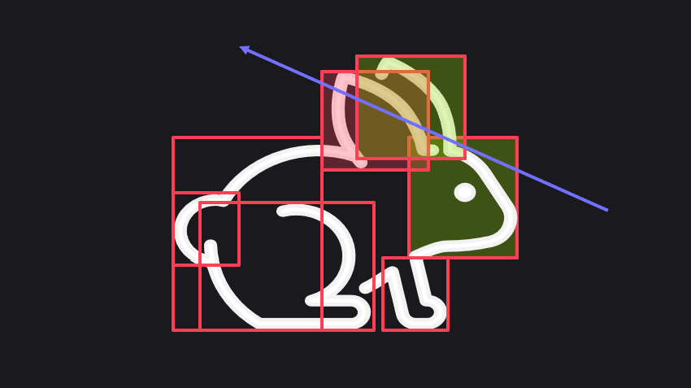

## What is an Acceleration Structure?

An acceleration structure is a data structure designed to improve ray traversal speed on ray tracing hardware. It uses a hierarchical tree to store the geometry data of the scene, minimizing the number of hit tests between rays and geometry. Ray tracing hardware typically utilizes this structure to quickly identify the triangles that intersect with a ray.

As shown in the image below, the scene is divided into boxes, and the acceleration structure stores the hierarchical tree of all these smaller boxes. During ray traversal, the hardware can use this structure to quickly locate the boxes that intersect with a ray. Subsequently, the hardware can then find the intersections between the ray and the triangles within those volumes.

In a typical game scene, there are often many duplicated objects that share the same geometry data but have different instance attributes, such as position or color. Therefore, the acceleration structure is divided into two levels: the Top Level Acceleration Structure (TLAS) and the Bottom Level Acceleration Structure (BLAS), as shown below.

### TLAS 
The TLAS only stores the instancing data of the BLAS, such as the transform data of each instance. It does not store any geometry data. Instead, it references the relevant BLAS. This approach allows the hardware to save memory by storing a single set of geometry data for many duplicated objects.

### BLAS
The BLAS stores the geometry data and hierarchical bounding boxes of the scene. Multiple instances in the TLAS can point to a single BLAS.

