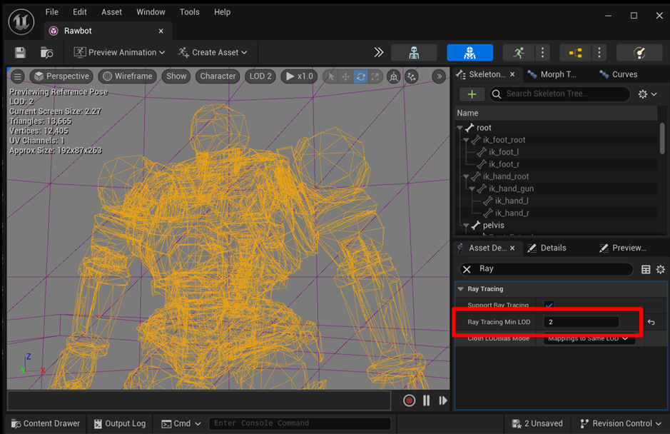

We now turn to run-time. The acceleration structure for static meshes is built offline and does not require updates at run-time. However, the acceleration structure for skinned meshes needs to be updated at run-time, which incurs a performance cost due to the need to update geometry data on the GPU and rebuild the acceleration structure. When the polygon count of a skinned mesh is high, the update cost can be too high for real-time applications. To reduce this cost, you can use a higher LOD (Level of Detail) level for skinned meshes in ray tracing, resulting in fewer polygons needing updates at run-time, as shown below:

Note that using a higher LOD level for skinned meshes in ray tracing may cause self-shadowing artifacts, if ray tracing shadows are enabled. These artifacts are caused by differences between the rendering mesh and the ray tracing mesh, as illustrated below:

