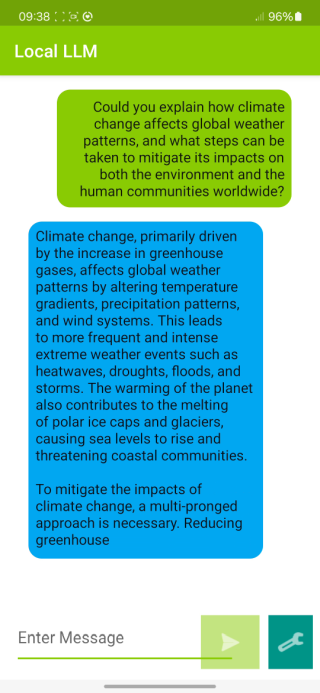

## Build an Android chat app

Another way to run the model is to use an Android GUI app.
You can use the Android demo application included in the [onnxruntime-inference-examples repository](https://github.com/microsoft/onnxruntime-inference-examples) to demonstrate local inference.

### Clone the repo

``` bash
git clone https://github.com/microsoft/onnxruntime-inference-examples
cd onnxruntime-inference-examples
git checkout 009920df0136d7dfa53944d06af01002fb63e2f5
```

{}
You could probably use a later commit but these steps have been tested with the commit `009920df0136d7dfa53944d06af01002fb63e2f5`.
{}

### Build the app using Android Studio

Open the `mobile\examples\phi-3\android` directory with Android Studio.

#### (Optional) In case you want to use the ONNX Runtime AAR you built

Copy ONNX Runtime AAR you built earlier in this learning path:

```bash
Copy onnxruntime\build\Windows\Release\java\build\android\outputs\aar\onnxruntime-release.aar mobile\examples\phi-3\android\app\libs
```

Update `build.gradle.kts (:app)` as below:

``` kotlin
// ONNX Runtime with GenAI
//implementation("com.microsoft.onnxruntime:onnxruntime-android:latest.release")
implementation(files("libs/onnxruntime-release.aar"))
```

Finally, click **File > Sync Project with Gradle**

#### Build and run the app

When you select **Run**, the build will be executed, and then the app will be copied and installed on the Android device. This app will automatically download the Phi-3-mini model during the first run. After the download, you can input the prompt in the text box and execute it to run the model.

You should now see a running app on your phone, which looks like this:


