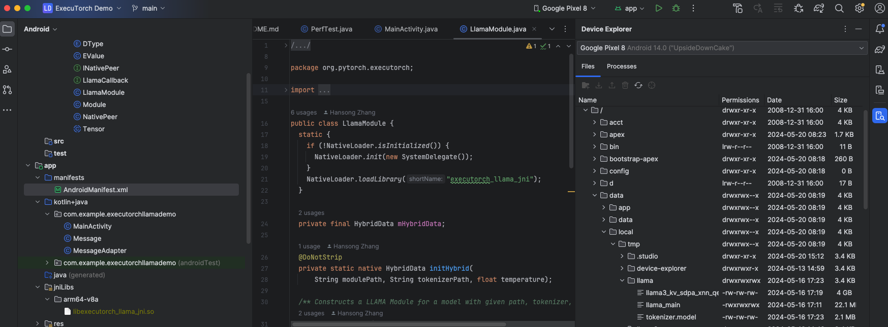
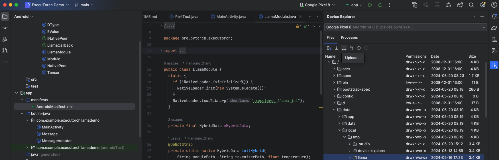
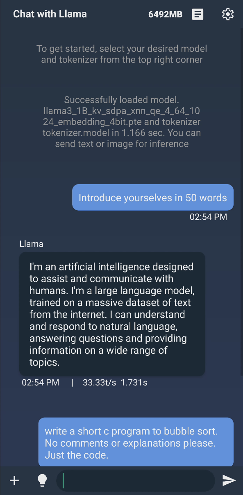
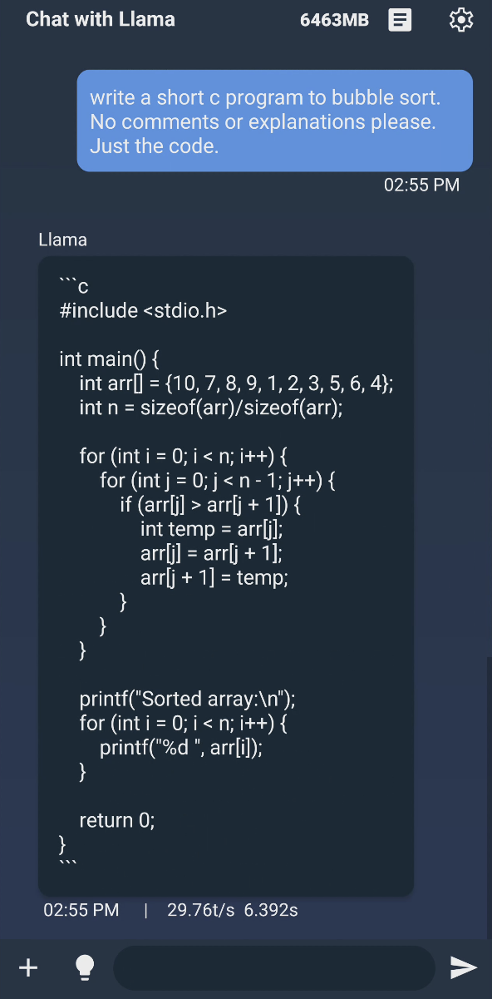

## Build the Android Archive (AAR)
{}
You can use the Android demo application included in ExecuTorch repository [LlamaDemo](https://github.com/pytorch/executorch/tree/main/examples/demo-apps/android/LlamaDemo) to demonstrate local inference with ExecuTorch.
{}

1. Open a terminal window and navigate to the root directory of the `executorch` repository.

2. Set the following environment variables:

    ``` bash
    export ANDROID_NDK=$ANDROID_HOME/ndk/28.0.12433566/
    export ANDROID_ABI=arm64-v8a
    ```

{}
<path_to_android_ndk> is the root for the NDK, which is usually under ~/Library/Android/sdk/ndk/XX.Y.ZZZZZ for macOS, and contains NOTICE and README.md. 
Make sure you can confirm <path_to_android_ndk>/build/cmake/android.toolchain.cmake is available for CMake to cross-compile.
{}

3. Run the following commands to set up the required JNI library:

    ``` bash
    pushd extension/android
    ./gradlew build
    popd
    pushd examples/demo-apps/android/LlamaDemo
    ./gradlew :app:setup
    popd
    ```

{}
This is running the shell script setup.sh which configures and builds the required core ExecuTorch, Llama, and Android libraries.
{}

## Getting models

Make sure the exported model and tokenizer are copied to the Android phone:

### Option 1: using adb

1. Check if the files are available on the phone:

``` bash
adb shell "ls -la /data/local/tmp/llama/"
```

2. If not, copy them:

``` bash
adb shell mkdir -p /data/local/tmp/llama
adb push <model.pte> /data/local/tmp/llama/
adb push <tokenizer.bin> /data/local/tmp/llama/
```

### Option 2: Using Android Studio

1. Use Android Studio's device explorer to look for the model files.



2. Upload the files.

If the files are not on the device, use the device explorer to copy them.



## Build the Android Package Kit

### Option 1: Using Android Studio

This is the recommended option.

1. Open Android Studio and select **Open an existing Android Studio project** and navigate to open `examples/demo-apps/android/LlamaDemo`.

2. Run the app (^R). This builds and launches the app on the phone.

### Option 2: Command line

Without Android Studio UI, you can run gradle directly to build the app. You need to set up the Android SDK path and invoke gradle.

``` bash
export ANDROID_HOME=<path_to_android_sdk_home>
pushd examples/demo-apps/android/LlamaDemo
./gradlew :app:installDebug
popd
```

You should now see a running app on your phone that looks like this:



