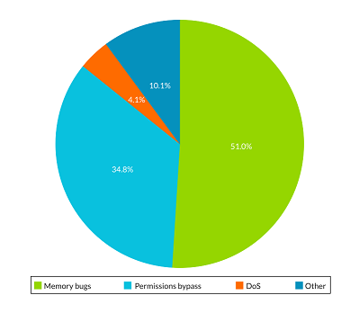

## Common memory safety bugs in Android applications 

Memory safety bugs are errors in handling memory by software. They are the most common type of security bug in Android applications.

Memory safety bugs in native code continue to be a major source of end-user crashes, which negatively impacts quality and stability. Memory safety bugs account for over 70% of high-severity security vulnerabilities and for millions of user-visible crashes.

Native code written in memory-unsafe languages such as C, C++, and assembly, represents over 70% of the Android platform code and it is present in approximately 50% of Play Store applications.

The following diagram shows that memory safety bugs are the main cause of Android security vulnerabilities, as reported in [Android Documentation: Memory Safety](https://source.android.com/docs/security/test/memory-safety):

 Memory safety bugs can occur in the following situations:

* Software accesses memory beyond its allocated size and memory addresses. This is called a *spatial* memory safety bug.
* Software accesses a memory location outside of the expected lifetime of the data, for example, after memory has been freed and reallocated. This is called a *temporal* memory safety bug.

