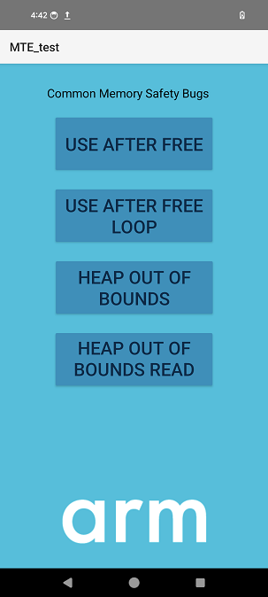

## Example implementations of most common memory safety bugs

A simple Android app is available to accompany this Learning Path. You can use it from Android Studio with your Pixel 8 smartphone in debug mode. 

The project is [available on GitHub](https://github.com/rlopez3d/mte_test_app).

On your development machine, clone the repository:

```console
git clone https://github.com/rlopez3d/mte_test_app
```

Once downloaded to your local machine, launch Android Studio, and open the Android project in the same location.
By default, Android Studio displays your project files in the Android view. 

Click on the **Project** view selector in the top-left area, below the menu bar, and select the **Project Source Files** option. 

You see the file structure of the Android project as shown below:
 


Expand the file structure as shown in the image, and double-click on the `native-lib.cpp` file to open it. 

This file contains the implementation of several of the most common memory safety bugs.

For example, the function below implements a common case that tries to access an array element after the array has been freed.

```

Java_com_example_mte_1test_MainActivity_useAfterFreeC(JNIEnv *env, jobject thiz) {
    int *p = new int[20];

    delete[] p;
    p[15] = 67;    // Trying to access an array element that no longer exists!
}
```
Other functions in the `native-lib.cpp` file implement different types of memory safety bugs. Have a look at them. These functions are called from the `MainActivity.kt` file.

Each of the four functions is associated with one of the buttons in the app. 

This association is implemented in the `activity_main.xml` file. 

To see this file, expand the content of the **res** folder in the **project** view and next the **layout** folder. Double-click on the file to open it. You can visualize this file in code and design modes.

Explore the code and see the implementation of each button. For example, the implementation of the buttons associated with the function listed above looks like this:

```
<Button
    android:id="@+id/button"
    android:layout_width="270dp"
    android:layout_height="100dp"
    android:layout_marginTop="140dp"
    android:backgroundTint="#0091BD"
    android:onClick="useAfterFree"
    android:text="@string/use_after_free"
    android:textColor="#002B49"
    android:textSize="30sp"
    app:layout_constraintEnd_toEndOf="parent"
    app:layout_constraintStart_toStartOf="parent"
    app:layout_constraintTop_toTopOf="parent" 
/Button>
```

This translates to buttons that look like this:


