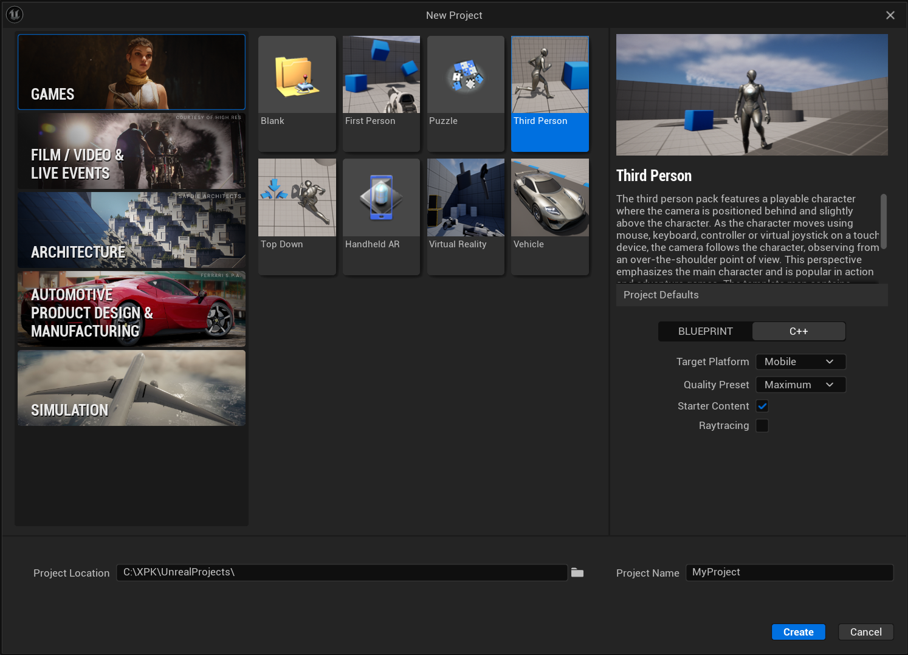
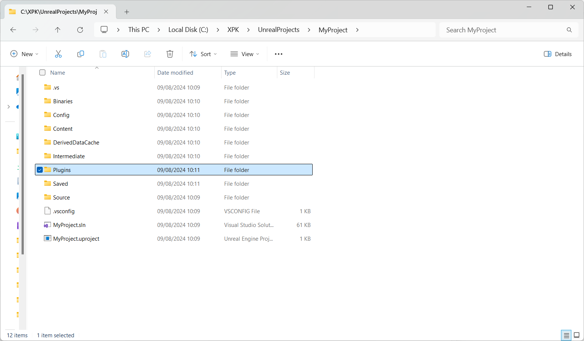
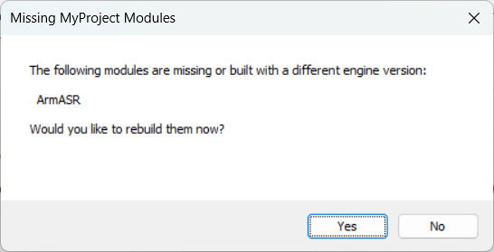
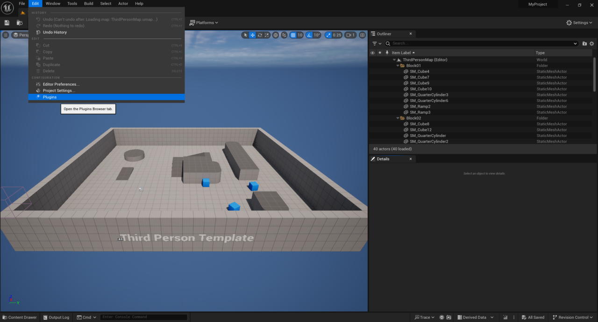
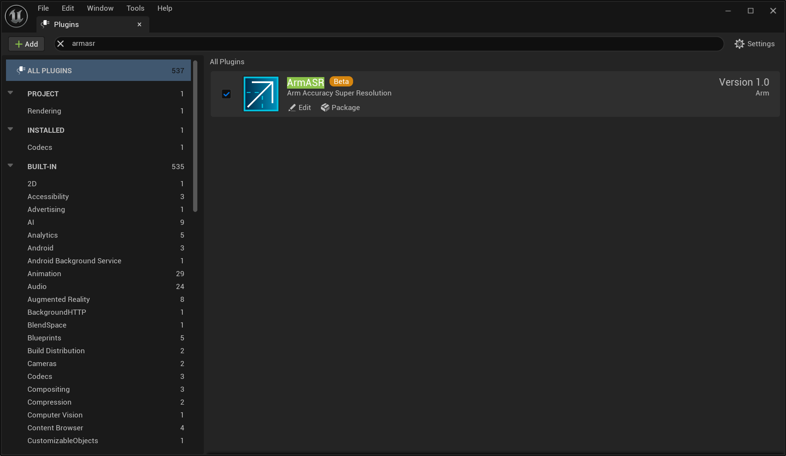
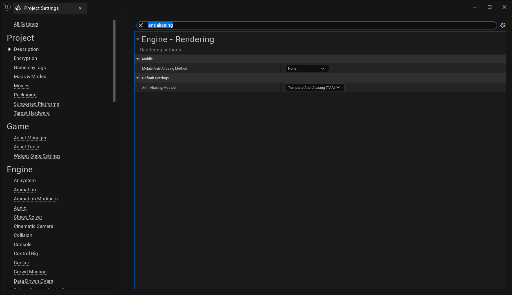
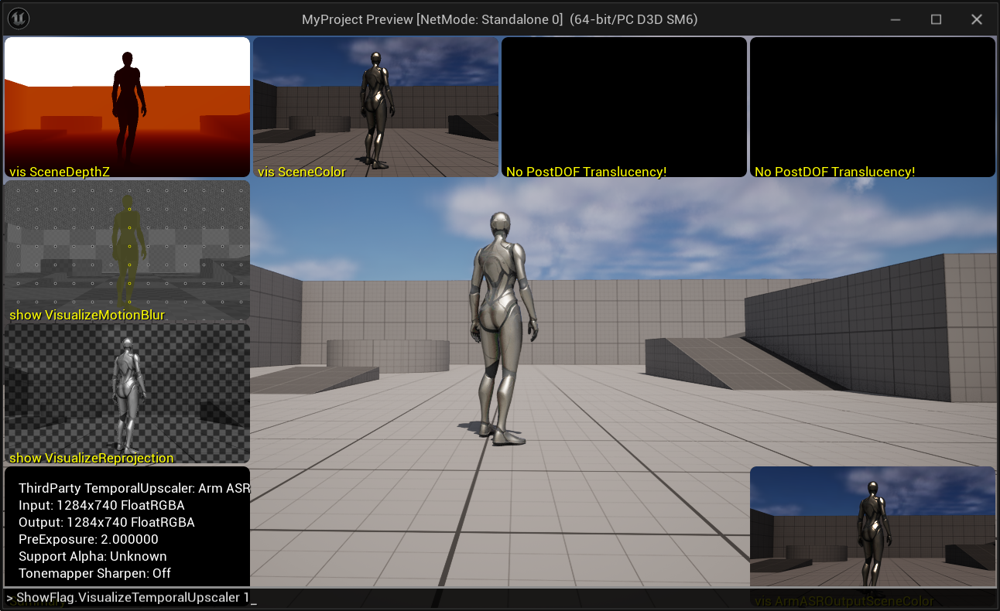
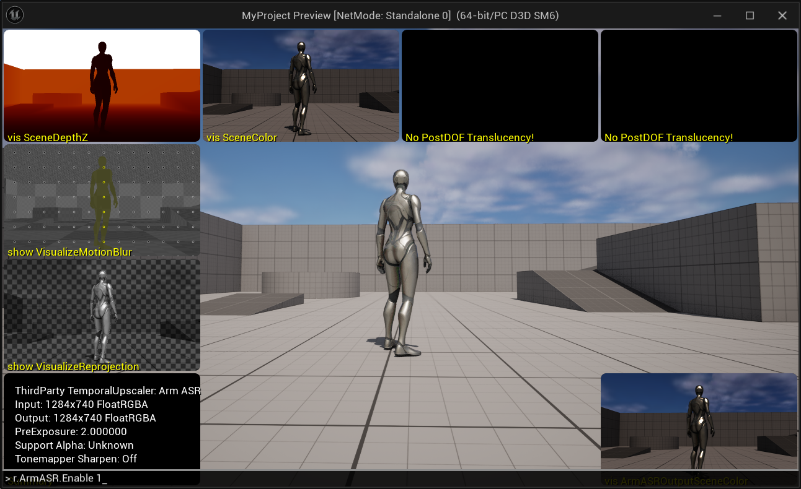
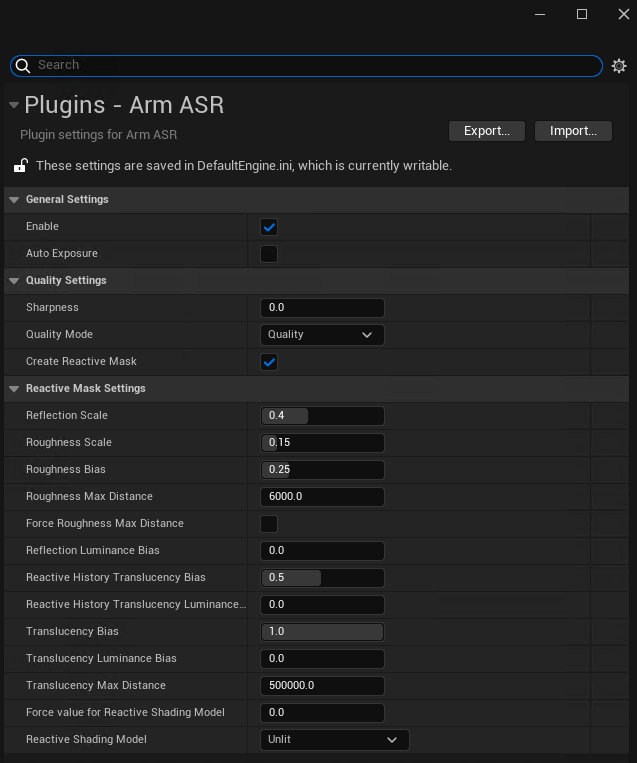
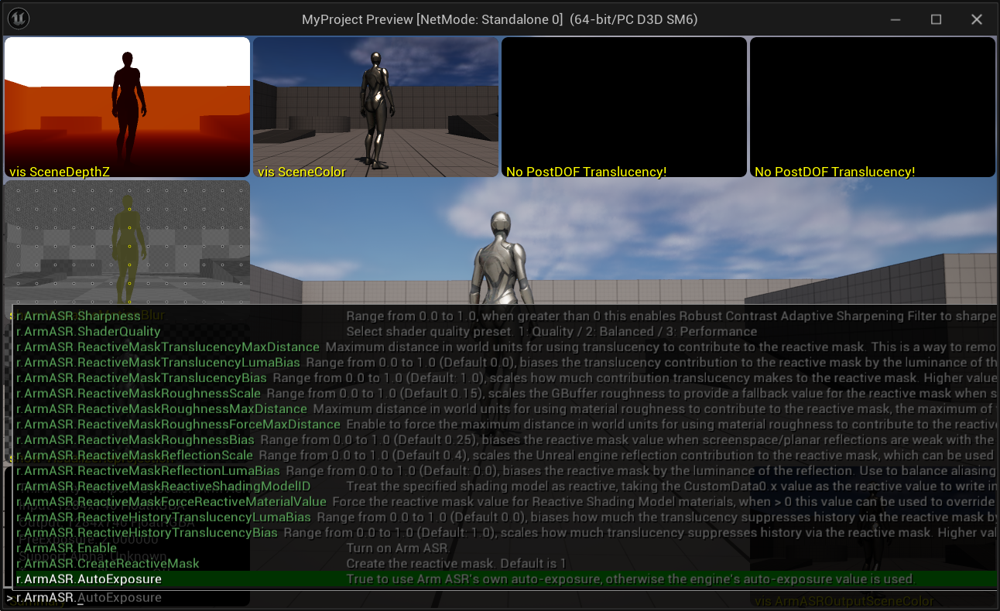

## Objective

This Learning Path describes how to get started with Arm&reg; Accuracy Super Resolution™ (Arm ASR) using an example project in Unreal Engine.

It is for Unreal Engine developers who want to apply upscaling techniques to their projects.

You will walk through the processes of installing Arm ASR performing some of the common setup tasks.

## Before you begin

It is recommended that you use Unreal Engine versions 5.3-5.5 through this tutorial.

## Installing the Arm ASR plugin

Follow these steps to install the Arm ASR plugin in Unreal Engine:

1. Open the Unreal Engine project you plan to use with Arm ASR.

The Third Person pack is available as an example, see below:



2. Download the Arm ASR plugin by cloning the repository:

    ```
    git clone https://github.com/arm/accuracy-super-resolution-for-unreal
    ```

3. Check out the branch corresponding to your Unreal Engine version.

    The repository contains branches containing the plugin for each supported version of Unreal Engine. For example, use branch `5.5` for Unreal Engine 5.5.

    ```
    cd accuracy-super-resolution-for-unreal
    git checkout 5.5
    ```

4. From the directory for your version of Unreal Engine, copy the Arm ASR plugin into the `Plugins` folder in the game directory.

    See below:




5. Navigate back to your Unreal Engine project.

6. When the pop-up window opens prompting you to build Arm ASR, select **Yes**.

    

## Enable and configure Arm ASR

After reopening the Unreal Engine project, ensure that the Arm ASR plugin is enabled.

1. Go to **Edit > Plugins**, search for **Arm ASR**, and make sure that it is checked.

    

    

2. To enable Arm ASR upscaling, open **Project Settings** and set the **Anti-Aliasing Method** to **Temporal Anti-Aliasing**.

   {}
   **Mobile Anti-Aliasing Method** is used for the mobile renderer, however this Learning Path uses the desktop renderer. For information about other available renderers, see the `README.md` in the `accuracy-super-resolution-for-unreal` repository.
    {}

    

3. To verify that Arm ASR is enabled and active, use the `ShowFlag.VisualizeTemporalUpscaler 1` console command.

    {}
   The debug views produced by this command are generated by Unreal Engine's TAA, not directly by Arm ASR.{}

If Arm ASR is active, you will see Arm ASR listed as the **ThirdParty TemporalUpscaler** in the console window.



4. If Arm ASR is not shown here, use the `r.ArmASR.Enable 1` console command to enable upscaling.

    

## Further Configuration Settings

You can configure Arm ASR further in two ways:

1. Using the UI:

* Go to **Edit > Project Settings > Plugins > Arm ASR**.



2. Through the console:

* Type `r.ArmASR.` into the console window to see configuration options.



For example, you can change the upscaling ratio by modifying the **ScreenPercentage**, through the command option `r.ScreenPercentage`. A value of `50.0` means frames are upscaled by a factor of 2.

You can configure Arm ASR's behavior through the following plugin-specific console variables:

|Console Variable                                   | Default Value | Value Range | Details                                                                                                |
|:------------------------------------------------- | :------------ | :---------- | :----------------------------------------------------------------------------------------------------- |
|`r.ArmASR.Enable`                                  | 1             | 0, 1        | Enable / disable Arm ASR.                                                    |
|`r.ArmASR.AutoExposure`                            | 0             | 0, 1        | Set to 1 to use Arm ASR's own auto-exposure, otherwise the engine's auto-exposure value is used.       |
|`r.ArmASR.Sharpness`                               | 0             | 0-1         | If greater than 0 this enables Robust Contrast Adaptive Sharpening Filter to sharpen the output image. |
|`r.ArmASR.ShaderQuality`                           | 1             | 1, 2, 3     | Select shader quality preset: 1 - Quality, 2 - Balanced, 3 - Performance.                              |
|`r.ArmASR.CreateReactiveMask`                      | 1             | 0-1         | Create the reactive mask.                                                                |
|`r.ArmASR.ReactiveMaskReflectionScale`             | 0.4           | 0-1         | Range from 0.0 to 1.0, scales the Unreal Engine reflection contribution to the reactive mask, which can be used to control the amount of aliasing on reflective surfaces. |
|`r.ArmASR.ReactiveMaskRoughnessScale`              | 0.15          | 0-1         | Range from 0.0 to 1.0, scales the GBuffer roughness to provide a fallback value for the reactive mask when screenspace & planar reflections are disabled or don't affect a pixel. |
|`r.ArmASR.ReactiveMaskRoughnessBias`               | 0.25          | 0-1         | Range from 0.0 to 1.0, biases the reactive mask value when screenspace/planar reflections are weak with the GBuffer roughness to account for reflection environment captures. |
|`r.ArmASR.ReactiveMaskRoughnessMaxDistance`        | 6000          | -           | Maximum distance in world units for using material roughness to contribute to the reactive mask, the maximum of this value and View.FurthestReflectionCaptureDistance will be used. |
|`r.ArmASR.ReactiveMaskRoughnessForceMaxDistance`   | 0             | -           | Enable to force the maximum distance in world units for using material roughness to contribute to the reactive mask rather than using View.FurthestReflectionCaptureDistance. |
|`r.ArmASR.ReactiveMaskReflectionLumaBias`          | 0             | 0-1         | Range from 0.0 to 1.0, biases the reactive mask by the luminance of the reflection. Use to balance aliasing against ghosting on brightly lit reflective surfaces. |
|`r.ArmASR.ReactiveHistoryTranslucencyBias`         | 0.5           | 0-1         | Range from 0.0 to 1.0, scales how much translucency suppresses history via the reactive mask. Higher values will make translucent materials more reactive which can reduce smearing. |
|`r.ArmASR.ReactiveHistoryTranslucencyLumaBias`     | 0             | 0-1         | Range from 0.0 to 1.0, biases how much the translucency suppresses history via the reactive mask by the luminance of the transparency. Higher values will make bright translucent materials more reactive which can reduce smearing. |
|`r.ArmASR.ReactiveMaskTranslucencyBias`            | 1             | 0-1         | Range from 0.0 to 1.0, scales how much contribution translucency makes to the reactive mask. Higher values will make translucent materials more reactive which can reduce smearing. |
|`r.ArmASR.ReactiveMaskTranslucencyLumaBias`        | 0             | 0-1         | Range from 0.0 to 1.0, biases the translucency contribution to the reactive mask by the luminance of the transparency. Higher values will make bright translucent materials more reactive which can reduce smearing. |
|`r.ArmASR.ReactiveMaskTranslucencyMaxDistance`     | 500000        | -           | Maximum distance in world units for using translucency to contribute to the reactive mask. This is a way to remove sky-boxes and other back-planes from the reactive mask, at the expense of nearer translucency not being reactive. |
|`r.ArmASR.ReactiveMaskForceReactiveMaterialValue`  | 0             | 0, 1        | Force the reactive mask value for Reactive Shading Model materials, when > 0 this value can be used to override the value supplied in the Material Graph. |
|`r.ArmASR.ReactiveMaskReactiveShadingModelID`      | MSM_NUM       | -           | Treat the specified shading model as reactive, taking the CustomData0.x value as the reactive value to write into the mask. |

## Next steps

You are now ready to use Arm ASR in your Unreal Engine projects.

You can use [Arm Performance Studio](https://developer.arm.com/Tools%20and%20Software/Arm%20Performance%20Studio) tools to measure the performance of your game as it runs on a mobile device, allowing you to monitor the effect of Arm ASR.
