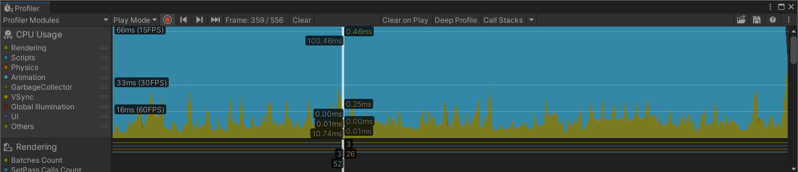

## Introduction to the Unity Profiler

The Unity Profiler will help us analyze the performance of our app to see why it's not running smoothly. The tool allows us to analyze CPU, graphics and memory usage across the different areas of the app including general scripting, physics and audio.

We can activate the profiler both in the editor and when we're running on a connected device. It will collect performance data from every frame in a useful timeline.

We can also insert statements into our code to gather custom data about the app. More about this later.

Although we won't get accurate data for our target device, it is useful to run the Profiler in the editor so we can quickly get an overview of how it works.

After this learning path, we recommend you read the [Profiler overview](https://docs.unity3d.com/Manual/Profiler.html) on the Unity web site.

## Profiling in the editor

1. As always, open the _SampleScene_ (if you haven't already) and click the _Play_ button to run the app.

1. While the app is running, we can open the Profiler. Select menu option _Window->Analysis->Profiler_.

1. Allow the app to run for a few seconds so the Profiler can gather a reasonable amount of data.

1. Once the timeline has been filled, click on the _Pause_ button to pause the app. Now click anywhere in the timeline at the top. It will look something like this:

5. The CPU Usage graph at the top-right shows the CPU activity of the app. The Profiler presents several different types of activity using different colors. You can click on the labels to hide or show them on the graph.

The various types of activity recorded can be seen in more detail if you scroll down the CPU Usage panel. The areas measured include rendering (CPU-side calls), scripts, physics, animation, and UI etc. You can also see details regarding memory usage, audio, video, and others.

You may not need all of the areas at once but it is worth knowing what's available should you ever need it.
