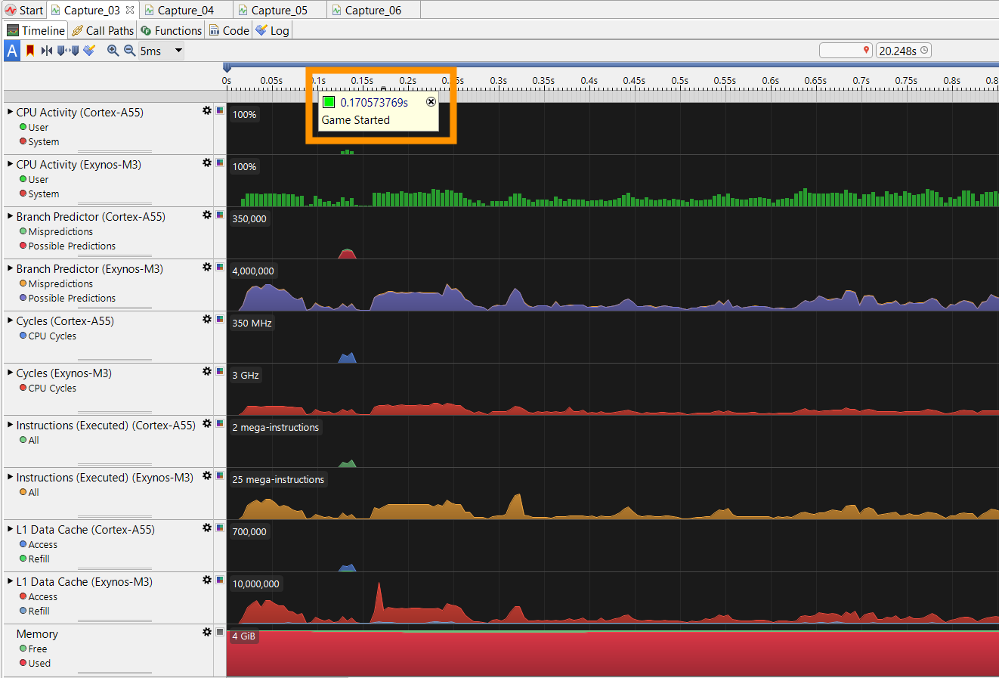

## Profile and analyze Godot game performance with Arm Performance Studio

Learn how to annotate and analyze performance in your Godot game using the Arm Performance Studio extension. You’ll use markers, counters, and timelines to highlight game events, then visualize them in Streamline and Performance Advisor to identify CPU and GPU bottlenecks.

{}
 This extension is compatible with **Godot 4.3 and later**.
{}

[Arm Performance Studio](https://developer.arm.com/Tools%20and%20Software/Arm%20Performance%20Studio) is a free suite of analysis tools to help you profile game performance on mobile devices with Arm CPUs and GPUs. Arm provides a Godot extension to make data from [Godot games](https://godotengine.org/) visible in the Arm Performance Studio tools, [Streamline](https://developer.arm.com/Tools%20and%20Software/Streamline%20Performance%20Analyzer) and [Performance Advisor](https://developer.arm.com/Tools%20and%20Software/Performance%20Advisor).

This package provides a simple way to incorporate annotations into your Godot project. These annotations enable you to mark the timeline with events or custom counters which provides valuable context alongside the performance data in Streamline, so you can see what was happening in the game when bottlenecks occur. For example, here you can see markers that highlight where a wave of enemies is spawning:


### How to install the Arm Performance Studio Integration extension

1. In Godot, click **AssetLib** to see the available extensions.

2. Find the **Arm Performance Studio Integration** extension, then double-click to open the extension.

3. The extension opens in a dialog box. Click **Download**.


4. A new dialog box opens where you can change the install folder if required. Click Install. 

### Using the extension

All functionality in the extension is provided by the PerformanceStudio class, so first create an instance of it:

```console
var performance_studio = PerformanceStudio.new()
```

### Adding single markers to a Godot project

The simplest annotations are single markers, which can have a name and a color. To use them in a Godot project where you have installed this extension, simply call into the Performance Studio library as follows:

```console
performance_studio.marker("Game Started")
```

This will emit a timestamped marker with the label "Game Started". When you capture a profile in Streamline, you can see this marker along the top of the timeline at the point that the game starts.



To give the annotation a color, use the `marker_color` method:

```console
performance_studio.marker_color("Game Started", Color8(0, 255, 0))
```

### Defining regions in a Godot project

To define regions of interest within the game, you can specify a pair of markers prefixed with “Region Start” and “Region End”, for example:

```console
performance_studio.marker("Region Start Times Square")
# Do work
performance_studio.marker("Region End Times Square")
```

These regions are shown on the frame rate analysis chart in the Performance Advisor report.


Also, dedicated charts for each region are appended to the end of the report, so you can analyze each region independently.


### Using channels in a Godot project

Channels are custom event timelines associated with a software thread. You can create channels and place annotations within them. A channel annotation has a text label and a color but, unlike markers, they span a range of time.

To create a channel called "Spawner" and insert an annotation called "Spawning Wave", with the color red:

```console
var channel : PerformanceStudio_Channel

func _ready() -> void:
    channel = performance_studio.create_channel("Spawner")

# Annotations can then be inserted into a channel:
func _on_new_wave_started() -> void:
    channel.annotate_color("Spawning Wave", Color8(255, 0, 0))

func _on_wave_completed() -> void:
    channel.end()
```

To see channels in Streamline, select the **Core Map** view, and expand the **VkThread** thread:


### Creating counters

Counters are numerical data points that can be plotted as a chart in the Streamline timeline view. Counters can be created as either absolute counters, where every value is an absolute value, or as a delta counter, where values are the number of instances of an event since the last value was emitted. All values are floats and will be presented to 2 decimal places.

When charts are first defined, you can specify a title and series name. The title names the chart, the series names the data series.

Multiple counter series can use the same title, which means that they will be plotted on the same chart in the Streamline timeline.

To create a counter:

```console
var counter = performance_studio.create_counter("Title", "Series", false)
```

Counter values are set easily as shown below:

```console
counter.setValue(42.2)
```

### Custom Activity Maps

[Custom Activity Map (CAM)](https://developer.arm.com/documentation/101816/latest/Annotate-your-code/User-space-annotations/Custom-Activity-Map-annotations) views allow execution information to be plotted on a hierarchical set of timelines. Like channel annotations, CAM views plot jobs on tracks, but unlike channel annotations, CAM views are not associated with a specific thread. Each CAM view contains one or more tracks and each track contains one or more jobs.


To create a custom activity map and add tracks to it:

```console
var game_cam : PerformanceStudio_CAM
var wave_track : PerformanceStudio_CAMTrack
var ui_track : PerformanceStudio_CAMTrack

func _ready() -> void:
    # Create the CAM
    game_cam = performance_studio.create_cam("Game Activity")

    # Add tracks to the CAM
    wave_track = game_cam.create_track("Wave Activity")
    ui_track = game_cam.create_track("UI Activity")
```

To create a job within a track:

```console
var wave_job : PerformanceStudio_CAMJob

func _on_new_wave_started() -> void:
    wave_job = wave_track.create_job("Spawning Wave", Color8(255, 0, 0))

func _on_wave_completed() -> void:
    wave_job.stop()
```

You can now annotate your Godot game and analyze the performance with markers that give context to a profile in Arm Performance Studio tools.
