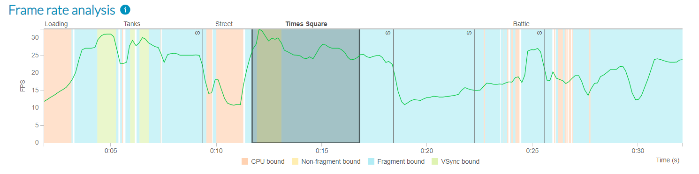

## Define regions of interest for performance analysis

To define regions of interest within the game, use marker pairs prefixed with “Region Start” and “Region End”:

```gdscript
performance_studio.marker("Region Start Times Square")
# Do work
performance_studio.marker("Region End Times Square")
```

These regions are shown in the **frame rate analysis chart** in Performance Advisor.



Each region gets a dedicated chart in the final report, so you can analyze them independently.


