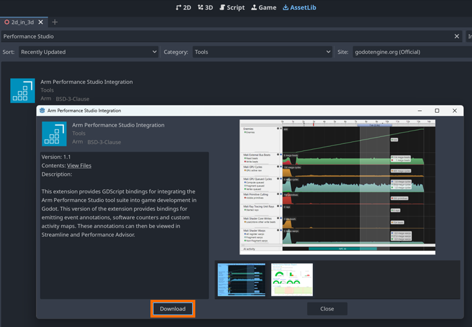

## Install the Arm Performance Studio extension in Godot

To profile performance in your Godot game, first install the Arm Performance Studio extension using the Godot Asset Library.

Start by opening your project in Godot,  then select **AssetLib** from the top menu to browse available extensions.

Search for **Arm Performance Studio Integration**, then double-click the result to open its details.

In the extension dialog that appears, select **Download** to begin the installation.

When prompted, you can change the install folder if needed. To complete the setup, select **Install**.

The extension will now be added to your project and ready to use for adding markers and counters.

