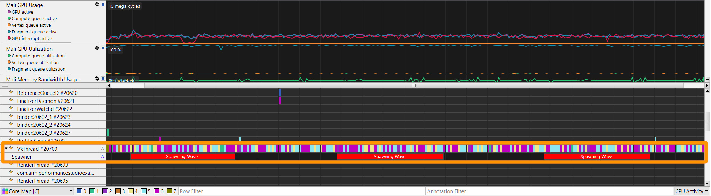

## Use channels to annotate threaded events

Channels are custom timelines tied to software threads. You can annotate them with labels and colors over a span of time.

### Create and use a channel:

```gdscript
var channel : PerformanceStudio_Channel

func _ready():
    channel = performance_studio.create_channel("Spawner")

func _on_new_wave_started():
    channel.annotate_color("Spawning Wave", Color8(255, 0, 0))

func _on_wave_completed():
    channel.end()
```

To view channels in Streamline, open the **Core Map** view and expand the **VkThread** thread.


