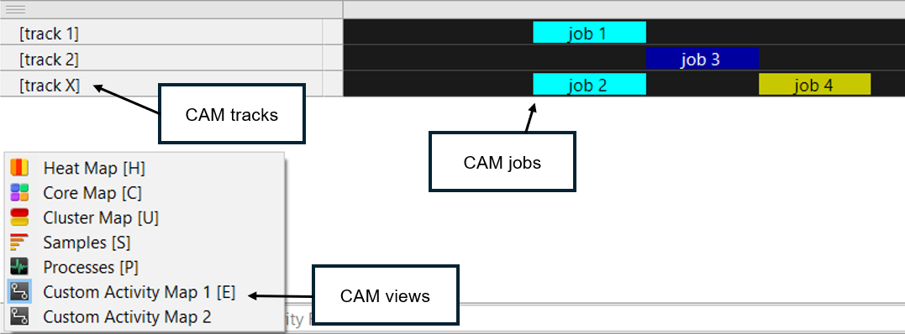

## Use custom activity maps to organize game profiling

[Custom Activity Map (CAM)](https://developer.arm.com/documentation/101816/latest/Annotate-your-code/User-space-annotations/Custom-Activity-Map-annotations) views allow execution information to be plotted on a hierarchical set of timelines. 

Like channel annotations, CAM views plot jobs on tracks, but unlike channel annotations, CAM views are not associated with a specific thread. Each CAM view contains one or more tracks and each track contains one or more jobs.



## Create a CAM and add tracks

To define a custom activity map and add tracks for different systems:

```console
var game_cam : PerformanceStudio_CAM
var wave_track : PerformanceStudio_CAMTrack
var ui_track : PerformanceStudio_CAMTrack

func _ready() -> void:
    # Create the CAM
    game_cam = performance_studio.create_cam("Game Activity")

    # Add tracks to the CAM
    wave_track = game_cam.create_track("Wave Activity")
    ui_track = game_cam.create_track("UI Activity")
```

## Add jobs to tracks

You can use jobs to represent specific time-bound tasks on a track. Here’s how to create and stop a job:

```console
var wave_job : PerformanceStudio_CAMJob

func _on_new_wave_started() -> void:
    wave_job = wave_track.create_job("Spawning Wave", Color8(255, 0, 0))

func _on_wave_completed() -> void:
    wave_job.stop()
```

## Analyze custom activity maps in Streamline

Once you capture a profiling session, you can view your CAM data in Streamline under the Custom Activity Map section. Each job appears on its assigned track, enabling you to inspect how long each task ran and when overlapping operations occurred.

Use CAMs to structure your profiling data around gameplay concepts, not just threads, making your performance analysis more intuitive and actionable.