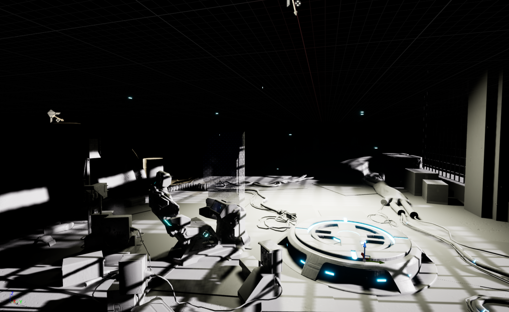

Lumen is a dynamic global illumination and reflections system in Unreal Engine 5, which also supports hardware ray tracing. Lighting indoor scenes using only direct lighting does not produce high-quality rendering results. To achieve a much better quality of indoor lighting, you also need to use indirect lighting but rendering dynamic indirect lighting is computationally expensive. 

Lumen introduces a new ray-tracing based solution that allows developers to render both dynamic direct lighting and indirect lighting in real-time.

You can see the improvements in the rendering quality by comparing the following two images of the same scene. The first image uses only direct lighting where details in the areas beyond the direct lighting range (such as the background) are not visible. In contrast, the second image utilizes Lumen lighting, incorporating both direct and indirect lighting. Now, you can discern many more details in the background that were previously hidden, as Lumen takes light bounces into account.

Lumen supports both software and hardware ray tracing. Software ray tracing uses a simplified Lumen scene to replace actual geometries in the scene. In contrast, hardware ray tracing uses actual geometries to trace rays, resulting in better lighting quality.
