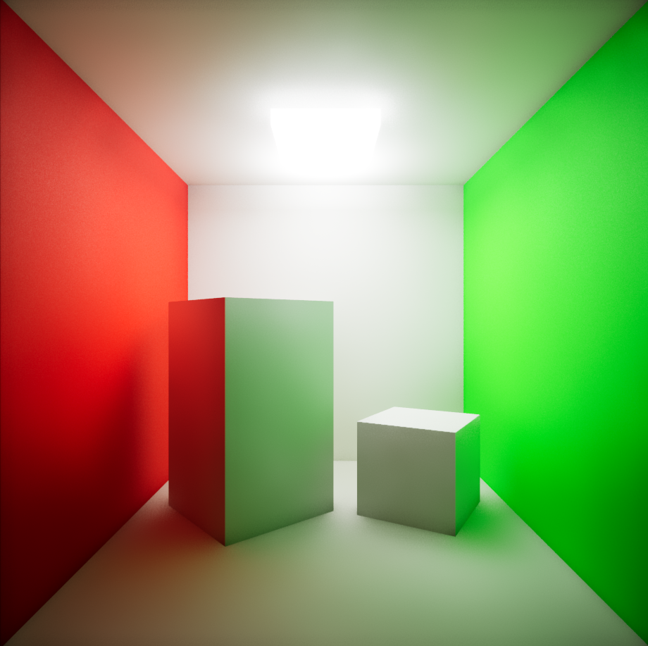
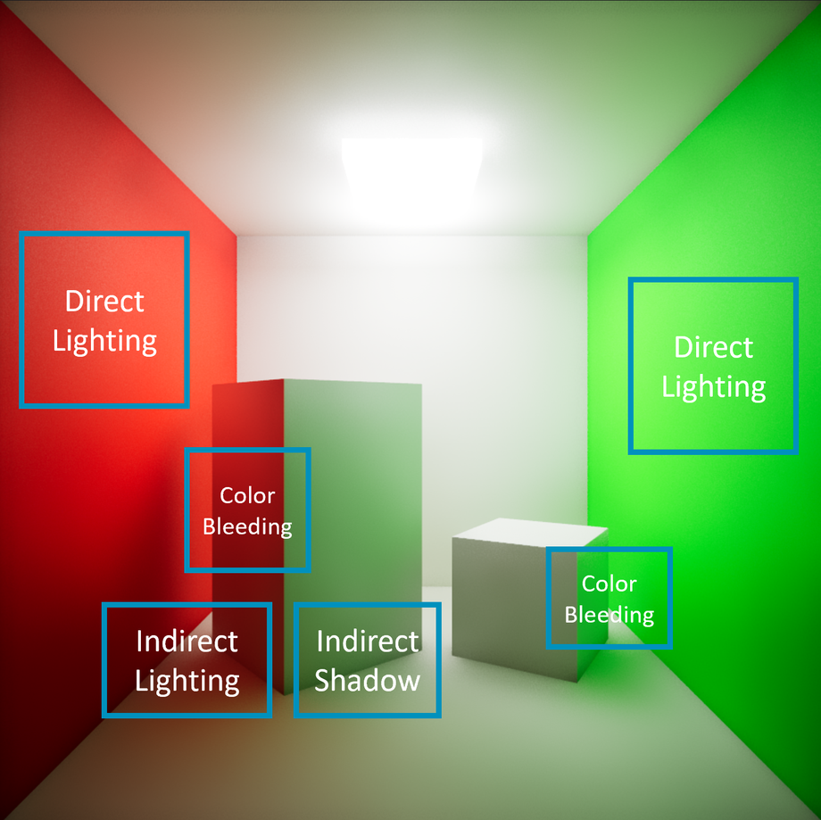

Global Illumination (GI) is a sophisticated lighting technique that considers the entire scene when calculating illumination. It meticulously accounts for how photons bounce between surfaces, resulting in realistic lighting effects. In GI-rendered images, four critical attributes stand out:

1. **Direct Lighting**: These are the well-defined areas directly illuminated by light sources. Think of sunlight streaming through a window or a spotlight on a stage.

2. **Indirect Lighting**: Indirect lighting occurs when light bounces off surfaces and indirectly illuminates other areas. It's responsible for soft glows and ambient lighting.

3. **Indirect Shadows**: As photons bounce around, they create shadows in areas not directly lit. These shadows add depth and realism to the scene.

4. **Color Bleeding**: Imagine a red wall casting a warm glow onto nearby objects. Color bleeding occurs when bounced photons carry the color of the reflecting surface, subtly tinting adjacent elements.

For a practical example, consider the following Cornell box scene which has been rendered using Unreal Engine's Lumen lighting system. In this image, you can easily observe how all four attributes have been successfully captured.

