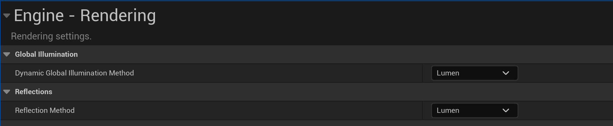

To enable Lumen in your Unreal project, open the Project Settings window, select **Engine - Rendering** and then select **Lumen** in the **Global Illumination** section, as shown below.

Next, select **Lumen** as the reflection method in the **Reflections** section, as shown below.

Alternatively, another way to enable Lumen is by creating a **Post Process Volume** actor in the scene and selecting **Lumen** in the **Global Illumination** sections in the Post Process Volume details panel, as shown in the following image. You can also select **Lumen** as the reflection method here as well.

