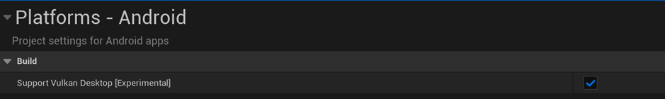
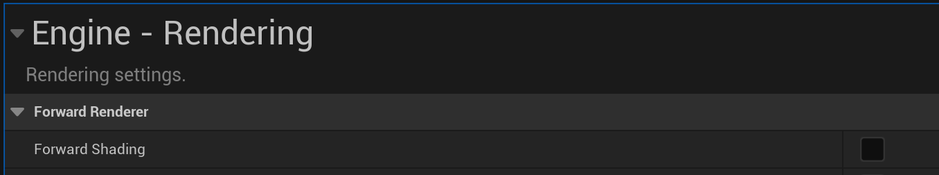
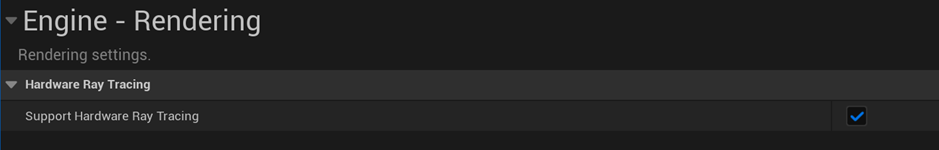
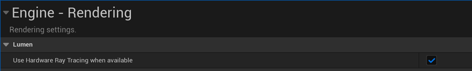

To harness the power of hardware ray tracing with Lumen in your application, follow these steps to configure your project settings:

1. **Enable SM5 Shader Format**:
   - Lumen operates only when the SM5 shader format is active. Navigate to your project settings under **Platforms - Android**.
   - Enable the option labeled **Support Vulkan Desktop [Experimental]** to activate SM5 shader format support, as shown below.

   

2. **Select Deferred Shading Mode**:
   - Currently, Lumen exclusively supports deferred shading mode. Go to your project settings under **Engine - Rendering**.
   - Uncheck **Forward Shading** under the **Forward Renderer** option, as shown below.

   

3. **Enable Hardware Ray Tracing Support**:
   - Next, enable hardware ray tracing for the entire engine. In your project settings under **Engine - Rendering**, check the box for **Support Hardware Ray Tracing**, as shown below.

   

4. **Use Hardware Ray Tracing When Available**:
   - As previously mentioned, Lumen can utilize both software and hardware ray tracing. To prioritize hardware acceleration, check **Use Hardware Ray Tracing when available** in the project settings under **Engine - Rendering**, as shown below.
   - This setting ensures that your application leverages hardware ray tracing first, falling back to software ray tracing if necessary.

   

5. **Configure Console Variables**:
   - Edit your engine configuration file to set up two essential console variables as per the following:
     - Set `r.Android.DisableVulkanSM5Support=0` to remove any restrictions related to SM5 shader format usage.
     - Enable Ray Query shader support for Vulkan by setting `r.RayTracing.AllowInline=1`.

   ```C
   r.Android.DisableVulkanSM5Support=0
   r.RayTracing.AllowInline=1
   ```

Your Lumen-powered application is now ready to dazzle with hardware-accelerated ray tracing! 
