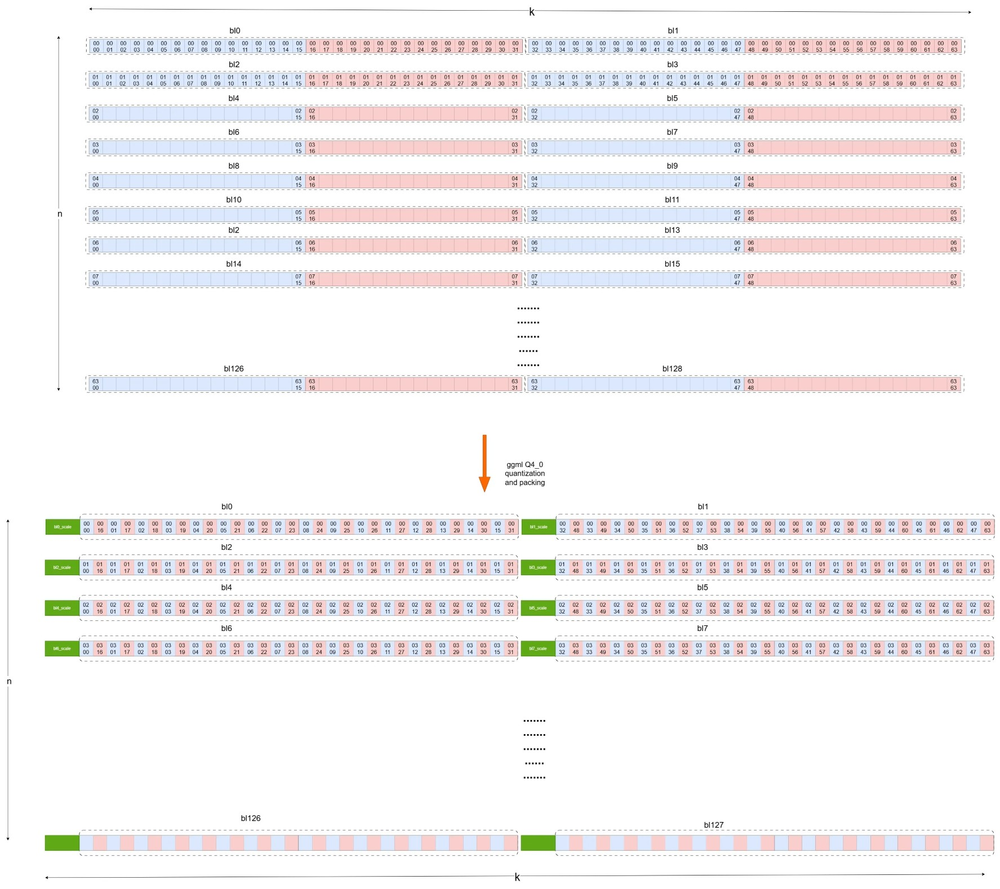
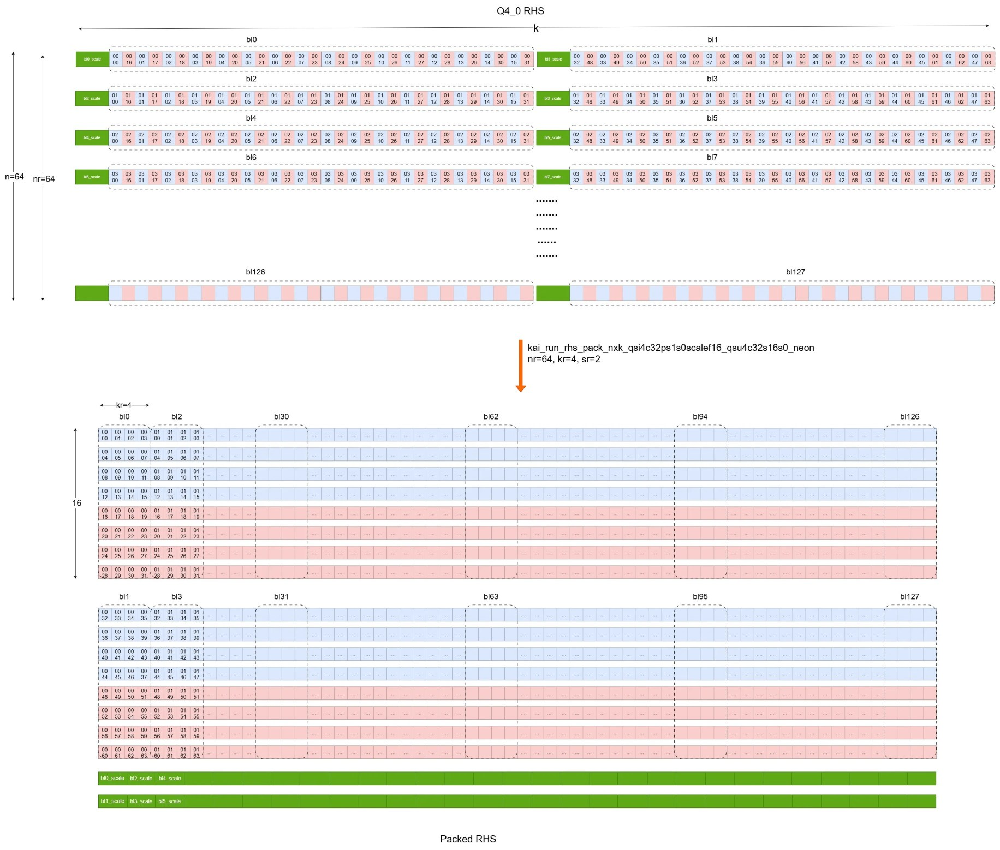
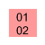

## Explain the SME2 matmul microkernel with an example - Part 1
By integrating the SME2‑optimized KleidiAI kernels into llama.cpp, the heavy matrix‑multiplication workloads in the K, Q, and V computations of the attention blocks, as well as in the FFN layers, can be delegated to the SME2 matmul microkernel when running the Llama-3.2-3B-Q4_0.gguf model.
In these operators, the LHS (activation) data type is FP32, while RHS (weight) type uses GGML Q4_0 quantized type. 

To make the demonstration easier in this learning path, the LHS dimension [m, k] is simplified to [16, 64], the RHS dimension [n, k] is simplified to [64, 64], and the SME2 SVL is set as 512-bit.

###Packing the RHS
Although the original Q4_0 RHS(weight) in the model uses INT4 quantization, it is signed INT4 quantization, rather than the unsigned INT4 quantization that the SME2 matmul microkernel requires. Moreover,the layout of the INT4 quantized data and the quantization scale does not meet the requirements of the SME2 matmul microkernel neither. Therefore, the LHS from the model needs to be converted from the signed INT4 data to unsigned INT4 and repacked. 
Since the RHS(weight) remains unchanged during the inference, this conversion and packing only need to be performed only once when loading the model. 


Let us have a close look at GGML Q4_0 quantization first to know how the orginal FP32 weight is quantized to Q4_0 format.
In the Q4_0 model, the Q4_0 weights are stored in layout of [n, k].
GGML Q4_0 quantizes weights in blocks of 32 floats. For each block, it calculates a scale for the block and then converts each value into a signed 4-bit integer. The scale is stored as FP16. 
Then GGML Q4_0 packs the values in a way of,
- the low nibble (bits 0–3) holds the first value (even index)
- and the high nibble (bits 4–7) holds the second value (odd index)
Thus, each byte contains a low/high pair. 
The following diagram shows how GGML Q4_0 quantizes and packs the original [n, k] FP32 matrix into Q4_0 type with layout of [n, k].


Unfortunately, the Q4_0 format does not meet the requirements of the SME2 matmul microkernel. It needs to be converted to an unsigned INT4 quantization format and repacked using the *kai_run_rhs_pack_nxk_qsi4c32ps1s0scalef16_qsu4c32s16s0_neon* function. 

In this example, we use m=16 and k=64.
- The required mr value for the SME2 matmul kernel is obtained using *kai_get_mr_matmul_clamp_f32_qai8dxp1vlx4_qsi8cxp4vlx4_1vlx4vl_sme2_mopa*. Here, mr=16.
- The required nr value for the SME2 matmul kernel is obtained using *kai_get_nr_matmul_clamp_f32_qai8dxp1vlx4_qsi8cxp4vlx4_1vlx4vl_sme2_mopa*. Here, nr=64.
- The required kr value for the SME2 matmul kernel is obtained using *kai_get_kr_matmul_clamp_f32_qai8dxp1vlx4_qsi8cxp4vlx4_1vlx4vl_sme2_mopa*. Here, kr=4.
- The required sr value for the SME2 matmul kernel is obtained using *kai_get_sr_matmul_clamp_f32_qai8dxp1vlx4_qsi8cxp4vlx4_1vlx4vl_sme2_mopa*. Here, sr=2 (two INT4 elements in a byte).

The function call stack for this process in llama.cpp when loading the model is as follows:
```text
llama_model_load  
  llama_model::load_tensors  
     llama_model_loader::load_all_data					 
			ggml_backend_tensor_set		 
				ggml_backend_cpu_kleidiai_buffer_set_tensor 
                        ggml::cpu::kleidiai::tensor_traits::repack
						    kai_run_rhs_pack_nxk_qsi4c32ps1s0scalef16_qsu4c32s16s0_neon
```
This process can be illustrated with the diagram below.


The numerical label of an element in the diagram is used to indicate its row and column number in the original matrix. For example , 

it indicates that the element locates at row 01, column 02 in the original matrix. This row and column number remains unchanged in its quantized and packed matrix, so that the location of the element can be tracked easily. 

Now, the RHS is converted and packed into a format that can be handled by the SME2 matmul microkernel, allowing the packed RHS to be loaded into SME2 Z registers with sequential memory access. This improves memory access efficiency and reduces cache misses.