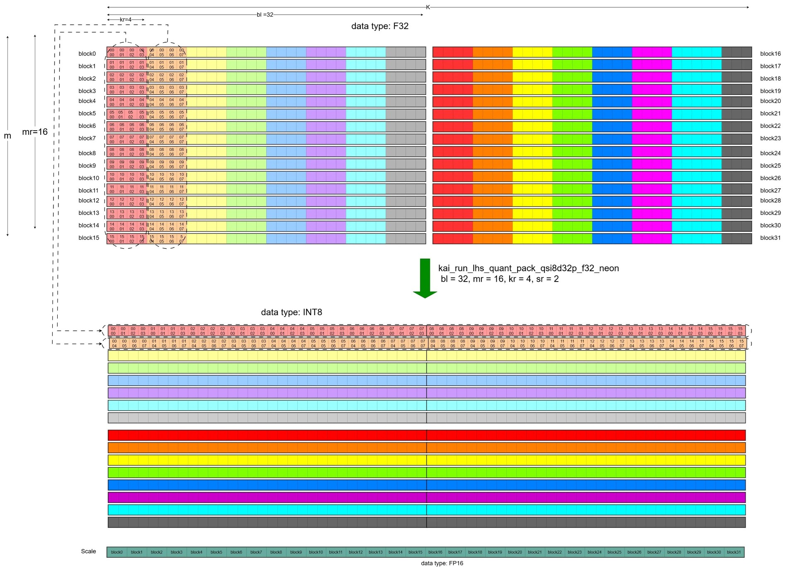

## Explain the SME2 matmul microkernel with an example - Part 2
Next, the FP32 LHS (activation) needs to be quantized and packed when the llama.cpp graph runner computes the matmul nodes/operators. 

### Quantization and Packing of the LHS
Since the LHS (activation) keep changing, we need to dynamically quantize the original FP32 matrix and pack it into the qsi8d32p1vlx4 format. This can be achieved using the *kai_run_lhs_quant_pack_qsi8d32p_f32_neon* microkernel.

The function call stack for this process in llama.cpp is as follows:
```text
llama_context::decode
   llama_context::process_ubatch
      llama_context::graph_compute
	     ggml_backend_sched_compute_splits
		    ggml_backend_cpu_graph_compute
			   ggml_graph_compute             //tick off the compute thread
			      ggml_graph_compute_thread   //the compute thread
				     ggml_compute_forward
					     ggml_cpu_extra_compute_forward
						    ggml::cpu::kleidiai::tensor_traits::compute_forward
							    ggml::cpu::kleidiai::tensor_traits::compute_forward_q4_0
								    kai_run_lhs_quant_pack_qsi8d32p_f32_neon
```
The diagram below illustrates how the RHS is quantized and packed by *kai_run_lhs_quant_pack_qsi8d32p_f32_neon*,


The values of mr, nr, and kr can be obtained in the same way as described above.
The mr, nr, and kr together with the matrix dimensions m and k are passed as parameters to *kai_run_lhs_quant_pack_qsi8d32p_f32_neon*. This function quantizes the FP32 LHS to signed INT8 type and packed the quantized data and quantization scales as shown in the diagram above. It divides the m x n matrix into submatrices of size mr x kr (it is 16 x 4) as shown in blocks outlined by dashed lines in the upper matrix of the diagram, and then sequentially packs the rows within each submatrix. This allows the SME2 matmul kernel to load an entire submatrix into an SME2 Z register from contiguous memory, thus reducing cache misses by avoiding loading the submatrix across multiple rows.
