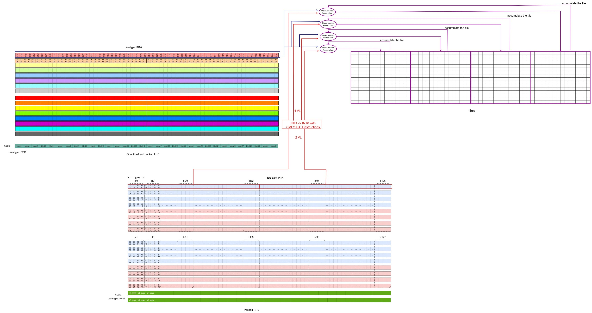
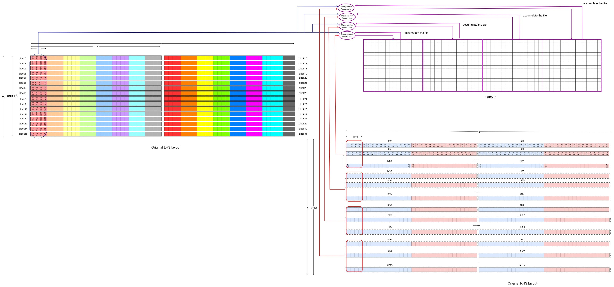
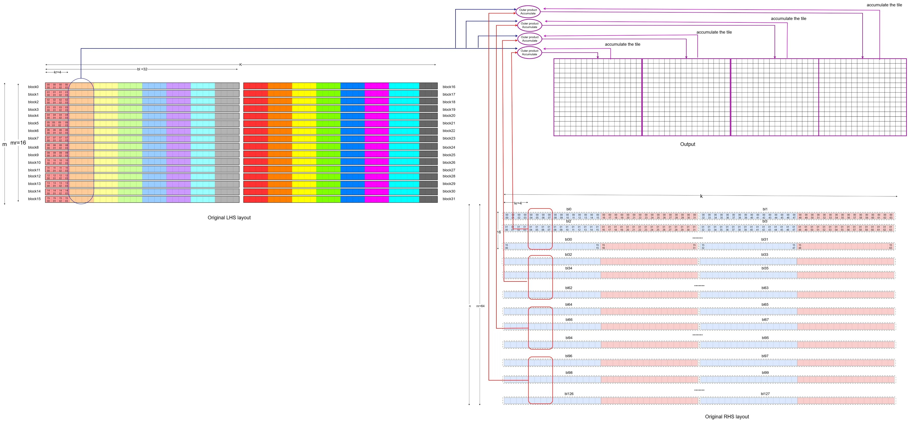

## Walk the SME2 matmul inner loop
Once both the packed LHS and packed RHS are ready, the SME2 matmul microkernel can run.

### Run the SME2 matmul microkernel (conceptually)

This section describes the core operations that compute a 16×64 output tile (four 16×16 submatrices, 1VL × 4VL).

- Iterate over the `K` dimension in blocks
  - Iterate in a block with step of kr (kr=4) 
    - Load one SME2 SVL-length (512-bit) of data from the quantized and packed LHS (containing 64 INT8 values) into one SME2 Z register
    - Load two SME2 SVL-lengths of data from the packed RHS (containing 2 x64x2 INT4 values) into two SME2 Z registers, then use the SME2 LUTI4 lookup table instruction to convert these INT4 values into INT8 type, extending them to four SME2 Z registers (4VL).
        - Use the SME2 INT8 MOPA (outer product accumulate) instruction to compute outer products and accumulate into four ZA tiles (initialized to zero). This produces intermediate results for four 16×16 output submatrices.

        The first iteration can be illustrated in the diagram below:

        The diagram below illustrates the second iteration along `K`:

  - After completing the iterations in the block, the intermediate INT32 results are dequantized to FP32 using the per-block LHS and RHS scales.
  - This step uses vector instructions such as floating-point multiply (FMUL), floating-point multiply-accumulate (FMLA), and signed fixed-point convert to floating-point (SCVTF).
  - It produces intermediate FP32 results for the four 16×16 output submatrices.
  - Accumulate the FP32 result above

After completing the iterations along the `K` dimension, the FP32 results of the four 16×16 output submatrices are ready. The kernel then stores the output tile back to memory.

The snippet (from [the source code](https://github.com/ARM-software/kleidiai/blob/main/kai/ukernels/matmul/matmul_clamp_f32_qsi8d32p_qai4c32p/kai_matmul_clamp_f32_qsi8d32p1vlx4_qai4c32p4vlx4_1vlx4vl_sme2_mopa_asm.S)) below highlights the inner loop structure.
```asm
KAI_ASM_LABEL(label_3)              // K Loop
    KAI_ASM_INST(0xc00800ff)        // zero {za} ， zeros the four ZA tile (za0.s, za1.s, za2.s, za3.s)
    mov x11, x4                //Set block size
KAI_ASM_LABEL(label_4)              // Block Loop
    KAI_ASM_INST(0xa0404342)        //ld1w {z2.s - z3.s}, pn8/z, [x26]   // load two VLs packed RHS data (64x2x2 INT4 data)
    addvl x26, x26, #2    // increase RHS address by two VLs
    ld1h {z8.h}, p0/z, [x3]    //load one VL quantized and packed LHS data (64 INT8 data)
    addvl x3, x3, #1       // increase LHS address by one VLs
    KAI_ASM_INST(0xc08a4044)        // luti4 {z4.b - z5.b}, zt0, z2[0]  //use LUT4I instruction to convert INT4 to INT8, one source VL produces two VLs result 
    KAI_ASM_INST(0xc08a4066)        // luti4 {z6.b - z7.b}, zt0, z3[0]  //use LUT4I instruction to convert INT4 to INT8, one source VL produces two VLs result
    KAI_ASM_INST(0xa0840100)        // smopa za0.s, p0/m, p0/m, z8.b, z4.b   ]  //Outer Product Accumulate with the VL of LHS, the first VL of RHS and ZA0.S
    KAI_ASM_INST(0xa0850101)        // smopa za1.s, p0/m, p0/m, z8.b, z5.b   //Outer Product Accumulate with the VL of LHS, the second VL of RHS and ZA1.S
    KAI_ASM_INST(0xa0860102)        // smopa za2.s, p0/m, p0/m, z8.b, z6.b   //Outer Product Accumulate with the VL of LHS, the third VL of RHS and ZA2.S
    KAI_ASM_INST(0xa0870103)        // smopa za3.s, p0/m, p0/m, z8.b, z7.b      // Outer Product Accumulate with the VL of LHS, the fourth VL of RHS and ZA3.S

    subs x11, x11, #4     //block_index - 4
    b.gt label_4       //end of block iteration?
    
   // the code below performs per block dequantization of the four tiles with LHS and RHS scales
    mov w12, #0
    mov x25, x24
    ld1b {z17.b}, p4/z, [x3]               // lhs sum
    ld1b {z16.b}, p4/z, [x3, #1, mul vl]   // lhs scale
    addvl x3, x3, #2
    KAI_ASM_INST(0xa040c354)        // ld1w { z20.s - z23.s }, pn8/z, [x26]            // rhs zp
    KAI_ASM_INST(0xa041c340)        // ld1w { z0.s - z3.s }, pn8/z, [x26, #4, mul vl ] // rhs scale
    addvl x26, x26, #8
    pfalse p3.b
KAI_ASM_LABEL(label_5)
    // omit some codes that perform the block quantization and save the result to memory 
    ...
    blt label_5
    subs x10, x10, x4     //decrease the K index
    b.gt label_3     //end of K loop?

```
In a single block-loop iteration, four pipelined SME2 INT8 MOPA instructions perform 4,096 multiply-accumulate (MAC) operations, calculating the intermediate results for four 16×16 submatrices.

To connect this back to "normal" FP32 matmul, map one iteration of quantization + packing, the SME2 MOPA step, and dequantization to an equivalent FP32 computation (with expected quantization loss).


The second iteration can be mapped back to the original FP32 LHS and RHS operations as below,


**Note**: In this diagram, the RHS is laid out in the dimension of [N, K], which is different from the [K, N] dimension layout of the RHS in the video demonstration of 1VLx4VL. If you interpret the RHS in the diagrams above using the [K, N] dimension, you can match the previous video demonstration with the diagrams above.

By repeating the submatrix computation across the M and N dimensions, the entire result matrix can be calculated. If a non-empty bias is passed to the SME2 matmul microkernel, it also adds the bias to the result matrix.

### Hands-on: follow the inner loop in the source (optional)

If you cloned KleidiAI earlier, you can search the microkernel for the exact "load → LUTI → MOPA" sequence shown above.

From the KleidiAI repo root:

```bash
KERNEL_FILE="kai/ukernels/matmul/matmul_clamp_f32_qsi8d32p_qai4c32p/kai_matmul_clamp_f32_qsi8d32p1vlx4_qai4c32p4vlx4_1vlx4vl_sme2_mopa_asm.S"
grep -n "zero {za}" "$KERNEL_FILE" | head
grep -n "luti" "$KERNEL_FILE" | head
grep -n "smopa" "$KERNEL_FILE" | head
```

If you have a recent LLVM toolchain on an Arm Linux host, you can also try assembling and disassembling the kernel to see `smopa` in the output. Toolchain details vary across distributions, so treat this step as optional.
