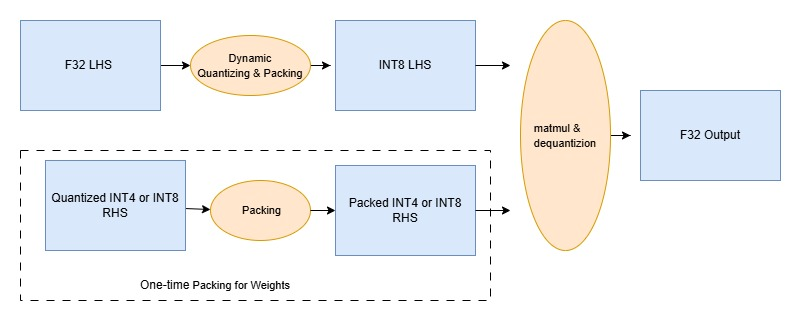

## Matmul tiling and packing

At a high level, a KleidiAI matmul microkernel computes the output matrix `C` in tiles. Instead of producing the full matrix `C` in one pass, it produces small submatrices (tiles) of `C` one by one.

### Understand the tiling parameters

Microkernels typically expose a small set of constants that define the tile shape and the inner-loop step sizes:
- **mr**: number of rows of `C` (and `A`) computed per output tile
- **nr**: number of columns of `C` (and `B`) computed per output tile
- **bl**: number of elements from the `K` dimension processed per block
- **kr**: number of elements from the `K` dimension processed per inner step

The video below demonstrates how matrix multiplication is carried out using this method.


This process can be described with the following pseudocode:
```c
// RHS N LOOP
for(n_idx = 0; n_idx < n; n_idx+=nr){
    // LHS M LOOP
    for(m_idx = 0; m_idx < m; m_idx+=mr){
        // K LOOP, break K into blocks first
        blocks_in_K= K/bl;     // bl is the block length
        //Block Loop 
        for(bl_idx = 0; bl_idx< blocks_in_K; bl_idx += 1) {
              //Loop inside a block
              krs_in_block= bl/kr;  //kr is the number of elements in K dimension per inner loop
              for(k_idx = 0; k_idx < krs_in_block; k_idx +=1) {
               // Perform the matrix multiplication with source submatrices of size [mr, kr] and [kr, nr]
               // Accumulate the matrix multiplication result above into per block level result.
                 ...
              }       
          // Accumulate per block level results along K dimension. When iteration on K dimension is completed,a submatrix of size [mr, nr] of the output matrix is ready        
        }
    //Continue computing a submatrix of size [mr, nr] of the output matrix along M dimension
   }
  //Continue computing a submatrix of size [mr, nr] of the output matrix along N dimension 
}
```

In practice, KleidiAI matmul microkernels follow this pattern, but use tight loops, explicit packing, and architecture-specific instructions.

### Understand why packing matters

KleidiAI also provides corresponding packing microkernels for the matmul microkernels, in order to make efficient contiguous memory access to the input of the matrix multiplication, reducing cache misses.

### See the quantized matmul dataflow

KleidiAI supports quantized matrix multiplication to speed up AI inference on Arm CPUs. Instead of multiplying full precision (FP32) matrices `A` and `B` directly, it quantizes:
- The left-hand source (LHS, activations) to 8-bit integers
- The right-hand source (RHS, weights) to 4-bit or 8-bit integers

It then packs those quantized values into memory layouts that match the CPU’s preferred access patterns and instruction shapes (for example, DotProd, I8MM, and SME2).

The matmul microkernel runs on the packed quantized data, accumulates into a wider type (typically INT32), and then scales back to FP32.

This process can be illustrated in the following diagram,


### Hands-on: confirm the tiling idea in the source (optional)

Validate that `mr/nr/kr`-style constants exist and are exposed via small helper functions.

Run the following commands from the KleidiAI repo root:

```bash
grep -R "kai_get_mr_matmul" -n kai | head
grep -R "kai_get_nr_matmul" -n kai | head
grep -R "kai_get_kr_matmul" -n kai | head
```

The output is similar to:
```output
(...)
kai/ukernels/matmul/matmul_clamp_f32_qai8dxp_qsi4cxp/kai_matmul_clamp_f32_qai8dxp1x4_qsi4cxp4vlx4_1x4vl_sme2_sdot.h:52:size_t kai_get_kr_matmul_clamp_f32_qai8dxp1x4_qsi4cxp4vlx4_1x4vl_sme2_sdot(void);
```

You’ll use these values later when you connect the packing steps to the inner loop of the SME2 microkernel.

For more background on KleidiAI, see [Accelerate Generative AI workloads using KleidiAI](/learning-paths/cross-platform/kleidiai-explainer/).