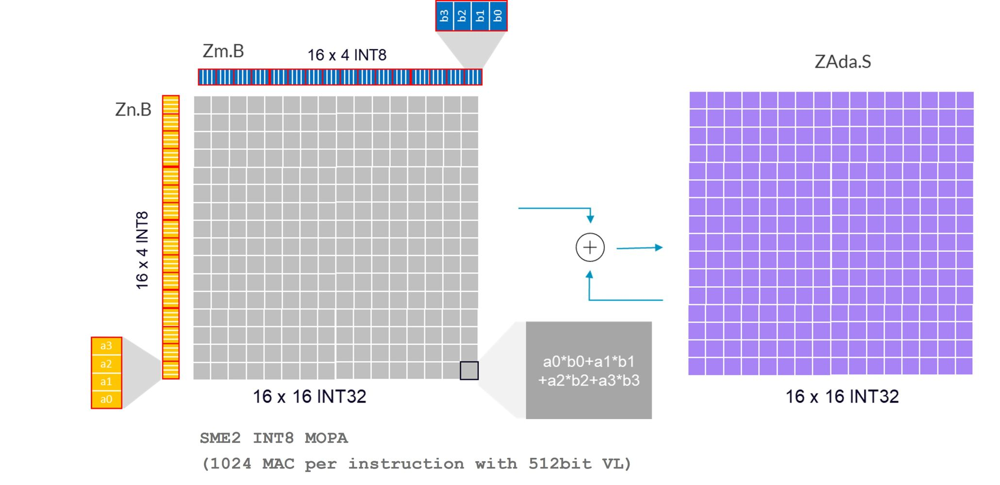

## SME2 INT8 MOPA for matmul

SME2 INT8 MOPA (outer product accumulate) instructions compute the sum of outer products for INT8 inputs, widen the results into INT32, and accumulate into an SME2 tile in the ZA storage.

### Understand what MOPA computes


When the SME2 streaming vector length (SVL) is 512 bits, each input register (`Zn.B`, `Zm.B`) can be treated as a matrix of 16×4 INT8 elements (with a hardware-defined arrangement).
- The first source, Zn.B contains a 16x4 sub-matrix of 8-bit integer values.
- The second source, Zm.B, contains a 16 x4 sub-matrix of 8-bit integer values.
- The INT8 MOPA instruction calculates a 16×16 widened INT32 sum of outer products, then destructively adds it to the INT32 destination tile, `ZAda`.

The video below shows how SME2 INT8 Outer Product Accumulate instructions are used for matrix multiplication.


### Map MOPA to a 16×16 output tile

To calculate the result of a 16×16 submatrix in matrix `C` (element type: INT32):

First,
-	a 16x4 sub-matrix in matrix A (element type: INT8) is loaded to a SME2 Z register,
-	a 4x16 sub-matrix in matrix B (element type: INT8) is loaded to another SME2 Z register
-	a 16x16 sub-matrix in matrix C is stored in an SME2 ZA tile, which is initialized to zero only once 

Then, the SME2 INT8 MOPA instruction uses the data from these two Z registers to perform the outer product operation and accumulates the results into the ZA tile, which holds the 16x16 sub-matrix of matrix C, thus obtaining an intermediate result for this 16x16 sub-matrix.

Iterate over the K dimension, repeatedly loading 16x4 submatrices from matrix A and 4×16 submatrices from matrix B. For each step, use the SME2 INT8 MOPA instruction to compute outer products and accumulate the results into the same ZA tile. After completing the iteration over K, this ZA tile holds the final values for the corresponding 16×16 submatrix of matrix C. Finally, store the contents of the ZA tile back to memory.

Apply the same process across the `M` and `N` dimensions to compute the full output matrix.

Apply the same process to all 16x16 sub-matrices in matrix C to complete the entire matrix computation.

### See the 1VL×4VL pattern

To improve throughput, a microkernel can pipeline multiple MOPA instructions so that it accumulates into multiple ZA tiles in parallel. One common pattern is 1VL×4VL: one VL slice from the LHS multiplies four VL slices from the RHS in the same inner-loop iteration, accumulating into four ZA tiles.

The video below demonstrates how four pipelined MOPA instructions perform matrix multiplication of one 16×4 submatrix from matrix A and four 4×16 submatrices from matrix B in a single iteration (1VL×4VL).


The intermediate result of 4x16x16 output submatrix is held in four ZA.S tiles.

### Hands-on: locate MOPA in the SME2 microkernel (optional)

If you cloned KleidiAI earlier, you can confirm that the SME2 matmul microkernel uses MOPA by searching for `smopa` instructions in the kernel source.

From the KleidiAI repo root:

```bash
KERNEL_FILE="kai/ukernels/matmul/matmul_clamp_f32_qsi8d32p_qai4c32p/kai_matmul_clamp_f32_qsi8d32p1vlx4_qai4c32p4vlx4_1vlx4vl_sme2_mopa_asm.S"
grep -n "smopa" "$KERNEL_FILE" | head
```

You’ll connect these `smopa` sites to the "load → dequantize → MOPA → dequantize" flow later in the example walk-through.

You can find more information about SME2 MOPA here,
-  [part 1 Arm Scalable Matrix Extension Introduction](https://developer.arm.com/community/arm-community-blogs/b/architectures-and-processors-blog/posts/arm-scalable-matrix-extension-introduction)
- [part 2 Arm Scalable Matrix Extension Instructions](https://developer.arm.com/community/arm-community-blogs/b/architectures-and-processors-blog/posts/arm-scalable-matrix-extension-introduction-p2)
-  [part4 Arm SME2 Introduction](https://developer.arm.com/community/arm-community-blogs/b/architectures-and-processors-blog/posts/part4-arm-sme2-introduction)
   