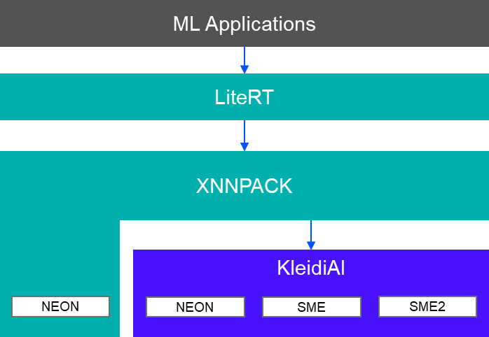
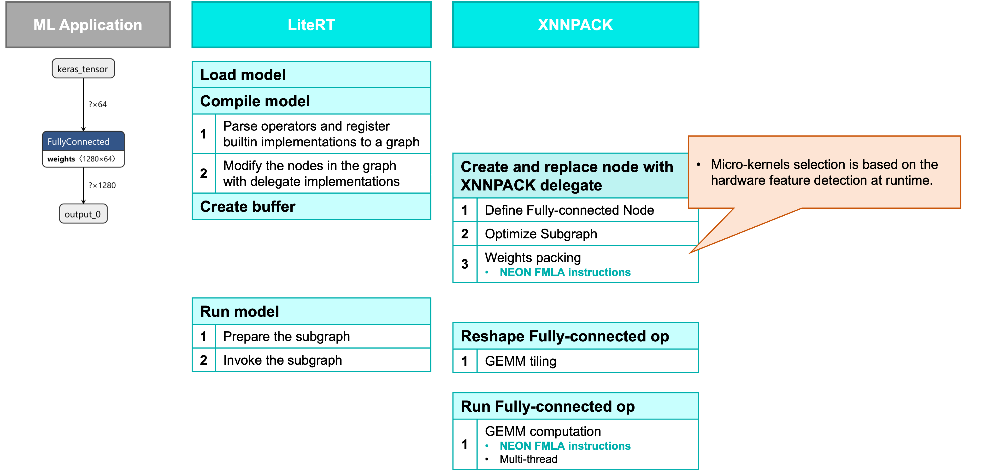
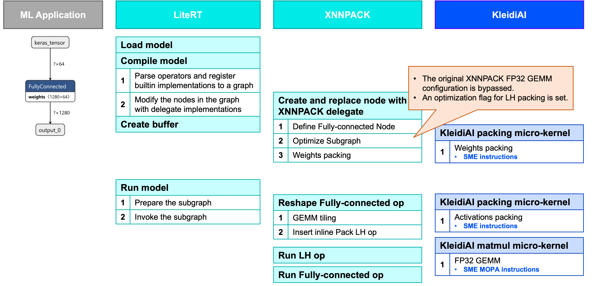

## LiteRT, XNNPACK, KleidiAI and SME2

LiteRT (short for Lite Runtime), formerly known as TensorFlow Lite, is a runtime for on-device AI.
The default CPU acceleration library used by LiteRT is XNNPACK.

XNNPACK is an open-source library that provides highly optimized implementations of neural-network operators. It continuously integrates KleidiAI library to leverage new CPU features such as SME2.

KleidiAI is a library developed by Arm that offers performance-critical micro-kernels leveraging Arm architecture features, such as SME2.

Both XNNPACK and KleidiAI are external dependencies of LiteRT. LiteRT specifies the versions of these libraries to use.
When LiteRT is built with both XNNPACK and KleidiAI enabled, XNNPACK invokes KleidiAI’s micro-kernels at runtime to accelerate operators with supported data types; otherwise, it falls back to its own implementation.

The software stack for LiteRT is as follows.

## Understand how KleidiAI works in LiteRT

To understand how KleidiAI SME2 micro-kernel works in LiteRT, a LiteRT model with one Fully Connected operator with FP32 datatype is used as an example. 

The following illustrates the execution workflow of XNNPACK’s implementation compared with the workflow when KleidiAI SME2 is enabled in XNNPACK.

### LiteRT → XNNPACK workflow

A Fully Connected operator can be essentially implemented as a matrix multiplication.

When LiteRT loads a model, it parses the operators and create a computation graph. If the CPU is selected as the accelerator, LiteRT uses XNNPACK by default.

XNNPACK traverses the operators in the graph and tries to replace them with its own implementations. During this stage, XNNPACK performs the necessary packing of the weight matrix. To speed up the packing process, XNNPACK uses NEON instructions for Arm platform. XNNPACK provides different implementations for different hardware platforms. At runtime, it detects the hardware capabilities and selects the appropriate micro-kernel.

During model inference, XNNPACK performs matrix multiplication on the activation matrix (the left-hand side matrix, LHS) and the repacked weight matrix (the right-hand side matrix, RHS). In this stage, XNNPACK applies tiling strategies to the matrices and performs parallel multiplication across the resulting tiles using multiple threads. To accelerate the computation, XNNPACK uses NEON instructions.

### LiteRT → XNNPACK → KleidiAI workflow

When KleidiAI and SME2 are enabled at building stage, the KleidiAI SME2 micro-kernels are compiled into the XNNPACK. 

During the model loading stage, when XNNPACK optimizes the subgraph, it checks the operator’s data type to determine whether a KleidiAI implementation is available. If KleidiAI supports it, XNNPACK bypasses its own default implementation. As a result, RHS packing is performed using the KleidiAI SME packing micro-kernel. In addition, because KleidiAI typically requires packing of the LHS, a flag is also set during this stage.

During model inference, the LHS packing micro-kernel is invoked. After the LHS is packed, XNNPACK performs the matrix multiplication. At this point, the KleidiAI SME micro-kernel is used to compute the matrix product.