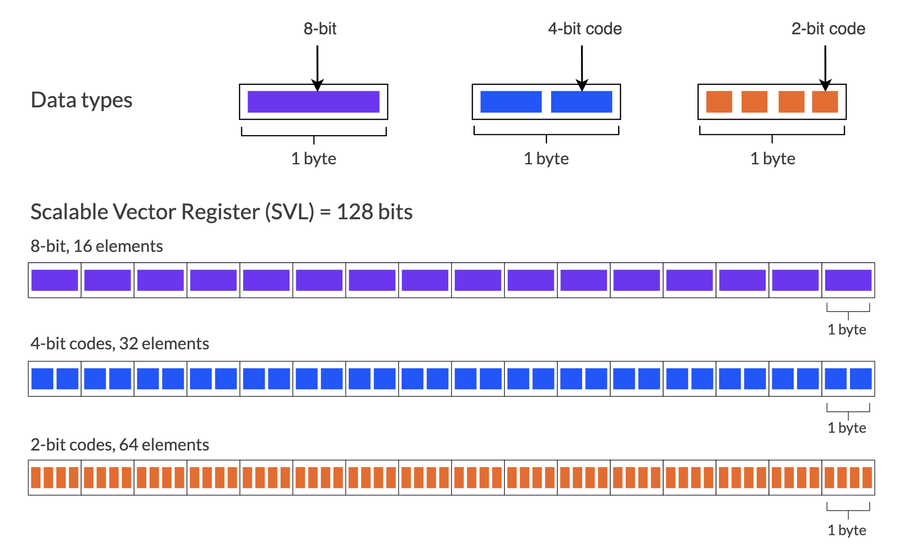
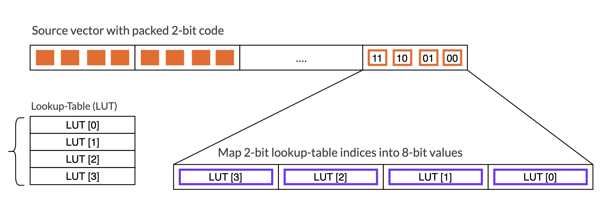

## Overview
Large language model (LLM) inference on the CPU is now practical on mobile and edge devices, due in large part to the rise of low-bit AI models.
Low-bit AI models store weights in a compact packed format that must be efficiently expanded before matrix multiplication. You will see how 2-bit and 4-bit weights are stored, why conventional unpacking adds cycles, and how lookup-table instructions (LUTI) remove the unpacking step.

By the end, you should be able to explain why packed low-bit indices are efficient for storage and memory traffic, how the indices are laid out in memory and how to use LUTI instructions to efficiently expand them.

## Why use sub-byte weights?

LLM inference on mobile and edge devices is often limited by memory capacity and bandwidth. During inference, model weights must be transferred from memory to the CPU, contributing to latency and energy use.

Quantization reduces this traffic by storing weights in lower-precision formats. Weight-only quantization maps each 32-bit floating-point (`fp32`) weight to a compact logical code and stores shared metadata, such as a scale or zero point, for each block.

{} The terms `4-bit` and `2-bit` specify the number of bits assigned to each logical code. These codes do not necessarily denote the numerical datatypes `int4` or `int2`. A `4-bit` or `2-bit` code might represent a signed integer, an unsigned integer, or an index into a codebook, depending on the quantization format. {}

Physical packing is the storage layout that places several low-bit codes into each byte. If you ignore the metadata, four `2-bit` codes or two `4-bit` codes can be stored in one byte.



This approach trades reconstruction accuracy for lower memory use. Its value also depends on decoding the packed codes efficiently. LUTI achieves that by expanding low-bit codes directly into arithmetic-ready vector values.

## Understand the LUTI operation

Matrix multiplication kernels do not usually operate on packed 2-bit or 4-bit codes.
Before arithmetic, the codes must be decoded into values the computation can consume.

Conceptually, the operation is:
```c
index = get_lut_index(packed_code);
expanded_value = lookup_table[index];
```

Armv9-A LUTI instructions perform lookup-table operations that map low-bit indices to expanded values. LUTI2 and LUTI4 operate on 2-bit and 4-bit indices, respectively.

- `LUTI2` uses each 2-bit index to select one of four lookup-table values.
- `LUTI4` uses each 4-bit index to select one of sixteen lookup-table values.

The lookup table defines the expanded value associated with each code according to the quantization scheme.

### LUT for 2-bit codes

For example, a 2-bit lookup table might contain:

| Packed Code | LUT Index | Expanded Value |
|---|---|---|
| `0b00` | lut[0] | `-2` |
| `0b01` | lut[1] | `-1` |
| `0b10` | lut[2] | `0`  |
| `0b11` | lut[3] | `1`  |


### From packed 2-bit codes to 8-bit values
The key benefit of LUTI is that the matrix multiplication kernel can load weights in their compact form. A source vector of packed weights therefore carries more values per memory load than a vector containing already expanded 8-bit, 16-bit, or 32-bit values.

For 2-bit codes, LUTI uses the packed indices in a source vector to select lookup-table entries and writes the resulting values to destination vector registers. The following diagram shows how 2-bit codes expand into 8-bit values.



## Identify LUTI responsibilities

Keep these points in mind when using LUTI:

- The lookup table defines the meaning of each packed code
- LUTI2 and LUTI4 expand indices; they don't calculate quantization metadata
- Scaling, zero-point correction, bias, activation, clamping, and requantization remain separate operations
- Expansion happens in the vector path, close to the arithmetic that consumes the values

## What you've learned and what's next
You've learned how LUTI uses packed low-bit codes as indices and expands them into values for subsequent arithmetic.

Next, you'll set up the compiler and SME2 hardware needed to build and run the examples.
