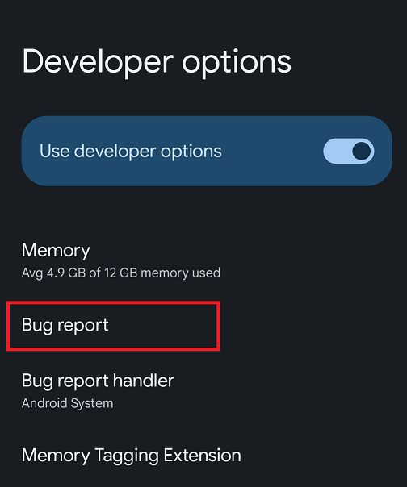
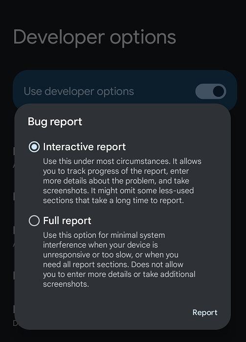
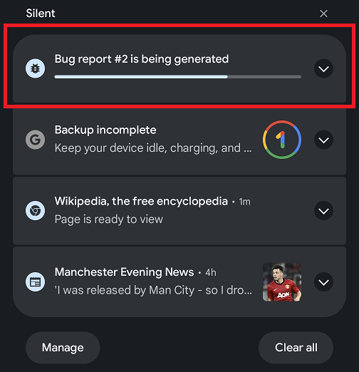
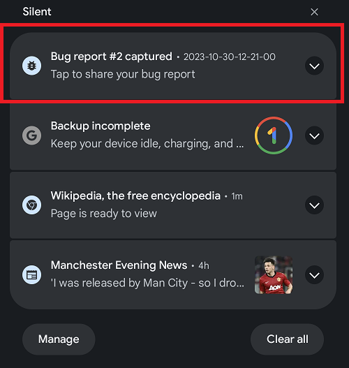
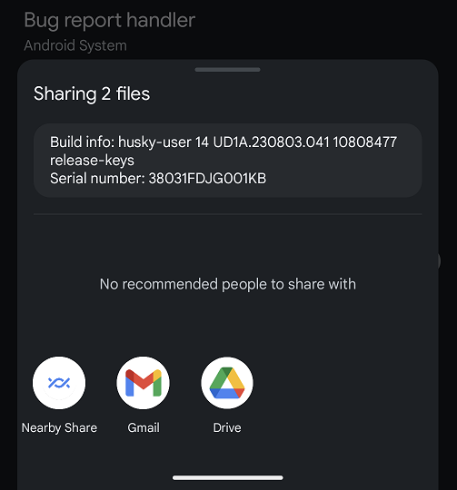

## Capturing the Bug Report
A bug report contains device logs, stack traces, and other diagnostic information to help you find and fix bugs in your application. If MTE is enabled on the device, the bug report will contain specific additional information about the memory bug. To capture a bug report on your Google Pixel 8, use the Bug report option available in the Developer options menu, as shown below:

Select the Bug report option to capture the bug report and tap Report at the bottom:

At this point the bug report generation starts. You can see the progress of the report generation by scrolling down the notification panel, as shown below. By tapping on the drop-down icon on the right, you can add a name and comments for the bug report:   

Once the bug report generation has completed, you can share it by tapping on the notification:

The report is a big text file containing information about the cause of the crash and where it happened (best suited for viewing on your desktop machine). You can send the report using any of the available options on your phone:

