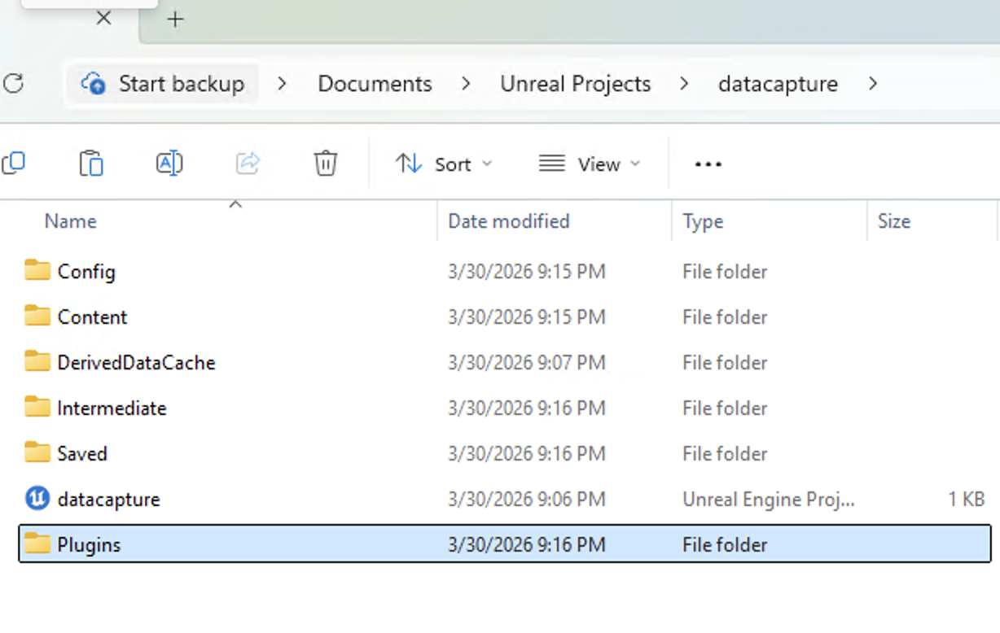
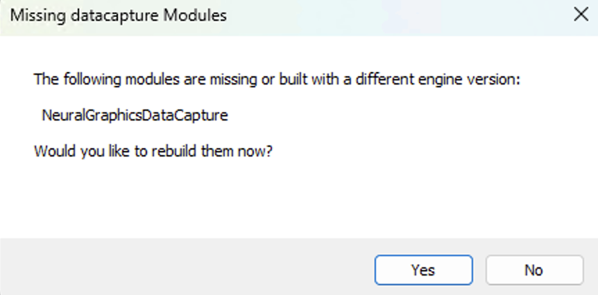
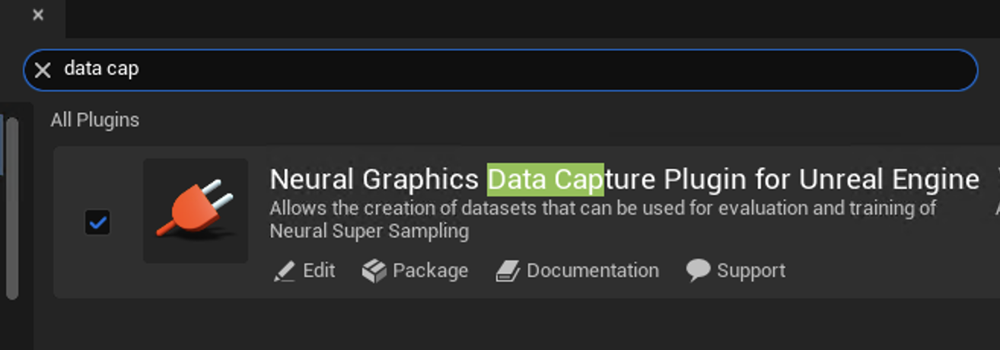

## Before you begin

This plugin currently supports **Unreal Engine 5.5**.

Use a **C++ Unreal project** so the plugin module can compile through Visual Studio.

## Add plugin files to your project

1. Open your Unreal project folder in File Explorer.
2. Create a `Plugins` folder at the root of the project if it does not already exist.
3. Copy the `NeuralGraphicsDataCapture` plugin folder into `Plugins/`.

## Reopen project and build module

1. Reopen the `.uproject` file.
2. If prompted about missing modules, click **Yes** to rebuild.

3. Build the project in Visual Studio.

{}
If Unreal does not detect the plugin after copying files, regenerate project files and rebuild from Visual Studio.
{}

## Verify plugin is enabled

In Unreal Editor:

1. Go to **Edit > Plugins**.
2. Search for `data cap`.
3. Confirm **Neural Graphics Data Capture Plugin for Unreal Engine** is enabled.

Next, add the capture graph to your Level Blueprint.
