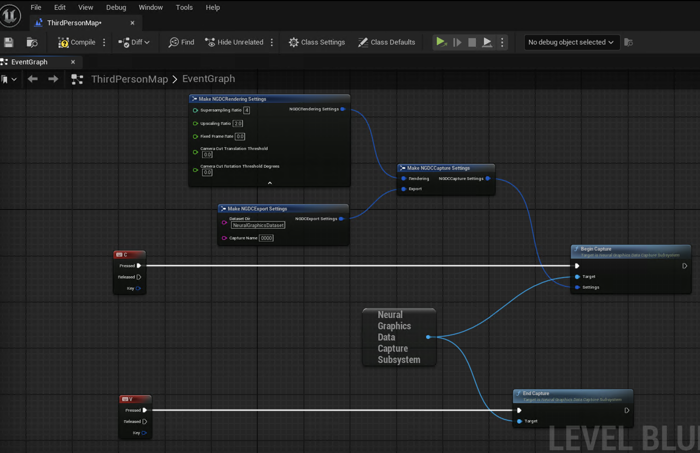

## Open the Level Blueprint

In your level:

1. Open the **Blueprints** drop-down.
2. Select **Open Level Blueprint**.


## Fast path: download and paste the ready-made blueprint snippet

On Windows, download the prepared Level Blueprint snippet from this Learning Path repository:

```powershell
wget "https://raw.githubusercontent.com/ArmDeveloperEcosystem/arm-learning-paths/main/content/learning-paths/mobile-graphics-and-gaming/neural-graphics-data-capture-unreal/assets/level_blueprint.txt" -OutFile ".\level_blueprint.txt"
```

Then in Unreal Editor:

1. Open `level_blueprint.txt` in a text editor and copy all text.
2. Click empty space in the Level Blueprint Event Graph.
3. Paste to create the full node graph.
4. Click **Compile** and **Save**.

{}
If you use Git Bash with GNU `wget`, use `wget -O level_blueprint.txt "https://raw.githubusercontent.com/ArmDeveloperEcosystem/arm-learning-paths/main/content/learning-paths/mobile-graphics-and-gaming/neural-graphics-data-capture-unreal/assets/level_blueprint.txt"` instead.
{}

## Optional: understand what the snippet creates

The snippet wires the following capture flow:

- Gets the **Neural Graphics Data Capture Subsystem**.
- Builds `NGDCCaptureSettings` from:
  - `NGDCRenderingSettings`
  - `NGDCExportSettings`
- Calls **Begin Capture** on key `C`.
- Calls **End Capture** on key `V`.

It also sets these export defaults to match this tutorial:

- `Dataset Dir`: `NeuralGraphicsDataset`
- `Capture Name`: `0000`


The full event graph should look similar to this:



Continue to run the level in Standalone mode and test capture.
