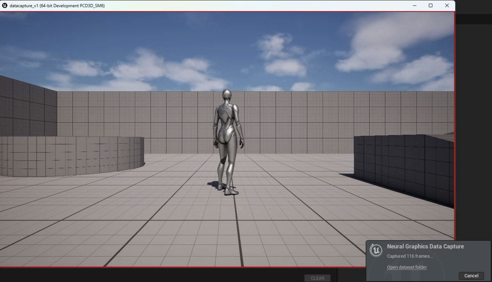

## Run in Standalone Game mode

Use **Standalone Game** for capture:

- Open the play mode menu next to the **Play** button.
- Select **Standalone Game**.


{}
If you use **New Editor Window (PIE)**, captured frame dimensions can differ from expected output sizes.
{}

## Start and stop capture

- Press **Play**.
- Press `C` to begin capture.
- Move through the level to capture frames.
- Press `V` to stop capture.



After stopping, you should see a completion notification in the bottom right corner. 

## Locate the dataset

Captured output is written under:

```
<YourProject>/Saved/NeuralGraphicsDataset/
```

With the defaults from this tutorial, see:

```
<YourProject>/Saved/NeuralGraphicsDataset/0000
```

Proceed to the next section to tune settings and troubleshoot common issues.
