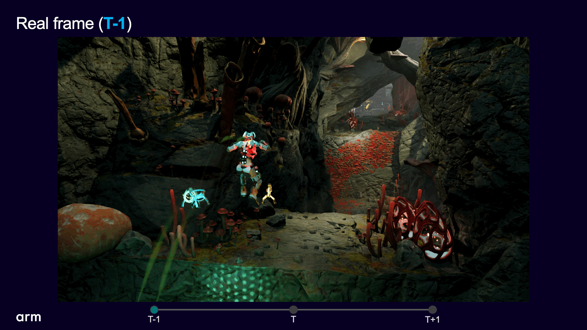
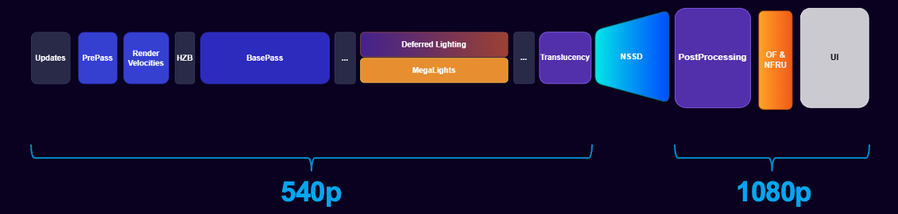

## Integration approach

The previous sections focused on the results and capabilities of Arm Neural Technology techniques. This section explains the core building blocks and what's involved in using them, making the technology easier to evaluate in the context of your own game.

Arm provides the foundation: the Unreal Engine plugins, the SDK, prebuilt models, and tooling to run and evaluate them with today’s runtime path centered on Vulkan on Arm platforms. You also get reference implementations and sample content to help you get started quickly, all packaged in the Neural Graphics Development Kit mentioned in the introduction.

What you own is everything that makes this work in your game. That includes integrating the technology into your rendering pipeline, ensuring that required inputs such as motion vectors are correct, and evaluating whether the output meets your quality bar. You're also responsible for making tradeoffs between performance, quality, and latency, and for handling edge cases that arise from your specific content.

In some cases, you might also choose to customize or retrain models. More on that later.

The important takeaway is that Arm Neural Technology is not a feature you simply enable. It's a system you integrate, evaluate, and tune. Understanding that upfront will make the rest of the playbook (and your evaluation process) much more effective.

## Technical overview

### NFRU

Neural Frame Rate Upscaling (NFRU) makes motion feel smooth. It works by looking at two consecutive frames and estimating how every pixel moves between them. This uses optical flow, which operates in image space and captures not just object motion, but also changes in lighting, shading, and other effects that show up in the final image.

With that motion data, both frames are warped toward the intermediate timestep. This gives you two different estimates for what the in-between frame should look like: one coming forward from the previous frame, and one coming backward from the next.

Those estimates don't line up perfectly. Some areas are missing, some disagree, and some are wrong due to motion estimation errors. The neural network resolves this. It looks at the warped inputs and the motion field, and learns how to combine them into a single, coherent frame. This includes deciding which input to trust, reconstructing newly visible regions, and smoothing out artifacts so the result is stable over time.

Rather than interpolating, NFRU reconstructs motion. It sits at the very end of the pipeline. By that point, the image has already been denoised and upscaled, so the model works with relatively clean inputs, which makes the problem easier to solve.

### NSSD

Neural Super Sampling and Denoising (NSSD) is where most of the image quality is actually recovered. It takes a low-resolution, noisy render and turns it into something that looks like a clean, high-resolution frame.

The important thing to understand is that the input here is intentionally very rough. The technique renders at 540p and takes only a few lighting samples per pixel. With stochastic rendering techniques such as ReSTIR and MegaLights, this means the image is dominated by noise.

The pipeline is often described as a “compute, neural, compute” sandwich, which is actually a useful way to think about it. It starts with a preprocessing pass that gathers all the information the network needs. This includes not just the noisy radiance buffer, but also depth, normals, motion vectors, and material properties such as albedo and specular.

That context allows the network to understand where surfaces begin and end, how they’re oriented, and how they move over time — which is exactly what you need to separate noise from real signal.

The neural network itself then processes this data. But instead of directly outputting a final image, it produces a set of intermediate signals that guide the rest of the pipeline.

From there, a series of compute passes reconstruct the image. One of the key ideas is the use of a multi-resolution pyramid. The image is represented at several levels of detail, from high-frequency (sharp but noisy) to low-frequency (smooth but blurred). The network predicts how to combine these levels for each pixel.

In practice, that means flat regions can be aggressively smoothed by pulling from lower-resolution representations, while edges and fine details stay sharp by relying more on high-resolution data. Instead of applying a fixed denoising filter, the system is adapting its behavior across the image.

On top of that, there’s a temporal component. Previous frames are reprojected using motion vectors and combined with the current frame, and a feedback tensor is fed back into the network on the next frame. That feedback loop gives the model a kind of memory. It allows the model to learn when to trust historical data and when to rely on the current frame, which is what keeps the result stable instead of flickering.

By the end of the pipeline, you have a frame that is denoised, temporally consistent, and upscaled — for example, from 540p to 1080p — even though it was never rendered that way directly.

## Putting NFRU and NSSD together

When you combine NSSD and NFRU, the pipeline looks very different from a traditional renderer. The full system renders roughly one-eighth of the total pixels across space and time.

The renderer is no longer responsible for producing the final image. Its job is to produce just enough signal for the neural system to reconstruct everything else.

