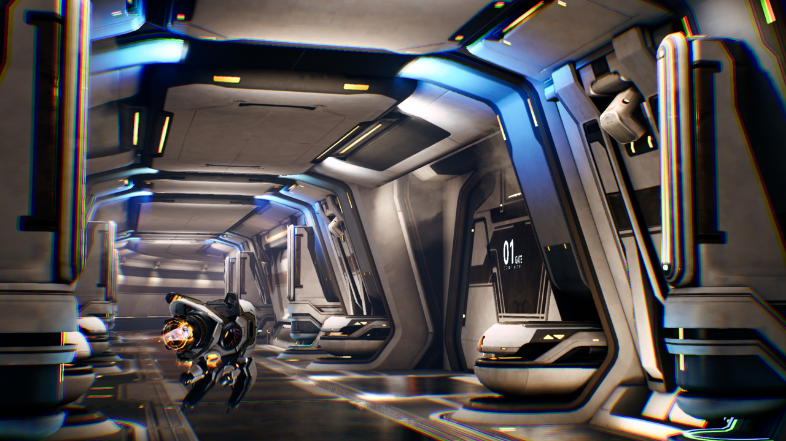
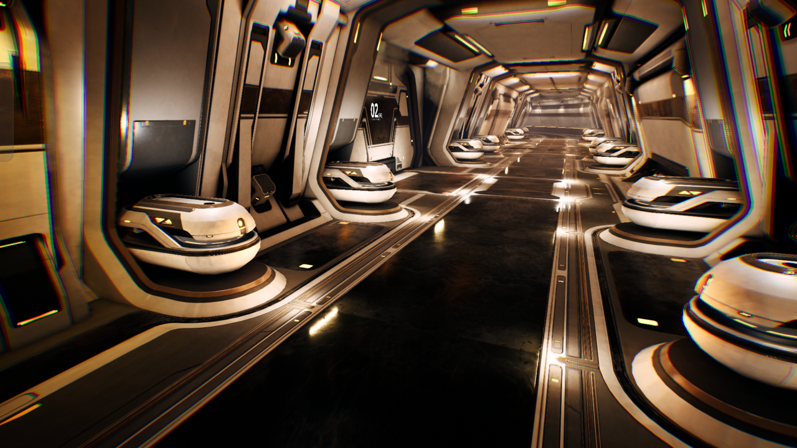
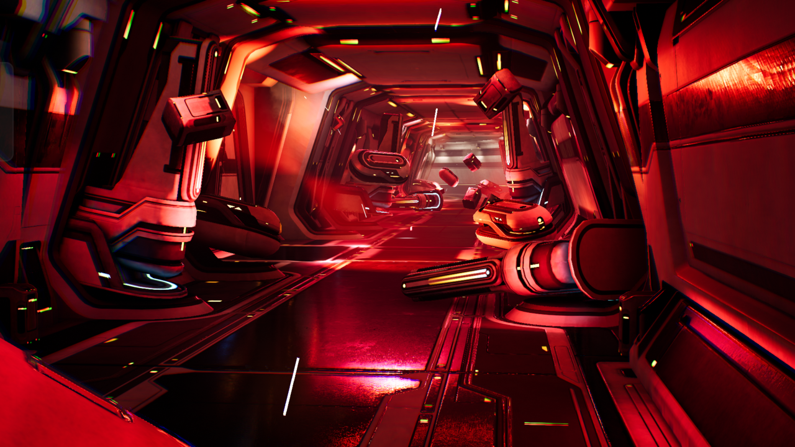
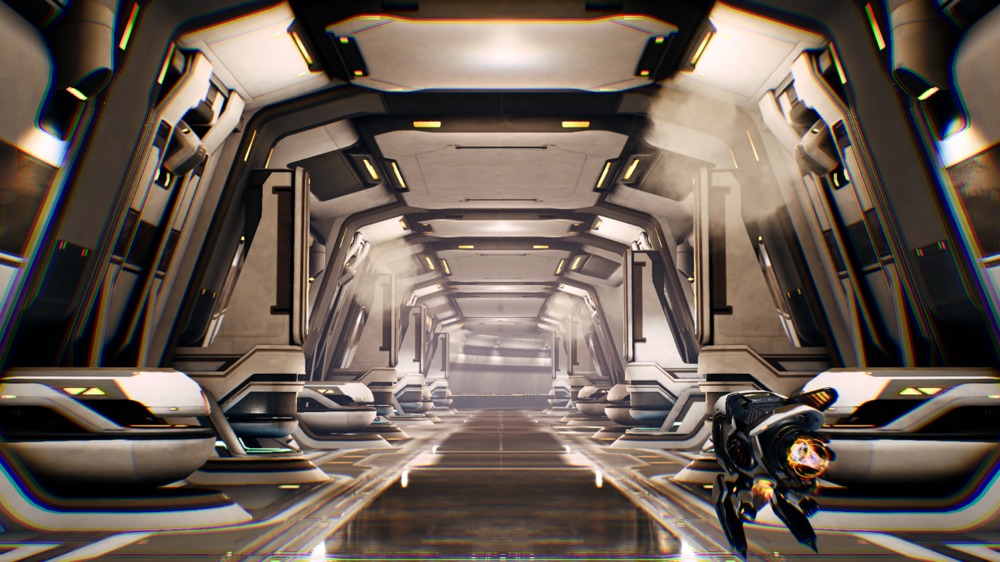

--- 
title: Understand Project Moku as an NFRU test environment
description: Explore Project Moku as a controlled Unreal Engine environment for evaluating Neural Frame Rate Upscaling and related neural rendering techniques on mobile GPUs.
weight: 2

### FIXED, DO NOT MODIFY
layout: learningpathall
---

## What Project Moku is

Project Moku is an Unreal Engine sample project developed by Arm that demonstrates neural rendering technologies for mobile platforms. Built on Unreal 5.6, the project provides a controlled environment for testing Neural Frame Rate Upscaling (NFRU), along with complementary neural rendering techniques such as Neural Super Sampling (NSS) and Neural Super Sampling and Denoising (NSSD). Project Moku is designed to exercise dedicated neural accelerators on GPUs with built-in neural processing support.

{}
To learn more about neural graphics techniques — including NFRU — and evaluate how they fit your game, see the [Neural Graphics Playbook - Evaluate](/learning-paths/mobile-graphics-and-gaming/neural-graphics-playbook-evaluate/) Learning Path.
{}

## Why use Project Moku to evaluate NFRU

The Project Moku corridor level is designed to showcase NFRU in a clear, controlled scene. Its long corridor makes it easy to observe the visual improvements from higher frame rates.  Occlusion interactions, lighting environments, and particle VFX scenarios help exercise frame generation under different visibility and illumination conditions.

NFRU gives you a practical way to stretch an existing rendering budget. By generating an intermediate frame between rendered frames, NFRU can increase the perceived framerate without requiring the engine to render every displayed frame or introducing a new content-authoring workflow.

### Watch the NFRU explainer

Watch this explainer for an overview of how Neural Frame Rate Upscaling generates intermediate frames to improve perceived smoothness:



## Reference cuts from Project Moku for testing NFRU

For repeatable testing, the case study uses reference cuts from Project Moku that replay the same camera paths and gameplay actions across runs. To follow along, you'll need similar reference cuts from your game.

The cuts create a consistent development and test environment, making it easier to compare NFRU disabled and enabled captures, inspect visual artifacts, and measure performance changes. The following screenshots show examples of the cuts from Project Moku.

|  |  |  |
| --- | --- | --- |

In the tested Moku corridor captures, the scene can run above 60 FPS and present up to 120 FPS using generated intermediate frames. Treat these numbers as empirical results from the tested device, build, scene cut, and pacing setup, not as a fixed guarantee for every configuration.

## Compare Moku with and without NFRU

The following animated comparison shows the same Moku scene with NFRU disabled and enabled:

<video width="100%" controls muted playsinline>
  <source src="https://raw.githubusercontent.com/powen-yang/arm_learning_path_assets/main/nfru_case_study/videos/compare_no_nfru_60fps_vs_nfru_120fps_small.mp4" type="video/mp4">
  Your browser does not support the video tag.
</video>

Use the comparison to observe how NFRU inserts generated intermediate frames to increase the perceived frame rate, making motion appear smoother while preserving visual detail. The most demanding cases — visibility changes, alpha-blended particles, and dramatic lighting transitions — can produce localized differences where the correct intermediate image is difficult to infer.

## What you've learned and what's next

You've now learned why Project Moku is useful for NFRU evaluation.

Next, you'll enable the Arm Neural Graphics plugin in the Unreal Engine project.
