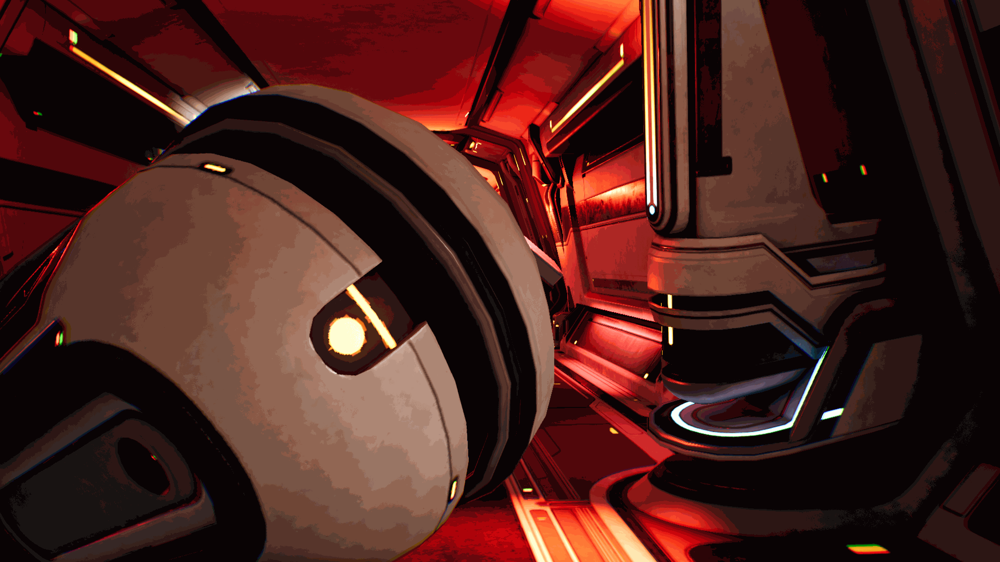
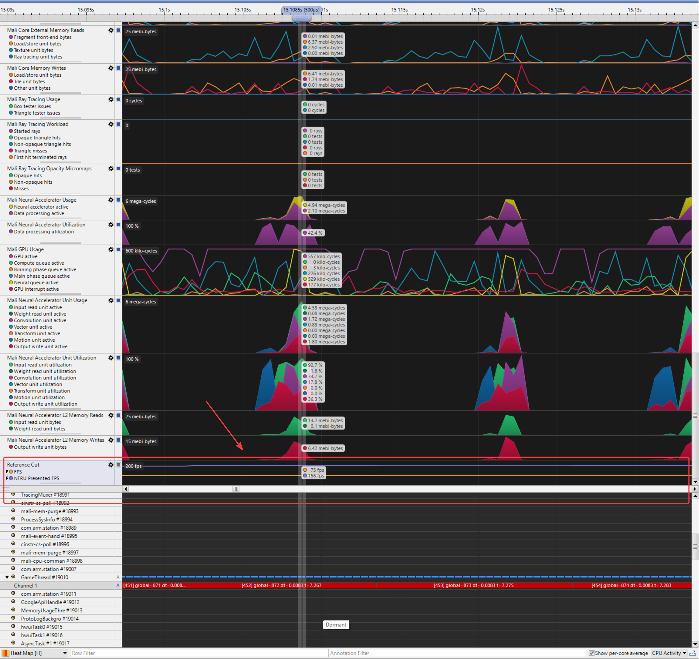
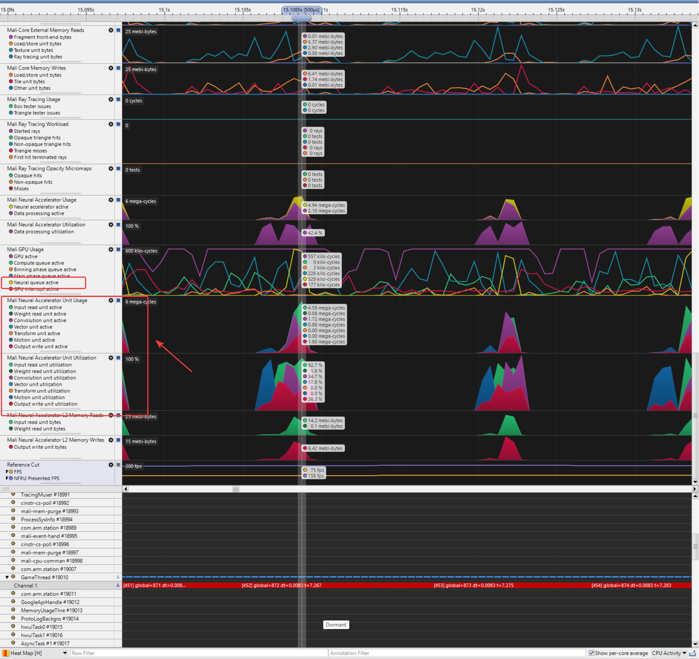
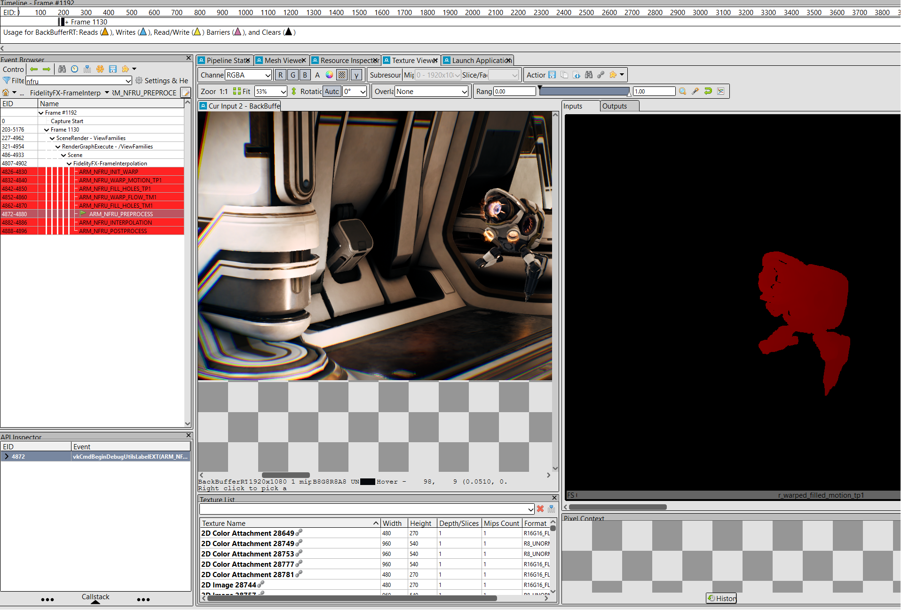
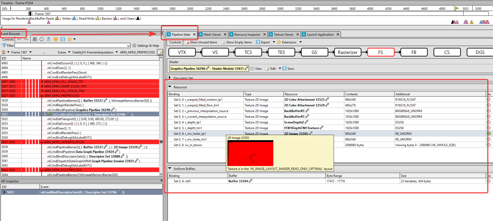

NFRU reconstructs an intermediate frame between two rendered frames to make motion feel smoother without requiring the engine to render another full frame. In the Project Moku captures, the generated output remains coherent across representative gameplay, while the most visible differences are localized to challenging conditions such as changing visibility, particles, and dramatic lighting changes. This workflow measures the performance benefit and gives you the tools to evaluate those edge cases against your own quality target.

Use Streamline and RenderDoc to validate NFRU from two directions:

- Use Streamline to confirm that NFRU is active, measure the GPU and neural workload, and check whether frame generation fits within the frame budget.
- Use RenderDoc to confirm generated-frame quality and investigate any localized differences in the frame-generation inputs, visible intermediate resources, and final interpolated frame.

## Prepare a repeatable test

Before collecting data, choose a short camera path or gameplay action that can be repeated with NFRU disabled and enabled. Keep the camera path, resolution, graphics settings, and test conditions as consistent as possible.

For Moku, multiple sequences are prepared for demonstration, including 30-second, 5-second, and fixed-camera sequences. Additional test sequences are also created for specific scenarios. Each sequence is treated as a reference cut so that the same content can be replayed consistently across test runs.



Different device profiles are configured to control whether NFRU is enabled, disabled, or running in debug mode. For example:
```
[Moku_SM5_NoNeural DeviceProfile]
DeviceType=Android
BaseProfileName=Moku_SM5_Base
+CVars=r.NFRU.Enable=0

[Moku_SM5_NFRU DeviceProfile]
DeviceType=Android
BaseProfileName=Moku_SM5_Base
+CVars=r.NFRU.Enable=1

[Moku_SM5_NFRU_Debug DeviceProfile]
DeviceType=Android
BaseProfileName=Moku_SM5_Base
; Development/test builds only
+CVars=r.NFRU.OnlyInterpolatedFrames=1
+CVars=r.NFRU.Enable=1
```

With these profiles, the test can be launched through ADB using a fixed device profile and reference cut:

```console
adb shell am start -S -n [package_name]/com.epicgames.unreal.GameActivity --es cmdline '-dp=Moku_SM5_NFRU -referenceCut=TestSequence'
```

For additional visual debugging, use `r.NFRU.ShowDebugView` to display the frame interpolation debug view. Use `r.NFRU.OnlyInterpolatedFrames` when you want to focus only on generated frames. Use `r.NFRU.CaptureDebugUI` when the debug UI or overlays need to be included in the captured path.

`r.NFRU.ShowDebugView` and `r.NFRU.OnlyInterpolatedFrames` are intended for development and test builds, and may not be available in shipping builds.

In NFRU debug resource names, `tm1` means time minus one (`t-1`) and `tp1` means time plus one (`t+1`) relative to the generated frame time. These names may not always match the simpler "previous/current" labels used in comparison images.

## Profile NFRU with Streamline

Use Streamline to compare the same scene with NFRU disabled and enabled. In the NFRU-enabled capture, confirm that the neural processing counters are active, and check that the additional GPU work, such as compute activity and memory bandwidth, fits within the frame budget.

As shown in the capture, counters such as Neural queue active and Neural Accelerator Unit Usage are active. This indicates neural accelerator activity during the NFRU workload. You can use the measured active time from these counters to evaluate the performance cost of NFRU. Moku also integrates the Streamline API, so Streamline captures can record both render FPS and present FPS at the same time.



On the timeline, the NFRU workload should complete cleanly between real rendered frames. If GPU or neural processing blocks become long, the cost of NFRU may limit the expected uplift. If the workload is light but idle gaps still appear, the limiting factor is more likely frame pacing or presentation behavior rather than NFRU execution cost. For a deeper explanation, see [NFRU performance](/learning-paths/mobile-graphics-and-gaming/nfru-cases-study/7-nfru_performance/).



For more information on performance profiling strategies, refer to the [Streamline](/learning-paths/mobile-graphics-and-gaming/ams/streamline/).

## Inspect NFRU frames with RenderDoc

Use RenderDoc to confirm generated-frame quality and investigate any visible differences. Capture a frame with NFRU enabled and inspect the frame generation area of the event list. Compare the real frame copies with the generated output, then review the bound frame-generation resources and debug-view tiles that expose motion, depth, disocclusion, and warped-color behavior. If the real frame inputs look correct but the generated output has artifacts, the issue is likely in frame generation, masking, disocclusion handling, or content such as rapidly changing alpha-blended effects.

For detailed guidance on using RenderDoc in Unreal Engine, refer to the [RenderDoc integration guide](/learning-paths/mobile-graphics-and-gaming/nfru-unreal/7-renderdoc/).



Use the following steps to inspect the Arm Frame Interpolation pipelines in RenderDoc:

| Step | Event or pipeline | What to inspect |
| --- | --- | --- |
| 1 | `FidelityFX-FrameInterpolation` | In the Event Browser, find the NFRU frame-generation work and expand the child events until you see pipeline names that start with `ARM_NFRU_`. |
| 2 | `ARM_NFRU_INIT_WARP` | This initializes the warp and hole-tracking resources used by later passes. On reset frames, the capture may show only the initialization and seeding work instead of the full interpolation sequence. |
| 3 | `ARM_NFRU_DOWNSAMPLE_OF_COLOUR` | If this optional pass appears, check it before the main interpolation passes. It creates lower-resolution color inputs for optical-flow processing when the source color is larger than the internal optical-flow input size. |
| 4 | `ARM_NFRU_WARP_MOTION_TP1` | This pass uses the current frame motion vectors and depth to warp visible data toward the generated frame time. Edge errors here usually point to motion vector, depth, or velocity conversion issues. |
| 5 | `ARM_NFRU_WARP_FLOW_TM1` | This pass uses optical flow and the previous-frame depth path to warp data from `t-1` toward the generated frame time. Problems here often appear around disocclusion, camera motion, or areas where optical flow cannot track the content reliably. |
| 6 | `ARM_NFRU_FILL_HOLES_TP1` and `ARM_NFRU_FILL_HOLES_TM1` | These passes fill gaps left by the motion-vector and optical-flow warps. Remaining gaps or noisy fill regions usually indicate difficult disocclusion, thin geometry, fast motion, or unreliable history. |
| 7 | `ARM_NFRU_PREPROCESS` | This pass prepares the tensor input from color, depth, motion, optical flow, masks, and warp results. Verify that the bound current and previous color, depth, and motion resources match the frame you intended to capture. |
| 8 | `ARM_NFRU_INTERPOLATION` | This is the neural frame-interpolation data-graph workload. RenderDoc may not expose the tensor contents like a normal color texture, but the event confirms that the neural interpolation stage ran. |
| 9 | `ARM_NFRU_POSTPROCESS` | This pass converts the interpolation result back to the output image and writes the generated frame. Compare this output with the real frame copies and the final back buffer. |
| 10 | `ARM_NFRU_DEBUG_VIEW` | If debug view is enabled, inspect this event after postprocess. Use it to compare the visible debug tiles for motion, depth, disocclusion, warped color, and final generated output. |

You can open the bound textures from RenderDoc's Pipeline State view or Resource Inspector, then view them in the Texture Viewer. For masks, depth, motion, and flow textures, select individual channels or adjust the range in the Texture Viewer to make the data easier to inspect. Some names in the list are shader binding names rather than texture allocation names. In those cases, open the texture bound to that shader input or output.



Common resources to check include:

| Resource | What to check |
| --- | --- |
| `InterpolatedRT` | Generated frame target before it is copied or presented. In `ARM_NFRU_POSTPROCESS`, this is typically the texture bound behind `rw_output`. |
| `r_current_interpolation_source` | Current rendered color input. |
| `r_previous_interpolation_source` | Previous rendered color input. |
| `r_motion_tp1` | Current-frame motion vectors. View the red and green channels to check direction and magnitude. |
| `r_depth_tp1` and `r_depth_tm1` | Current and previous depth inputs. Use these when checking disocclusion, edge, and occlusion-history artifacts. |
| `r_flow_tm1` | Previous-frame optical-flow input. |
| `r_dynamic_mask_tp1` and `r_dynamic_mask_tm1` | Dynamic masks for the current-frame (`t+1`) and previous-frame (`t-1`) inputs. |
| `r_mv_holes_tp1` and `r_mv_holes_tm1` | Hole masks generated by the warp stages. |
| `r_warped_filled_motion_tp1` and `r_warped_filled_flow_tm1` | Filled warp results after the hole-filling passes. |
| `r_in_tensor` and `r_out_params_tensor` | Neural input and output tensor resources. These may not display like normal color textures, but their bindings confirm the neural path resources are present. |

This workflow is useful for the artifact scenarios in the following sections. Occlusion changes stress depth history. Alpha-blended particles and VFX stress content that does not always have reliable depth or motion vector data. Lighting changes stress optical flow, blend parameters, and screen-edge reconstruction.

## What you've learned and what's next

In this section, you learned how to validate NFRU using Streamline and RenderDoc. Streamline confirms whether NFRU is active, measures the GPU and neural workload, and shows how effectively available frame time becomes a higher presentation rate. RenderDoc lets you confirm generated-frame quality and trace localized differences through the frame-generation event list, visible NFRU resources, real frame copies, debug-view output, and final generated output.

Together, these tools make NFRU's smoother presentation measurable and its edge cases actionable. You are now prepared to evaluate NFRU performance and visual quality in representative gameplay scenarios.

TODO: ask RD/Streamline team to verify
