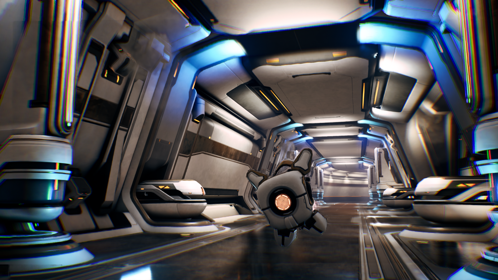
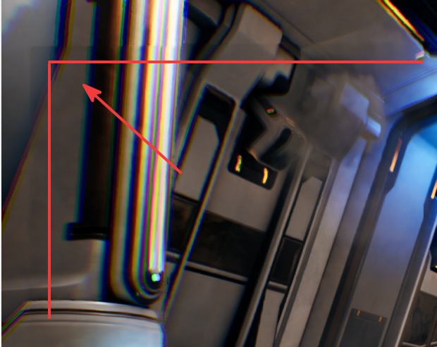
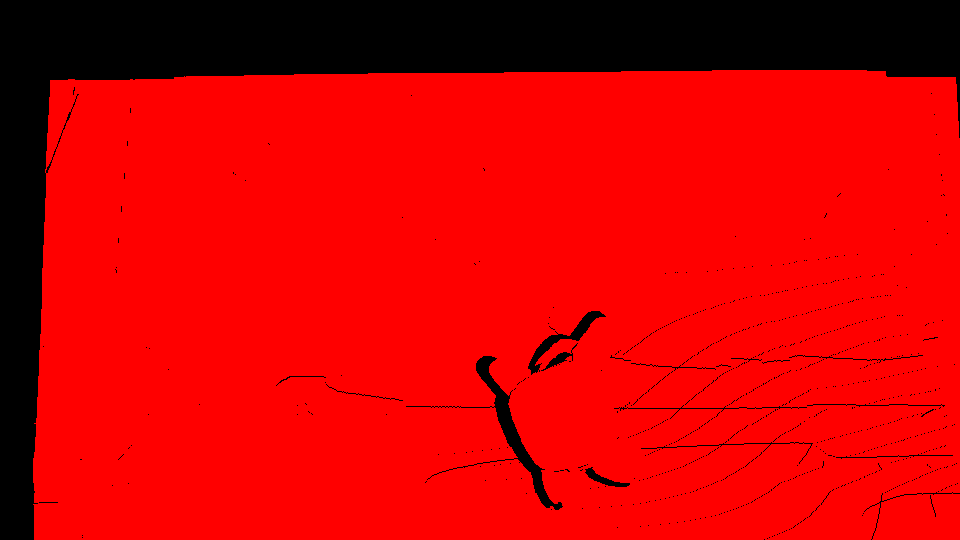
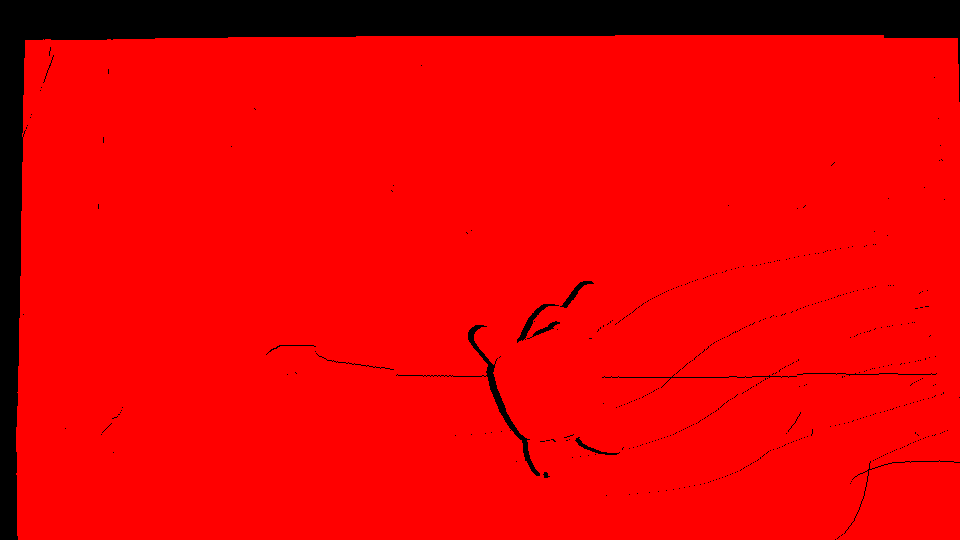

## Fast camera movement

Check the screen corners and outer edges while the camera moves quickly. The artifact usually appears on the interpolated frame as a brief color mismatch near the edge. The edge might look smeared, noisy, or flickery, or it might look as if it is using color from a nearby part of the image. This issue is most visible on the side of the screen that the camera moves toward, because that edge has the least reliable image information to reuse.

<figure>
  
  <figcaption>Sample fast camera movement</figcaption>
</figure>

NFRU generates `InterpolatedRT` from two consecutive rendered frames: the previous interpolation source and the current interpolation source. Compare these frames together to understand how much camera movement and newly exposed scene area NFRU must account for.

<figure>
  
  <figcaption>Fast camera movement comparison across interpolated, previous, and current frames</figcaption>
</figure>

The interpolated frame shows the generated scene produced between the two source frames. Use the comparison to confirm whether artifacts are visible during normal gameplay motion.

<figure>
  
  <figcaption>Interpolated frame during fast camera movement</figcaption>
</figure>

The first callout highlights a corner region where color separation and smearing appear along the outer edge of the frame. These artifacts can occur when newly exposed screen-space regions don't have enough reliable information from the previous frame.

<figure>
  
  <figcaption>Corner artifact during fast camera movement</figcaption>
</figure>

The second callout highlights artifacts along the lower edge of the interpolated frame. Watch for this type of artifact when the camera pans or turns quickly across high-contrast geometry.

<figure>
  
  <figcaption>Lower-edge artifact during fast camera movement</figcaption>
</figure>

Use RenderDoc to inspect the `r_mv_holes_tm1` and `r_mv_holes_tp1` buffers. Here, `tm1` means time minus one (`t-1`), and `tp1` means time plus one (`t+1`). These buffers show where motion-vector reprojection has holes or invalid regions in the previous (`t-1`) and next (`t+1`) temporal sources. The hole masks reveal areas where motion history is unreliable, particularly around object silhouettes and screen edges. When the interpolation pass samples from these unreliable areas, it picks up mismatched foreground and background pixels, creating noticeable edge-line artifacts in the final image.

<figure>
  
  <figcaption>Motion-vector holes in previous frame (r_mv_holes_tm1)</figcaption>
</figure>

<figure>
  
  <figcaption>Motion-vector holes in next temporal source (r_mv_holes_tp1)</figcaption>
</figure>

## What you've learned and what's next

In this section, you inspected how fast camera movement can affect NFRU-generated frames. You learned that edge artifacts often appear near newly exposed screen regions, especially when rapid motion leaves limited reliable image information for interpolation.

Next, continue evaluating NFRU output in additional gameplay scenarios so you can compare how different types of motion and scene content affect visual quality.
