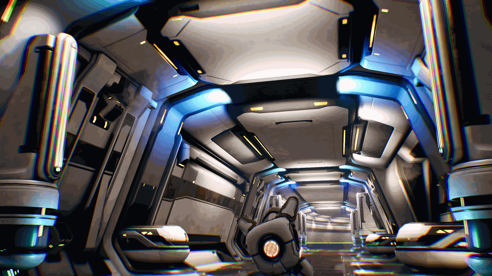
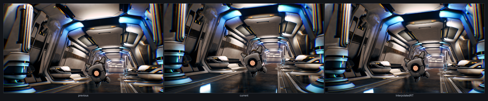
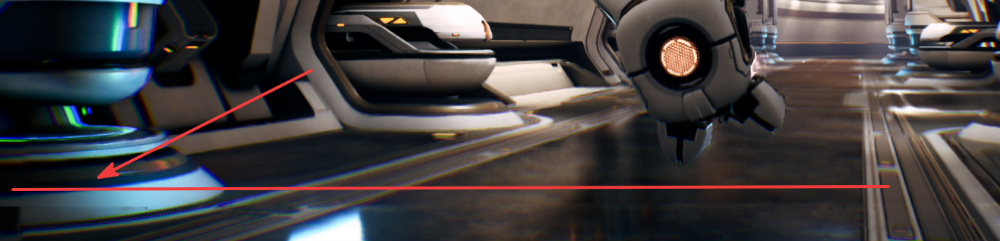

## Fast camera movement

Fast camera movement is a useful NFRU stress test because it reveals new screen-edge regions with limited image history. In the Moku capture, NFRU preserves the corridor and the sense of smooth motion across most of the frame. Brief color mismatch can appear at the outer edge on the side the camera moves toward, where the interpolation has the least reliable image information to reuse. The edge might look smeared, noisy, or flickery for a short time.

NFRU generates `InterpolatedRT` from two consecutive rendered frames: the previous interpolation source and the current interpolation source. Compare these frames together to understand how much camera movement and newly exposed scene area NFRU must account for.

The interpolated frame shows the generated scene produced between the two source frames. Assess the stability of the full image first, then check whether localized edge differences are noticeable at normal playback speed.

The first callout highlights a corner region where color separation and smearing appear along the outer edge of the frame. These artifacts can occur when newly exposed screen-space regions don't have enough reliable information from the previous frame.

The second callout highlights artifacts along the lower edge of the interpolated frame. Watch for this type of artifact when the camera pans or turns quickly across high-contrast geometry.

Use RenderDoc to inspect the `r_mv_holes_tm1` and `r_mv_holes_tp1` buffers. Here, `tm1` means time minus one (`t-1`), and `tp1` means time plus one (`t+1`). These buffers show where motion-vector reprojection has holes or invalid regions in the previous (`t-1`) and next (`t+1`) temporal sources. The hole masks reveal areas where motion history is unreliable, particularly around object silhouettes and screen edges. When the interpolation pass samples from these unreliable areas, it can pick up mismatched foreground and background pixels. In this capture, the resulting edge lines are concentrated around the outer screen region rather than the main scene.

| ") | ") |
| --- | --- |

## What you've learned and what's next

In this section, you saw that NFRU keeps the fast-moving corridor scene coherent while delivering a smoother presentation. The remaining differences are concentrated near newly exposed screen edges, and the RenderDoc hole masks provide a direct way to locate and explain them.

Next, continue evaluating NFRU output in additional gameplay scenarios so you can compare how different types of motion and scene content affect visual quality.
