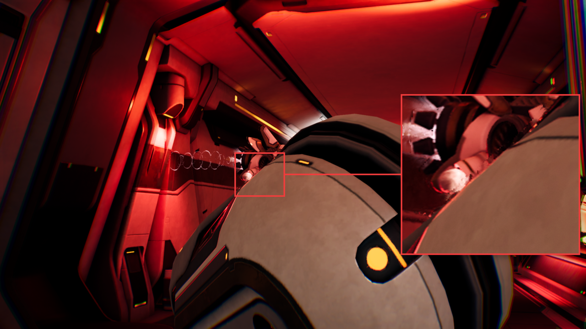
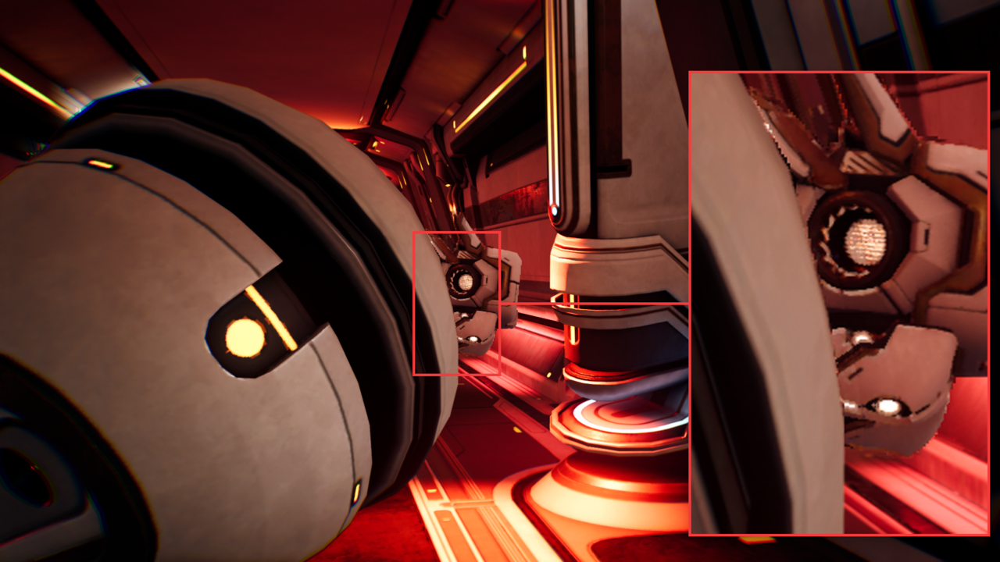

## Understand how NFRU handles occluded objects

When an object moves in front of another surface, NFRU has to generate an intermediate frame where part of the background is being covered (occlusion-in) or revealed (occlusion-out). These regions are challenging because foreground and background samples can change visibility between the two rendered frames.

In the Moku occlusion examples, NFRU handles most of the occluded and newly revealed areas cleanly. The generated frames preserve the main foreground shape and background region well. 

This is expected because NFRU uses the following to choose and combine source information for the intermediate frame:

- Motion vectors
- Optical flow
- Depth-aware warping
- Disocclusion masks
- Hole filling
- Neural frame generation

The remaining artifacts are mostly localized near object boundaries. At those edges, foreground and background pixels might both be plausible candidates for the same intermediate pixel. If the depth, motion-vector, and optical-flow signals point to slightly different source locations, the generated frame can show mild blur, edge distortion, or a small amount of background color bleeding into the foreground edge.

## Analyze occlusion-in artifacts

The occlusion-in generation sequence shows how the previous and current interpolation sources combine into `InterpolatedRT` as the foreground object covers the background.

The marked close-up highlights a small boundary artifact in the generated frame. The main occluded area remains stable, while the visible issue is limited to slight blending and softness along the foreground edge.

## Analyze occlusion-out artifacts

In an occlusion-out case, newly revealed background might be missing from one of the source frames. NFRU uses the available color, depth, motion, and optical-flow information to reconstruct the revealed region. In the example, the revealed area is mostly clean. The remaining artifact appears as a small amount of blur or distortion near the moving edge.

The occlusion-out generation sequence shows how the interpolated frame handles background pixels that become visible as the foreground object moves away.

The marked close-up shows mild softness at the boundary. The background reconstruction is generally clean, with minor smearing limited to the edge where the foreground object uncovers the background.

## What you've learned and what's next

You've now seen NFRU produce clean occlusion-in and occlusion-out results in representative content. The overall reconstruction remains stable as visibility changes, and the remaining differences are limited to small areas of edge-localized blur, distortion, or color bleeding.

Next, you'll evaluate NFRU in transparency-heavy content, including particle effects that remain visually natural even when their exact shape changes between frames.
