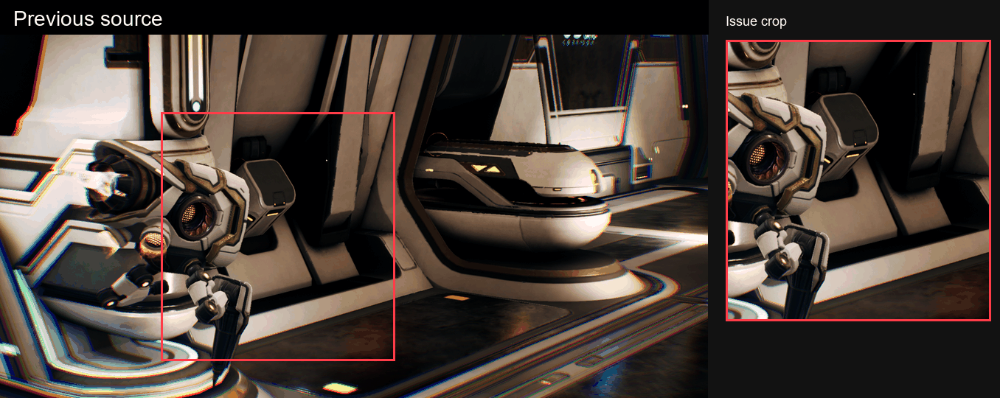
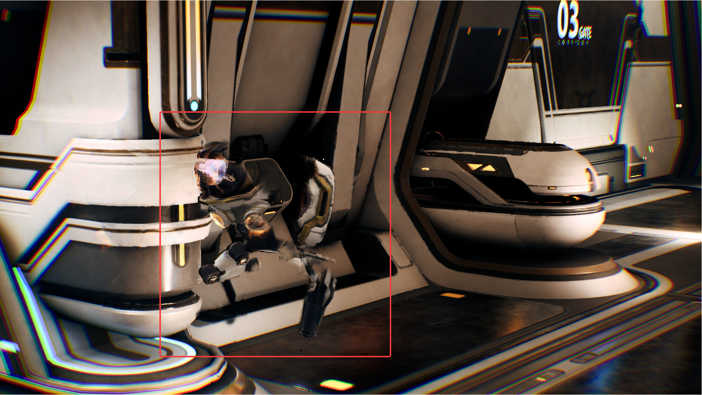
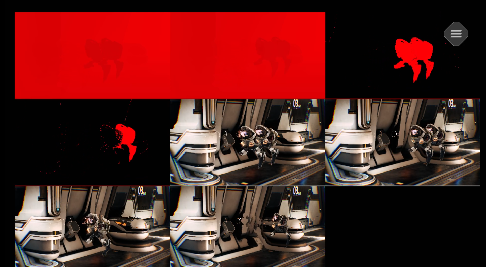

## Fast object movement
NFRU uses motion vectors, optical flow, depth, and disocclusion masks to keep moving content coherent between rendered frames. In the Moku capture, the overall motion remains readable, while very fast or teleported objects provide a demanding test for individual object boundaries. Localized trailing or duplicated shapes can appear when an object changes position significantly between frames.



When movement is large, the available motion, depth, and visibility signals can become ambiguous or incomplete. Newly visible or hidden pixels make it harder to determine which source should contribute to the intermediate object boundary.



Any visible differences are usually concentrated around fast-moving objects, thin geometry, sharp edges, particles, or objects crossing in front of other surfaces. They can appear as local distortion, trailing, duplication, missing detail, or blending with the background while the rest of the generated frame remains stable.

For debugging, enable the NFRU debug view and inspect motion-vector-warped `tm1`/`tp1` color, optical-flow-warped `tm1`/`tp1` color, and disocclusion masks. Here, `tm1` means time minus one (`t-1`), and `tp1` means time plus one (`t+1`). These views show which contribution comes from engine motion vectors, optical flow, masking, or hole filling.

Use the console command:
```
r.NFRU.ShowDebugView 1
```



## What you've learned and what's next

In this section, you saw that NFRU preserves the overall scene while the most demanding object motion can produce localized differences around fast-moving boundaries. The NFRU debug view makes those inputs visible, giving you a practical way to evaluate object motion while retaining the benefit of a higher presentation cadence.

Next, continue evaluating NFRU output in additional gameplay scenarios so you can compare how occlusion, transparency, and other scene content affect visual quality.
