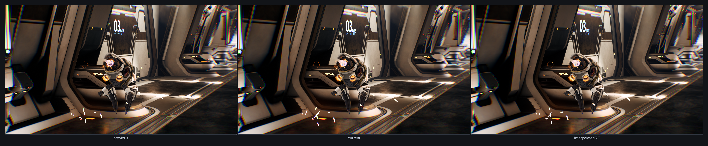
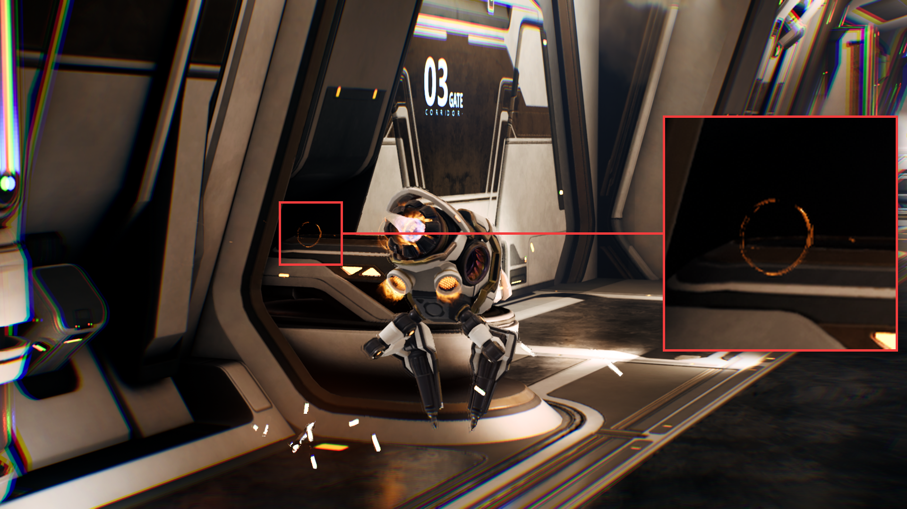
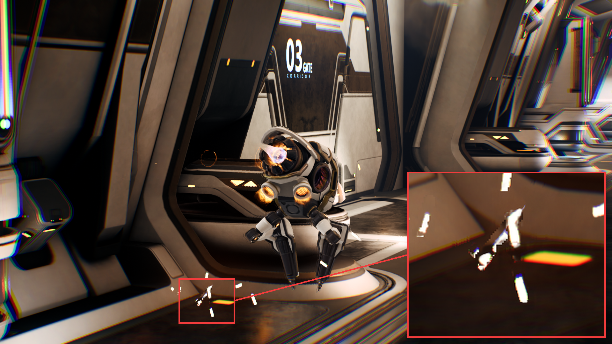
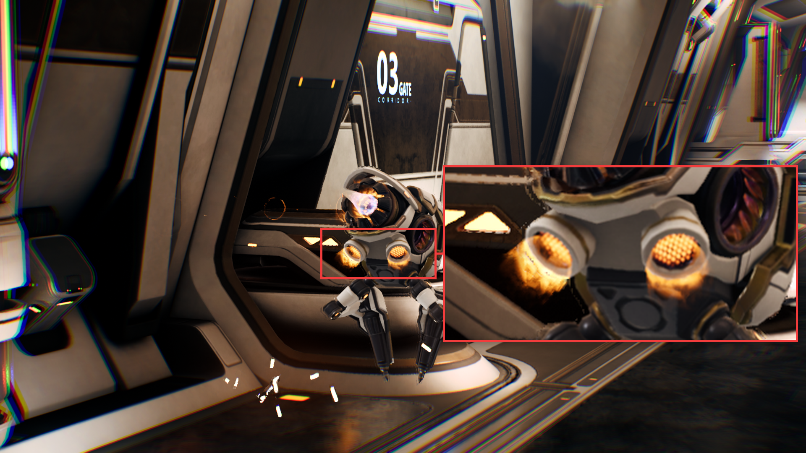

## Understand how NFRU handles particle effects

Particle effects are an important test of perceived quality because their exact shape often changes from frame to frame. In Moku, NFRU preserves the overall color, brightness, and placement of these effects during motion. Translucent or alpha-blended particles might not provide stable depth or motion-vector information after composition, so localized differences can still appear in the generated frame.

## Analyze the generated frame

Compare the previous frame, current frame, and `InterpolatedRT` to find whether the generated frame preserves the particle shape and position.

What to inspect:

- Blur or smear: The particle color is warped using an estimated motion that doesn't match the actual particle movement, especially for smoke, sparks, fire, or trails.
- Disappear or flicker: Particles that fade in or out, spawn, die, or change opacity between real frames might not have a stable match, so the generated frame might reduce or drop them.
- Distortion: Optical flow might interpret changing shape, additive brightness, or overlapping particles as motion, producing stretched, bent, or duplicated particle regions.

The highlighted blur area shows a particle ring that loses definition in the generated frame. Look for soft edges, smeared color, or a shape that no longer matches either source frame.

The distortion callout shows particles that bend or stretch after interpolation. This usually means the generated frame is using an unreliable motion estimate for small, bright, fast-changing particle elements.

## Identify natural-looking generated particles

Some particle effects, such as fire, sparks, and smoke, already have random shapes from frame to frame. In those cases, the generated frame can look natural even if it doesn't match a physically exact intermediate shape. The result is usually acceptable when the particle keeps the expected color, brightness, and approximate location during playback.

The highlighted thruster fire shows a generated particle result that still reads naturally because the effect is noisy, soft-edged, and expected to change shape quickly.

## What you've learned and what's next

You've now seen that particle effects can remain visually convincing in NFRU-generated frames even when individual shapes don't match a physically exact intermediate state. The Moku thruster example preserves the effect's expected color, brightness, and location. When alpha blending or rapidly changing opacity produces blur, distortion, flicker, or dropped detail, the differences are localized. You can evaluated the differences against the effect in motion.

Next, continue evaluating how NFRU preserves complex illumination and how to diagnose localized differences around emissive surfaces, translucent lighting, and screen edges.
