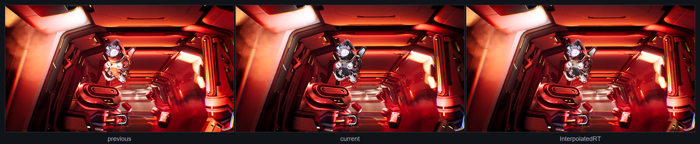
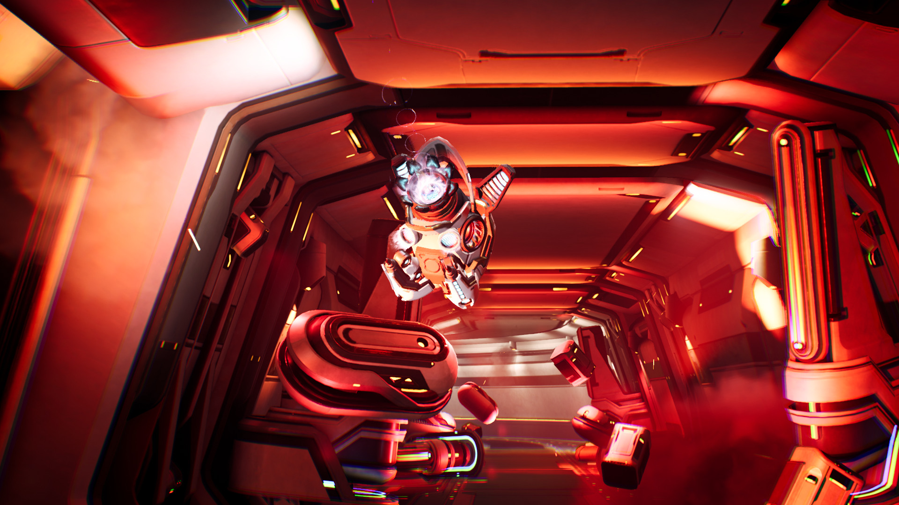
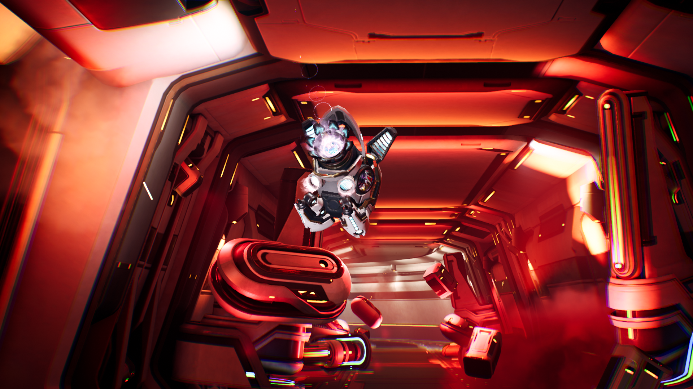
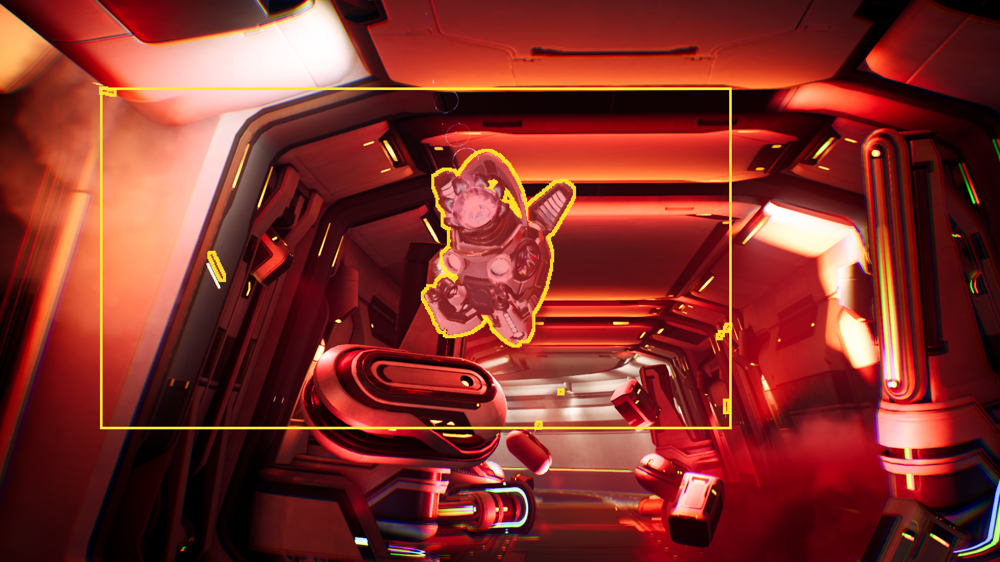
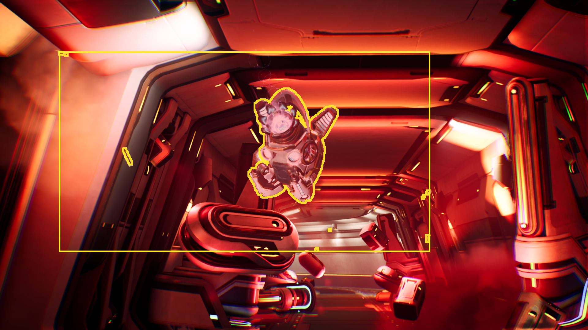
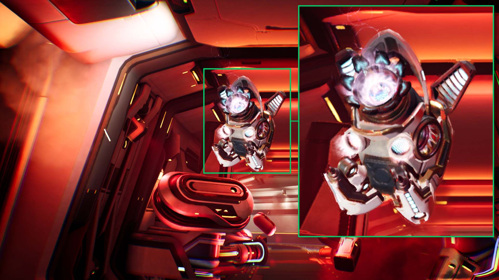
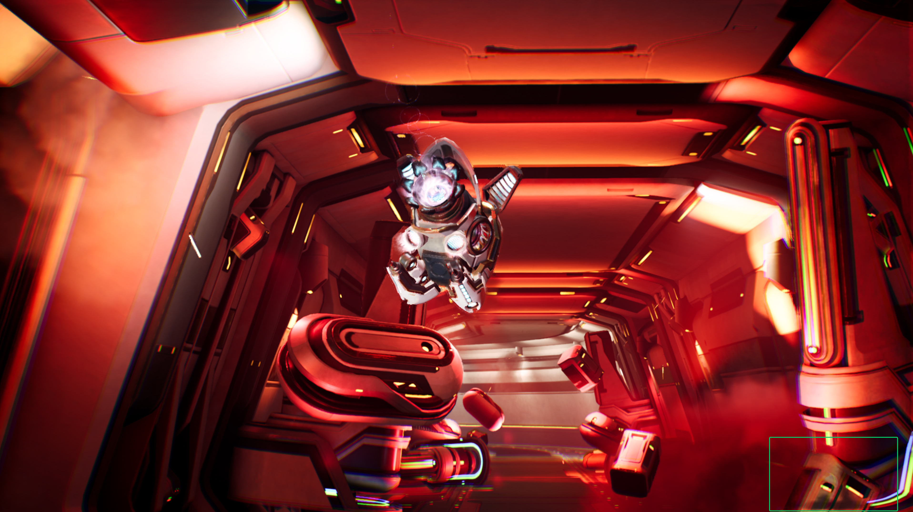
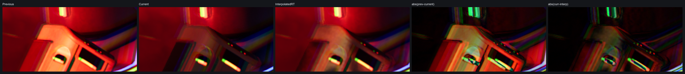
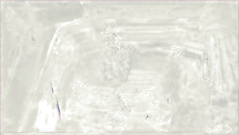

## Understand how NFRU handles lighting changes

Lighting changes demonstrate how NFRU combines image-space and geometry information to preserve a coherent intermediate frame. NFRU generates `InterpolatedRT` between `r_previous_interpolation_source` and `r_current_interpolation_source`, using color, depth, motion vectors, and optical flow. In Moku, this process maintains natural-looking motion across bright emissive detail, translucent effects, and changing illumination, while difficult screen-edge combinations can still reveal localized differences.

The following sequence shows the process. The previous source and current source are used as inputs for the interpolation calculation. The dynamic region is highlighted to show where generated content is most likely to differ from the source frames, and the result is visible in the final `InterpolatedRT`.

First, compare the two rendered source frames with the generated intermediate frame:

| Previous source | Current source | Generated area | Final `InterpolatedRT` |
| --- | --- | --- | --- |
|  |  |  |  |

Lighting changes matter because optical flow is estimated from image changes. If color changes because geometry moved, optical flow can help interpolation.

If color changes mainly because illumination changed, optical flow might interpret that lighting change as motion. This can fail to line up with depth and motion vectors, which describe geometry movement. Dramatic changes, such as one source frame being dark and the next being bright, are more likely to produce ghosting, flicker, or stale bright and dark remnants.

## Natural moving-character result

Not every lighting-heavy region produces a visible artifact. The moving character in this example is interpolated naturally even though it contains bright emissive detail, translucent effects, and fine edges. The core glow stays centered, the ring keeps a plausible shape, and the surrounding lighting remains coherent. Minor softness around the character reads as motion blur or glow during playback.

This result is acceptable because the important visual structure remains stable. The generated frame doesn't need to reproduce a physically exact lighting state for every pixel. Instead, it needs to preserve perceived shape, brightness, and motion without drawing attention to ghosting or edge breakup.

## Inspect a screen corner artifact

The screen corner is a more difficult case because it sits at the edge of the screen. When NFRU warps pixels from the previous and current frames, some samples in this area can point outside the valid image. The inputs also contain high-contrast light strips, dark foreground geometry, haze, and a large brightness change between source frames. 

The generated frame is mostly close to the current frame. However, unstable edge samples can leave a semi-transparent remnant from the previous frame. This appears as ghosting or smearing in the highlighted area.

The artifact might be related to unstable blend parameters, rather than optical flow alone. NFRU creates an intermediate parameter resource, `r_out_params_tensor`, that stores per-pixel values. The postprocess pass converts these values into blend weights that control how much each warped source sample contributes to the final `InterpolatedRT`.

Near the screen edge, warped samples can point outside the valid image. These edge cases, together with strong lighting changes, can make the blend parameters less reliable. The final frame can then keep too much contribution from the previous source frame, so old lighting information remains visible in the corner.

## Investigate lighting-change artifacts

When this type of artifact appears, inspect the image inputs as well as the motion and depth inputs:

- Compare `r_previous_interpolation_source`, `r_current_interpolation_source`, and `InterpolatedRT`.
- Check whether the affected region contains dramatic lighting changes, newly visible pixels, screen-edge content, translucent materials, bloom, particles, or emissive lighting.
- Inspect motion-vector and optical-flow debug views. Look for signals that do not line up near silhouettes, screen edges, and bright alpha-blended effects.
- Inspect `r_out_params_tensor` to see whether the blend parameters are noisy or unstable in the affected region.
- Inspect depth around the affected pixels. Lighting, translucency, or post-process effects might be visible in color but missing from depth.

## What you've learned and what's next

You've now seen NFRU preserve a natural-looking moving character across bright emissive detail, translucent effects, and fine edges. The screen edge example showed how a dramatic lighting transition can produce localized ghosting when optical flow, depth, motion, and blend parameters do not fully agree. Together, the examples show that the overall generated frame can remain coherent while RenderDoc exposes the specific inputs behind a difficult edge case.

Next, continue with NFRU performance analysis to understand how frame generation affects render FPS, present FPS, and frame pacing during gameplay.
