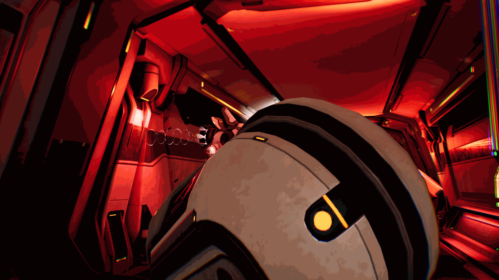
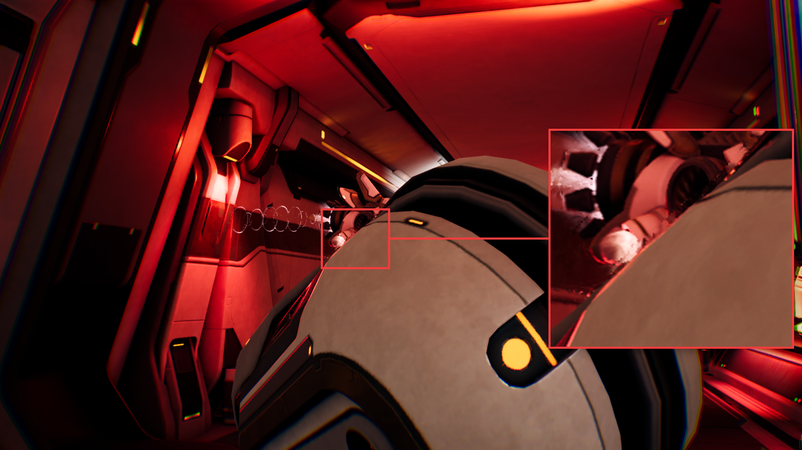
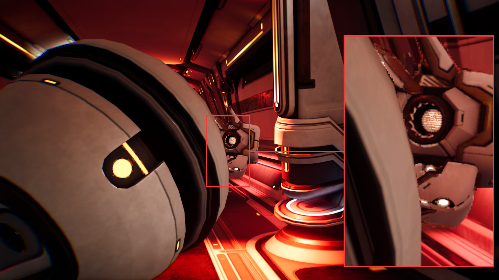

## Occlusion objects

When an object moves in front of another surface, NFRU has to generate an intermediate frame where part of the background is being covered (occlusion-in) or revealed (occlusion-out). These regions are challenging because foreground and background samples can change visibility between the two rendered frames.

In the Moku occlusion examples, NFRU handles most of the occluded and newly revealed areas cleanly. The generated frames preserve the main foreground shape and background region well. This is expected because NFRU uses motion vectors, optical flow, depth-aware warping, disocclusion masks, hole filling, and neural frame generation to choose and combine source information for the intermediate frame.

The remaining artifacts are mostly localized near object boundaries. At those edges, foreground and background pixels may both be plausible candidates for the same intermediate pixel. If the depth, motion-vector, and optical-flow signals point to slightly different source locations, the generated frame can show mild blur, edge distortion, or a small amount of background color bleeding into the foreground edge.

The occlusion-in generation sequence shows how the previous and current interpolation sources combine into `InterpolatedRT` as the foreground object covers the background.

The marked close-up highlights a small boundary artifact in the generated frame. The main occluded area remains stable, while the visible issue is limited to slight blending and softness along the foreground edge.

In an occlusion-out case, newly revealed background may be missing from one of the source frames. NFRU uses the available color, depth, motion, and optical-flow information to reconstruct the revealed region. In this example, the revealed area is mostly clean; the remaining artifact appears as a small amount of blur or distortion near the moving edge.

The occlusion-out generation sequence shows how the interpolated frame handles background pixels that become visible as the foreground object moves away.

The marked close-up shows the boundary region where the generated frame is not perfectly sharp. The background reconstruction is generally clean, but the edge can show minor smearing where the foreground object uncovers the background.

## What you've learned and what's next

In this section, you inspected how occlusion changes can affect NFRU-generated frames. You learned that NFRU can produce clean occlusion-in and occlusion-out results in representative content, and that remaining artifacts are usually small edge-localized blur, distortion, or color bleeding where visibility changes rapidly.

Next, continue evaluating NFRU output in transparency-heavy content, where alpha blending and particle effects can introduce a different set of frame-generation artifacts.
