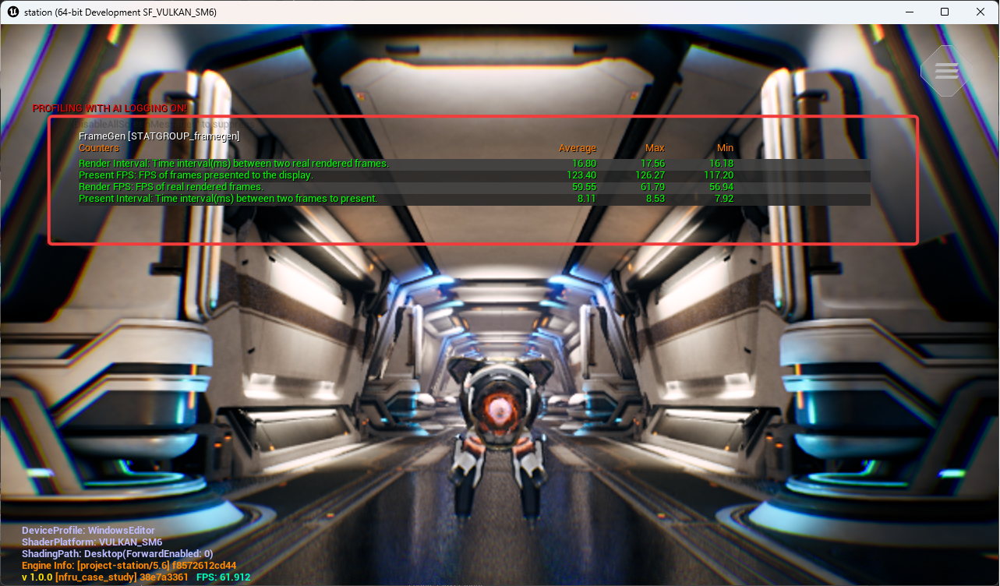
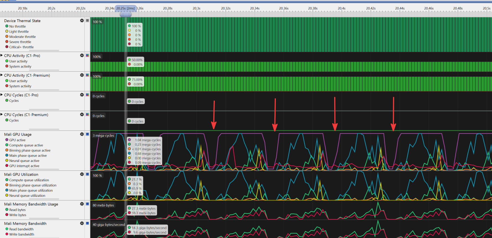
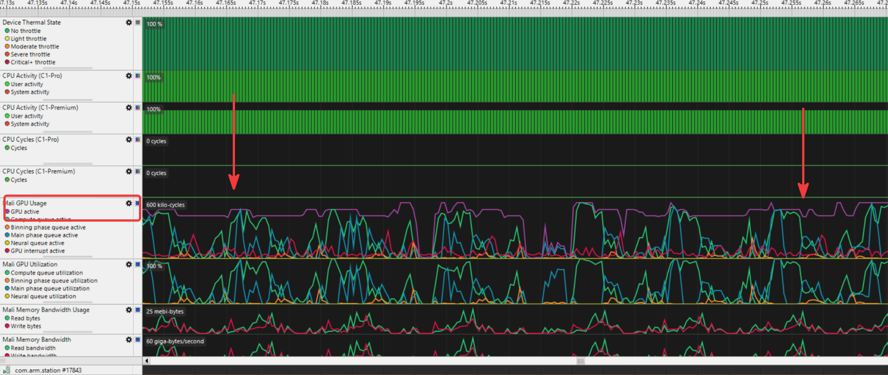

# NFRU frame pacing overview

With NFRU enabled, the observed FPS uplift may be lower than expected because frame generation is not only an interpolation pass; it is also tied to presentation pacing. NFRU does not make the game render twice as many real frames. In the standard path, after valid consecutive rendered frames are available, it generates one intermediate frame between the real frames. Frame pacing then determines when those real and generated frames are submitted and shown.

## Render FPS vs present FPS

To monitor NFRU performance in real-time, use the console command:

```console
stat framegen
```

This command displays four key counters that provide insights into NFRU operation:



There are two FPS values to distinguish:

| Metric           | Meaning                                                 |
|------------------|---------------------------------------------------------|
| Render FPS       | Real frames produced by the engine                      |
| Present FPS      | Frames shown to the display, including generated frames |
| Render Interval  | Time between real rendered frames                       |
| Present Interval | Time between displayed frames                           |

Example:

Render FPS       = 30 FPS
Render interval  = 33.3 ms

Present FPS      = 60 FPS
Present interval = 16.6 ms

With one generated frame between two real frames, the display can receive frames twice as often:

Render timeline:
```
R0 ---------------- R1
       33.3 ms
```

Present timeline:
```
R0 -------- G0 -------- R1
   16.6 ms    16.6 ms
```

So when NFRU is generating and presenting each intermediate frame, render FPS may stay the same, while present FPS increases.

## Why frame pacing is needed

Frame pacing controls when frames are submitted or presented. High FPS alone does not guarantee smoothness. If frames arrive unevenly, the result can still feel stuttery.

Bad pacing:

P0 -- P1 -------- P2 - P3 ---------- P4

Good pacing:

P0 ---- P1 ---- P2 ---- P3 ---- P4

### Frame pacing issues and GPU idle time

In Streamline captures, frame pacing issues often appear as gaps between GPU workloads. These gaps can happen when real rendered frames are produced unevenly, and the pacing system waits before submitting or presenting the next real or generated frame to keep the output aligned with the target cadence. During that wait, the GPU may be idle:



These idle gaps are important to identify because they can indicate that presentation timing, rather than pure render cost, is limiting the observed FPS uplift:

- **GPU idle time**: The GPU has no queued work while the pacing system waits for the next frame timing slot.
- **Lower measured throughput**: Present FPS may be limited by pacing or display timing even when the GPU has spare capacity.
- **Uneven workload distribution**: Bursts of rendering work followed by idle gaps can make frame delivery harder to interpret in profiling captures.
- **Power behavior changes**: Idle periods may reduce instantaneous GPU activity, while bursts can still create short load spikes.

Proper frame pacing keeps presentation intervals stable, but it can intentionally introduce waiting. For profiling, distinguish between idle time caused by pacing and idle time caused by missing render work or synchronization problems.

This is especially important for NFRU because the output alternates between real and generated frames:

R0 ---- G0 ---- R1 ---- G1 ---- R2

If these frames are not presented at regular intervals, the motion may look uneven even though more frames are being produced.

## Remove common pacing limits for profiling

When you want to measure the maximum present FPS that NFRU can reach, disable the pacing systems that might cap or smooth presentation timing. Use this setup for profiling and investigation only. For normal gameplay testing, frame pacing is still important because it keeps presentation intervals stable and reduces visible stutter.

The capture shows a frame-pacing issue where a large idle gap appears before the next submitted frame. Removing pacing caps can help you check whether the workload can produce higher present FPS when the platform is not intentionally delaying presentation.



To remove common software pacing limits for profiling, run the following console commands. Some commands are platform-specific, and the display refresh rate or compositor may still cap the final present FPS.

```console
r.NFRU.PaceAdjuster 0
a.UseSwappyForFramePacing 0
r.VSync 0
t.MaxFPS 0
r.SetFramePace 0
```

These commands change the pacing behavior as follows:

- `r.NFRU.PaceAdjuster 0` disables the NFRU adaptive pace adjuster.
- `a.UseSwappyForFramePacing 0` disables Android Swappy pacing when Swappy is available.
- `r.VSync 0` disables VSync.
- `t.MaxFPS 0` removes Unreal's max FPS cap.
- `r.SetFramePace 0` attempts to clear platform frame pacing.

After applying these settings, observe render FPS and present FPS again. If present FPS increases, one of the pacing systems was limiting presentation. If present FPS remains unchanged, the limit is more likely caused by render cost, NFRU processing cost, display refresh behavior, or another platform constraint.

## Why FPS uplift may be lower than expected

A common expectation is:

60 render FPS + NFRU = 120 present FPS

But the actual result may be lower:

45 render FPS + NFRU = 90 present FPS

Or it may be capped by the display:

45 render FPS + NFRU = 90 possible present FPS
60 Hz display cap     = 60 actual present FPS

This can happen because NFRU output is still constrained by:

- Display refresh rate
- VSync
- Hardware/platform frame pacing
- Swappy pacing on Android
- NFRU processing cost
- The selected custom frame pace target

NFRU also has its own GPU cost, including optical flow, frame interpolation, resource copies, and presentation handling. Therefore, the theoretical 2x present-FPS uplift is not always reached in real workloads.

## How the NFRU pace adjuster works

The NFRU pace adjuster is an optional adaptive frame pacing controller provided by the ArmNG Unreal plugin. It runs on the plugin's NFRU custom-present path and chooses a sustainable presentation FPS target while NFRU is running. It does not make Unreal render more real frames, and it does not change interpolation quality. Instead, it adjusts the frame pace target so real and generated frames are presented at a rate the current workload can sustain.

When enabled, the NFRU custom presenter monitors frame timing during presentation. If frames consistently finish with enough spare time, the adjuster raises the target to the next available FPS level. If frames are late, it lowers the target to the previous FPS level. The selected target is applied through `r.SetFramePace`.

Enable it with:

```console
r.NFRU.PaceAdjuster 1
```

```
Renderer + NFRU
      |
      v
Custom presenter measures frame timing
      |
      v
Enough spare time? -> raise FPS target
Late frames?       -> lower FPS target
      |
      v
Apply:
r.SetFramePace <CustomFPS>
```

The goal is to find a stable FPS target instead of always aiming for the highest possible value.

## FPS adjustment settings

The pace adjuster moves between stable FPS levels derived from the platform frame pace, such as `30 -> 40 -> 60 -> 120`. It only changes one level at a time to avoid sudden jumps. If several frames have enough spare time, it raises the target to the next FPS level. If several frames are late, it lowers the target to the previous FPS level.

`r.NFRU.UpAdjustFrameCount` controls how many consecutive good frames are required before increasing the target FPS. Its default value is `40`, which makes the adjuster cautious before moving up. `r.NFRU.DownAdjustFrameCount` controls how many consecutive late frames are required before decreasing the target FPS. Its default value is `20`, so the adjuster reacts faster when the current target cannot be sustained. In practice, this means NFRU increases FPS slowly for stability and decreases FPS faster to reduce visible stutter.

Developers can tune these two values to fit their content and target device. Lower values make the pace adjuster react faster to changing workload conditions, but can also cause more frequent FPS target changes. Higher values make the adjuster more stable, but it may take longer to move up when headroom is available or move down when the selected target becomes too expensive.

## Summary

NFRU generates an intermediate frame between valid consecutive rendered frames to improve presented smoothness, but frame pacing determines when those real and generated frames are submitted and shown. As a result, present FPS may be limited by render cost, NFRU overhead, display refresh rate, VSync, platform frame pacing, Android Swappy, or the selected pace-adjuster target.

When profiling, observe render FPS and present FPS, and check whether idle gaps are caused by pacing waits or by actual GPU workload limits. The NFRU pace adjuster helps by moving between stable FPS targets instead of always aiming for the highest possible present rate.
