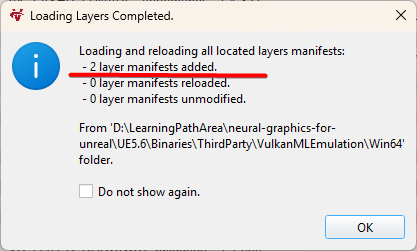

## Install the required tools and dependencies

To use Neural Frame Rate Upscaling (NFRU) in your Unreal Engine project, install and configure several tools. These components provide the development environment and runtime support for building and testing NFRU with ML extensions for Vulkan.

Install the following:

- [Vulkan SDK](https://vulkan.lunarg.com/sdk/home/) — Required for developing applications that use Vulkan. It includes the Vulkan Configurator, which you use to enable the emulation layers for running ML workloads through Vulkan ML extensions. Install the version 1.4.321.0 or newer.
- [CMake](https://cmake.org/download/) — A build system that configures and generates project build files. You use CMake to build the Neural Graphics SDK, which compiles the components and dependencies required by the neural graphics plugins and tools. The minimum necessary CMake version is 3.21, and the maximum version is 3.31.
- [`neural-graphics-for-unreal`](https://github.com/arm/neural-graphics-for-unreal/tree/main) — The Unreal Engine integration for the Neural Graphics Development Kit. The `neural-graphics-for-unreal` repository contains the NFRU plugin and resources you need to integrate neural graphics features into Unreal Engine.
- [ML Emulation Layer for Vulkan](https://github.com/arm/ai-ml-emulation-layer-for-vulkan) — The `neural-graphics-for-unreal` repository includes prebuilt Vulkan ML emulation layers for supported Unreal Engine versions. If you need support for a different version, build the emulation layer from source.

## Set up the neural-graphics-for-unreal repository

Clone and set up the `neural-graphics-for-unreal` repository and integrate it with your Unreal Engine project.

1. Clone the repository:

     ```bash
     git clone https://github.com/arm/neural-graphics-for-unreal.git
     cd neural-graphics-for-unreal
     ```

2. Initialize the submodules:

     ```bash
     git submodule update --init
     ```

3. Initialize Git LFS:

     ```bash
     git lfs install
     ```

4. Download the large files:

     ```bash
     git lfs pull
     ```

5. Select your Unreal Engine version and build the SDK:

     ```bash
     cd [UEVersion]
     BuildSDK.bat
     ```

## Configure Vulkan emulation layers

The Vulkan Configurator (`vkconfig-gui`) is a tool included with the LunarG Vulkan SDK that you can use to manage Vulkan layers and runtime settings.

Enable the ML emulation layers for Vulkan to test neural graphics features such as NFRU during development without hardware with a dedicated neural accelerator.

To emulate the ML extensions for Vulkan:

1. Launch the **Vulkan Configurator** from the Windows **Start** menu.

2. Add a user-defined Vulkan layer path to locate the prebuilt Vulkan emulation binaries.

     

3. Select the `neural-graphics-for-unreal/[UEVersion]/Binaries/ThirdParty/VulkanMLEmulation/Win64` folder.


     A **Loading Layer Completed** dialog appears, showing that two layer manifests loaded successfully.

     

4. Verify that the following layers appear in the list:

     - `VK_LAYER_ML_Graph_Emulation`
     - `VK_LAYER_ML_Tensor_Emulation`

     

5. Switch to the **Vulkan Loader Management** tab. Ensure the **Graph** layer is listed *before* the **Tensor** layer and configure the layer scope as follows:

     

{}
Keep the Vulkan Configurator running in the background while you complete the next steps.
{}

## What you've accomplished and what's next

You've now installed required dependencies, set up the `neural-graphics-for-unreal` repository, and configured Vulkan emulation layers.

With the ML emulation layers configured, Vulkan runs machine learning workloads using ML extensions for Vulkan. Neural inference runs alongside the graphics pipeline during development, even on systems without dedicated neural acceleration hardware.

Next, you'll integrate NFRU into an Unreal Engine project. You'll enable the neural graphics plugin and create an example scene to verify the setup and observe NFRU in action.
