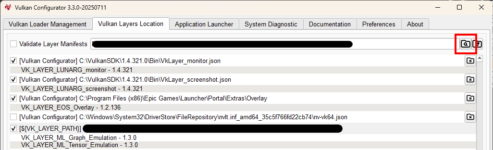
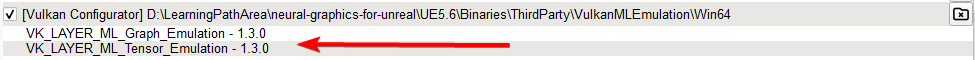
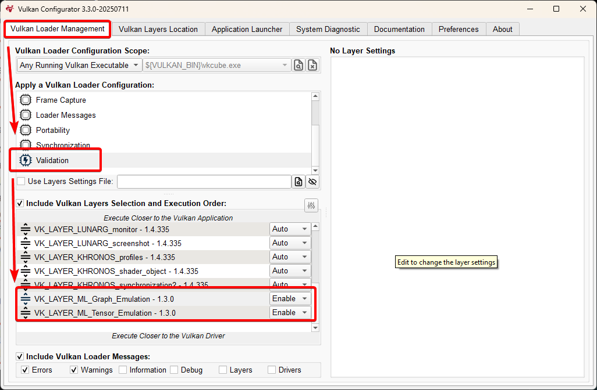

## Install the required tools and dependencies

To use Neural Frame Rate Upscaling (NFRU) in your Unreal Engine project, install and configure several tools. These components provide the development environment and runtime support for building and testing NFRU with ML extensions for Vulkan.

You will install the following:

- **Vulkan SDK 1.4.321.0 or later**. The SDK includes Vulkan Configurator, which you use to activate the ML emulation layers on Windows.
- **ML Emulation Layer for Vulkan 0.10.0 or later**. The standalone Windows release is available in the `arm/ai-ml-emulation-layer-for-vulkan` repository. Version 0.10.0 or later is required for the NFRU optical-flow extension.
- **Arm Neural Graphics Plugin 1.1.0**. The plugin sits in the `arm/neural-graphics-for-unreal` repository.

## Install the Vulkan SDK

Go to the [Vulkan SDK page](https://vulkan.lunarg.com/sdk/home) and install Vulkan SDK version 1.4.321.0 or later for Windows.

The Vulkan SDK supplies the development tools and headers, but NFRU also requires a Vulkan implementation that exposes the ML Extensions for Vulkan used by the plugin. In particular, the NFRU optical-flow path requires `VK_ARM_data_graph_optical_flow`, in addition to the tensor and data graph functionality used for neural inference.

On a Windows development system without native support for these extensions, use the standalone ML Emulation Layer for Vulkan. The active Vulkan environment must expose `VK_ARM_data_graph_optical_flow`; otherwise, NFRU cannot run its optical-flow stage.

## Download the ML Emulation Layer for Vulkan

Go to the [ML Emulation Layer for Vulkan releases](https://github.com/arm/ai-ml-emulation-layer-for-vulkan/releases) and download version 0.10.0 or later of the `Windows_AMD64.zip` archive. Version 0.10.0 added support for `VK_ARM_data_graph_optical_flow`.

Extract the archive. Its `bin` directory contains the Graph and Tensor layer DLLs and their Vulkan manifest files. Keep this directory separate from Arm Neural Graphics Plugin 1.1.0; the plugin and emulation layers are downloaded and installed independently.

## Download Arm Neural Graphics Plugin 1.1.0

Go to the [Arm Neural Graphics Plugin releases](https://github.com/arm/neural-graphics-for-unreal/releases) and download the 1.1.0 release `.zip` file. Extract the archive on your Windows system.

Keep the extracted `neural-graphics-for-unreal` folder intact. You will copy this complete folder into your Unreal project's `Plugins` directory in the next section.

## Configure the Vulkan ML emulation layers

Vulkan Configurator is installed with the Vulkan SDK. Use it to activate the emulation layers before you run the Windows non-editor build.

1. Launch **Vulkan Configurator** from the Windows **Start** menu.

2. Add a **user-defined Vulkan layer path** that points to the `bin` directory in the extracted standalone emulation-layer release:

    ```text
    <extracted-emulation-layer>\bin
    ```

    

3. Verify that these layers appear in the list:

    - `VK_LAYER_ML_Graph_Emulation`
    - `VK_LAYER_ML_Tensor_Emulation`

    

4. Switch to the **Vulkan Loader Management** tab. Make sure the Graph layer is above the Tensor layer, enable both layers, and apply the configuration.

    

{}
Keep Vulkan Configurator running with this configuration active whenever you launch the NFRU Windows executable.
{}

With the Vulkan requirements in place, you can install Arm Neural Graphics Plugin 1.1.0 in your Unreal Engine project.
