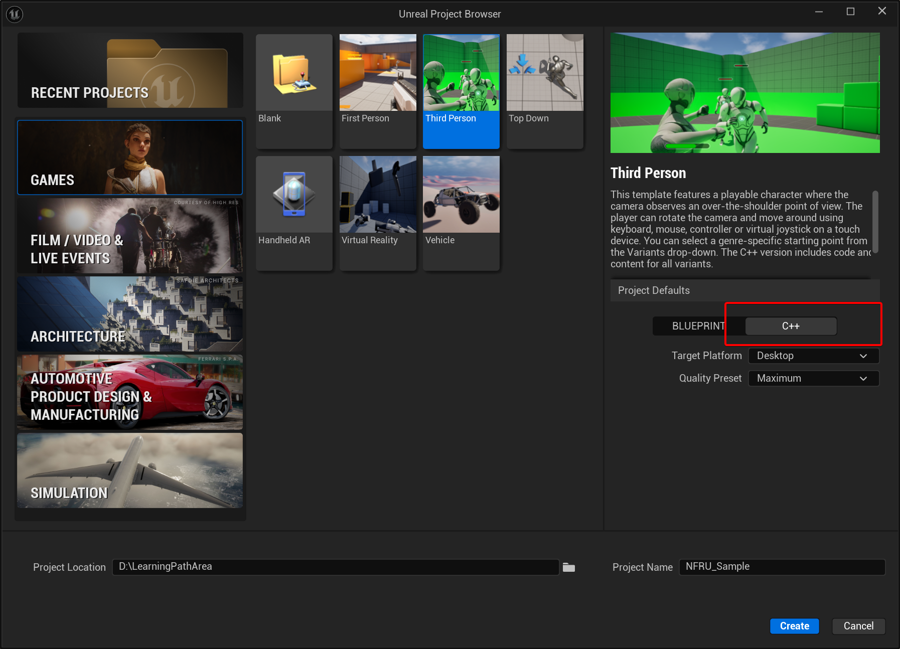
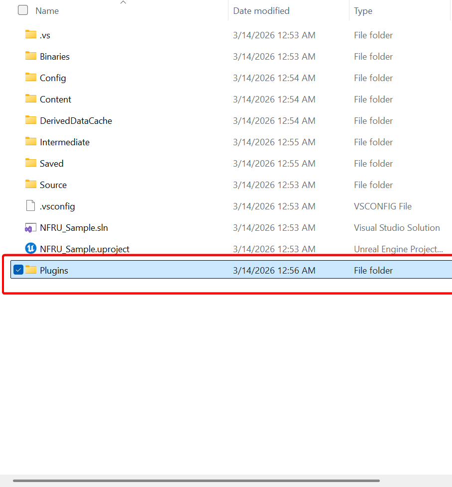
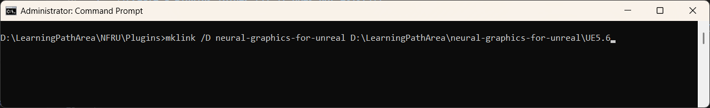
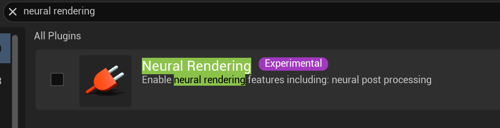
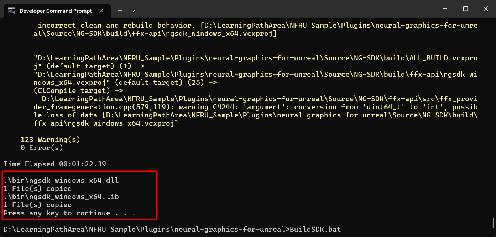

## Enable NFRU for Unreal Engine

1. Open Unreal Engine and create a new **Third Person** template project using the **C++** option. You need a C++ project to build the Neural Graphics for Unreal plugin.

    

2. Create a `Plugins` folder in your project's root directory if it doesn't already exist.

    

3. Open Command Prompt in the `Plugins` directory and create a symbolic link to the plugin folder for your Unreal Engine version. You need administrator permissions to create the symbolic link.

    ```bash
    mklink /D neural-graphics-for-unreal /path/to/neural-graphics-for-unreal/[UEVersion]
    ```

    

4. Regenerate the Visual Studio project files so Unreal Engine detects the plugin.

5. Open your project in Visual Studio and build it using **Build** > **Build Solution** or press `Ctrl+Shift+B`.

After building, open your project in Unreal Engine.

## Change Unreal's rendering hardware interface to Vulkan

Unreal Engine uses DirectX by default. To use NFRU, you must set Vulkan as the rendering hardware interface (RHI):

1. Open **Project Settings** in Unreal Engine.
2. Go to **Platform** > **Windows** > **Targeted RHIs** > **Default RHI**.
3. Select **Vulkan**.
4. Restart Unreal Engine to apply the change.

    

## Enable the plugin

1. Open **Edit** in Unreal Engine and select **Plugins**.
2. Search for **Neural Rendering** in the Plugins window.

    

3. Enable the plugin and restart Unreal Engine.

## Troubleshoot issues with setup

Use the following guidance to troubleshoot issues with setting up the Unreal project with NFRU.

### "Bad Image" error with ngsdk_windows_x64.dll

If you see a "Bad Image" error that mentions `ngsdk_windows_x64.dll`, the Neural Graphics SDK binaries are missing or incompatible.

To fix this:

- Build the SDK for your platform using the `buildsdk.bat` script. See [Build the SDK](/learning-paths/mobile-graphics-and-gaming/nfru-unreal/2-set_up_the_development_environment) for details.
- Check that `ngsdk_windows_x64.dll` exists in the plugin's `Binaries` directory.

    

If the error continues, confirm the SDK built without errors and the binaries match your Unreal Engine version and platform. Rebuild the SDK and restart Unreal Engine.

### Vulkan backend support error

If you see a "Plugin only supports Vulkan backend" error, return to the [Change Unreal's rendering hardware interface to Vulkan](#change-unreals-rendering-hardware-interface-to-vulkan) section and confirm Vulkan is set as the default RHI. Restart Unreal Engine after you make this change.


## What you've accomplished and what's next

You've enabled NFRU, set Vulkan as the default RHI, and activated the plugin. Next, you'll run Neural Frame Rate Upscaling in Unreal Engine to validate your setup.
