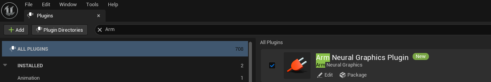
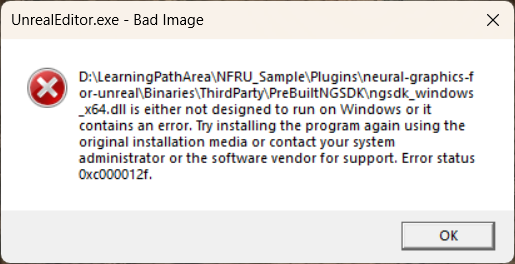
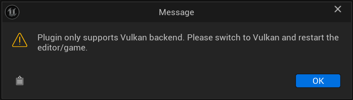

## Install Arm Neural Graphics Plugin 1.1.0

1. Open Unreal Engine 5.4 or 5.6 and create a new **Third Person** template project using the **C++** option.

    

2. Close Unreal Editor.

3. Create a `Plugins` directory in the project root if it does not already exist.

4. Copy the complete `neural-graphics-for-unreal` folder from the extracted Arm Neural Graphics Plugin 1.1.0 release into the project's `Plugins` directory. Do not copy selected subdirectories or create a symbolic link.

    The resulting directory structure starts as follows:

    ```text
    <project-root>\
    ├── <project-name>.uproject
    └── Plugins\
        └── neural-graphics-for-unreal\
    ```

5. Right-click the project's `.uproject` file and select **Generate Visual Studio project files**.

6. Open the generated solution in Visual Studio. Select **Development Editor** and **Win64**, then build the solution.

7. Start the project in Unreal Editor. If Unreal Engine prompts you to rebuild missing modules, accept the prompt and wait for the build to finish.

## Use Vulkan as the rendering hardware interface

Unreal Engine uses DirectX by default on Windows. NFRU requires Vulkan:

1. Open **Edit > Project Settings**.
2. Go to **Platforms > Windows > Targeted RHIs > Default RHI**.
3. Select **Vulkan**.
4. Restart Unreal Editor to apply the change.

    

## Enable Arm Neural Graphics Plugin 1.1.0

To enable the plugin, follow these steps:

1. Open **Edit > Plugins**.
2. Search for **Arm Neural Graphics Plugin 1.1.0**.
3. Enable the plugin if it is not already enabled, and restart Unreal Editor if prompted.



## Configure NFRU project settings

Open **Edit > Project Settings > Plugins > Arm Neural Graphics Plugin 1.1.0** to view and configure the NFRU settings stored with the project.

These project settings provide the persistent configuration. You can use the `r.NFRU.*` console variables documented later in this Learning Path to inspect or override NFRU behavior while a supported non-editor build is running.

## Troubleshoot issues with setup

Use the following guidance to troubleshoot issues with setting up the Unreal project with NFRU.

### "Bad Image" error for ngsdk_windows_x64.dll

If Windows reports a "Bad Image" error for `ngsdk_windows_x64.dll`, check that you copied the complete `neural-graphics-for-unreal` folder from the Arm Neural Graphics Plugin 1.1.0 release. Do not mix plugin files from different releases or Unreal Engine versions.



Replace any incomplete plugin copy with the complete folder from the release archive, regenerate the Visual Studio project files, and rebuild the solution.

### Vulkan backend support error

If you see a "Plugin only supports Vulkan backend" error, confirm that Vulkan is selected under **Platforms > Windows > Targeted RHIs > Default RHI**, then restart Unreal Editor.



### Missing Vulkan ML extensions

If the project starts but NFRU is unavailable, confirm that you installed version 0.10.0 or later of the standalone [ML Emulation Layer for Vulkan](https://github.com/arm/ai-ml-emulation-layer-for-vulkan), Vulkan Configurator is running, the Graph layer is above the Tensor layer, and both emulation layers are active. The Vulkan environment must expose `VK_ARM_data_graph_optical_flow` for the NFRU optical-flow stage.

You have now installed and configured Arm Neural Graphics Plugin 1.1.0. Next, cook the project and run a Windows non-editor build to validate NFRU.
