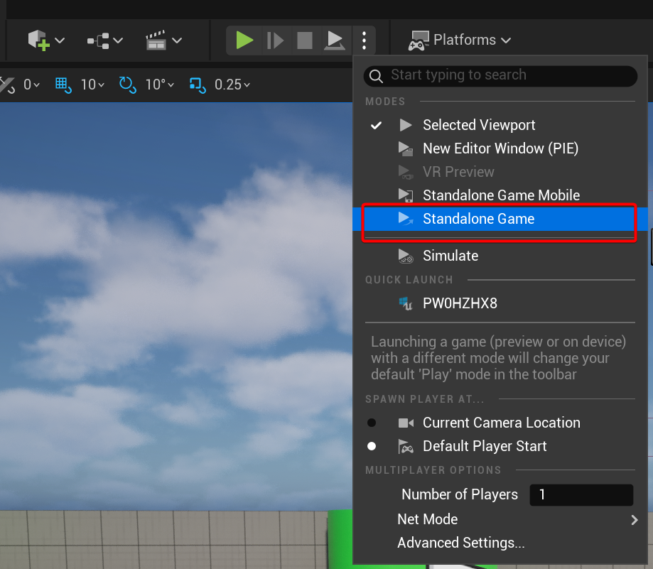
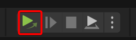
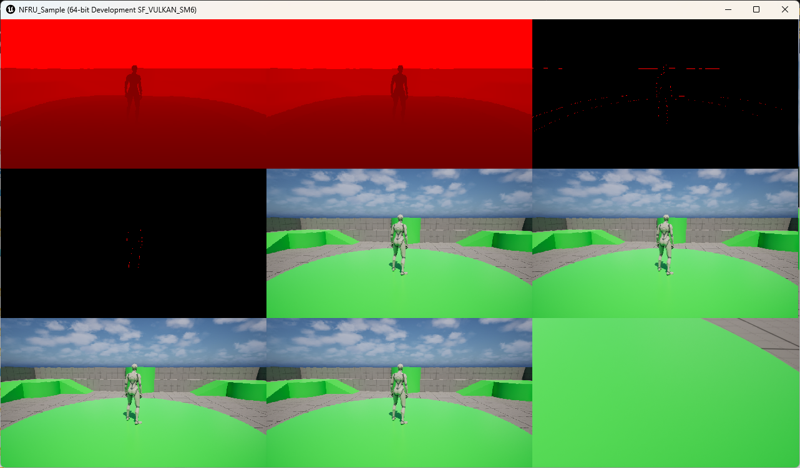

## Start the level and validate NFRU

NFRU is not supported in the standard Unreal Engine viewport. To test NFRU features, use **Standalone Game** mode or create a packaged build. This activates NFRU in a runtime environment.



When you switch to **Standalone Game** mode, the **Play** button changes appearance.



Select the green **Play** button to launch the level in a new window. To confirm NFRU is running, enter these commands in Unreal:

```
r.NFRU.Enable 1
r.NFRU.ShowDebugView 1
```

You see the NFRU debug visualization, which confirms the feature is active during gameplay.



For more details about the debug outputs, see the [Debug view section](/learning-paths/mobile-graphics-and-gaming/nfru-unreal/6-debug_view).

## Troubleshoot issues with the game

If the game does not behave as expected, check these common issues:

### Game crash

A crash after enabling NFRU usually indicates a misconfigured Vulkan emulation layer.


Open the **Modules** window in Visual Studio while the game runs. Check that the emulation layer DLL loads from the correct path. If not, update your configuration and restart Unreal Engine.

### Unreal Engine configuration

If the plugin is enabled but not working:

- Start Vulkan Configurator and confirm it is running
- Ensure the correct layer configuration is active
- Check the emulation layer path
- Confirm the Graph layer is above the Tensor layer

For detailed setup steps, see the [emulation layer section](/learning-paths/mobile-graphics-and-gaming/nfru-unreal/2-set_up_the_development_environment/).

### Software and hardware setup

If there are issues with software and hardware setup:

- Ensure the NFRU plugin version matches your Unreal Engine version
- Confirm your GPU driver supports Vulkan
- Verify Visual Studio is compatible with your Unreal Engine version
- Review build output and logs for errors

Version mismatches or missing dependencies cause most build or startup issues.

## What you've accomplished and what's next

You have validated NFRU in a runtime environment using Unreal Engine, confirmed its activation, and resolved common troubleshooting scenarios. Next, explore built-in NFRU console variables to further customize and analyze performance, or proceed to the final section for additional resources and guidance on NFRU.
