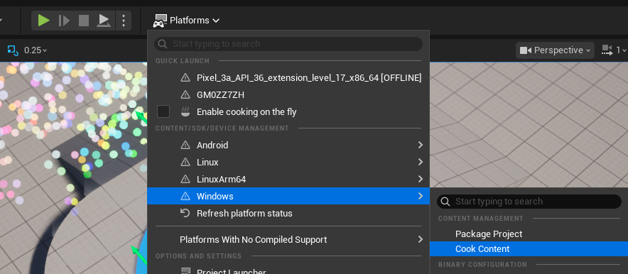
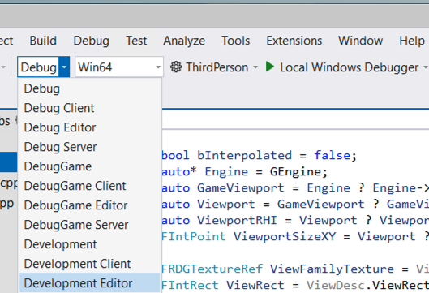

## Understand the NFRU build requirement

NFRU does not run in **Development Editor**, **DebugGame Editor**, or **Debug Editor** builds. Do not use the editor viewport, Play In Editor, or Standalone Game launched from an Editor build to validate NFRU. After you finish configuring the project, use Unreal Editor only to cook content for the NFRU run workflow.

Run NFRU from a Windows non-editor game build. The supported development workflow is:

1. Start the project using **Development Editor**.
2. Select **Platforms > Windows > Cook Content**, and wait for cooking to finish.



3. Close Unreal Editor.
4. In Visual Studio, compile a **Development**, **DebugGame**, or **Debug** non-editor build for Win64. Select the game target, not a target whose name ends in `Editor`.



5. Run the exported `.exe` from the project's `Binaries` directory. The executable is normally located at:

    ```text
    <project-root>\Binaries\Win64\<project-name>.exe
    ```


Use a Development non-editor build for the remainder of this Learning Path unless you specifically need DebugGame or Debug.

## Verify NFRU in the Windows executable

Open the console in the running Windows executable and enter:

```console
r.NFRU.Enable 1
r.NFRU.ShowDebugView 1
stat FrameGen
```

`r.NFRU.ShowDebugView 1` displays the NFRU intermediate-buffer grid. If the grid appears and updates during gameplay, the NFRU frame-generation path is active. `stat FrameGen` displays generated-frame and frame-pacing statistics so you can confirm that frames are being generated and presented.


Enter `r.NFRU.ShowDebugView 0` when you want to disable the debug grid.

## Know when to cook content again

Cooking converts project content into the format consumed by the non-editor executable. Whether you need to repeat the cook depends on what changed:

- **C++-only changes:** recompile the non-editor build. You do not need to cook the content again.
- **Shader or asset changes:** return to Development Editor and select **Platforms > Windows > Cook Content** again before you close the editor and run the non-editor executable.

## Troubleshooting

### NFRU does not start

Check that you launched the game executable from the `Binaries` directory. NFRU cannot run in Development Editor, DebugGame Editor, or Debug Editor, even when you use an editor Play mode.

Also confirm that:

- Arm Neural Graphics Plugin 1.1.0 is enabled.
- Vulkan is the project's default RHI.
- Vulkan Configurator is running with the Graph layer above the Tensor layer.
- The active Vulkan implementation exposes `VK_ARM_data_graph_optical_flow`.

### The executable crashes after NFRU is enabled

A crash after enabling NFRU can indicate a missing or incorrectly ordered Vulkan emulation layer.


Return to Vulkan Configurator, verify the emulation layer path, and confirm that both the Graph and Tensor layers are enabled in the correct order. Then restart the Windows executable.

You have now run NFRU in a supported Windows build and verified it with the debug view and frame-generation statistics. Next, use the project settings and console variables to tune NFRU.
