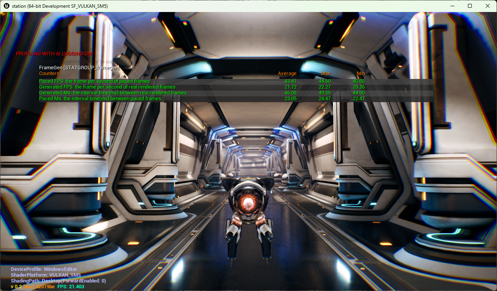

## Configure the plugin through Project Settings

In Development Editor, open **Edit > Project Settings > Plugins > Arm Neural Graphics Plugin 1.1.0** to configure the NFRU settings stored with the project.

After you save a setting that affects shaders or assets, cook the Windows content again. Then close the editor and run a Development, DebugGame, or Debug non-editor executable to observe the result. NFRU does not run in an Editor build.

## Configure the running build with console variables

The following table summarizes key console variables for Neural Frame Rate Upscaling (NFRU) in Unreal Engine. These variables control enablement, debugging, performance tuning, and frame generation modes. Adjust them to optimize NFRU behavior for your development, testing, and performance needs.

| Console variable | Type | Default | Description | Notes |
|---|---|---|---|---|
| `r.NFRU.Enable` | int | 0 | Enables NFRU when set to `1`. | — |
| `r.NFRU.CaptureDebugUI` | int | 1 | Captures debug UI rendered on the first Slate `DrawWindow` call. | Non-shipping builds only |
| `r.NFRU.UpdateGlobalFrameTime` | int | 0 | Includes interpolated frames in global frame-time and FPS calculations. | — |
| `r.NFRU.ModifySlateDeltaTime` | int | 1 | Sets the Slate delta time to zero during UI redraws to avoid `NativeTick` side effects. | Slate Redraw UI mode |
| `r.NFRU.PaceAdjuster` | int | 0 | Enables dynamic target-FPS adjustment. | Set to `1` to enable |
| `r.NFRU.UpAdjustFrameCount` | int | 40 | Sets how many frames above the target are required before the Pace Adjuster increases the target FPS. | Requires `r.NFRU.PaceAdjuster 1` |
| `r.NFRU.DownAdjustFrameCount` | int | 20 | Sets how many frames below the target are required before the Pace Adjuster decreases the target FPS. | Requires `r.NFRU.PaceAdjuster 1` |
| `r.NFRU.DataGraphOpticalFlow` | int | 1 | Selects the optical-flow method: `0` = Data Graph preferred, `1` = Data Graph only, `2` = shader-based. | Availability depends on the plugin build |
| `r.NFRU.DataGraphFrameGeneration` | int | 1 | Selects frame generation: `0` = NFRU preferred, `1` = neural, `2` = shader-based. | Availability depends on the plugin build |
| `r.NFRU.OnlyInterpolatedFrames` | int | 0 | Presents only interpolated frames for debugging. | Development and test builds only |
| `r.NFRU.ShowDebugView` | int | 0 | Displays the NFRU intermediate-buffer grid. | Development and test builds only |

For example, enable NFRU and display its debug view with:

```console
r.NFRU.Enable 1
r.NFRU.ShowDebugView 1
```

## Tune frame pacing

Enable the Pace Adjuster when you want NFRU to change its target FPS in response to sustained performance changes:

```console
r.NFRU.PaceAdjuster 1
r.NFRU.UpAdjustFrameCount 40
r.NFRU.DownAdjustFrameCount 20
```

`r.NFRU.UpAdjustFrameCount` controls how long performance must remain above the current target before the target increases. `r.NFRU.DownAdjustFrameCount` controls how long performance must remain below the target before it decreases. Larger values make the adjustment less reactive; smaller values make it respond sooner.

Use `stat FrameGen` while you tune these values. Compare the generated and paced statistics to determine whether the application produces frames consistently and whether presentation pacing matches the intended cadence.

## Monitor frame generation performance with STATGROUP_FrameGen

NFRU provides the `STATGROUP_FrameGen` statistics group to monitor frame generation performance at runtime. 

Run the following command in the Unreal Engine console:

```console
stat FrameGen
```



This command displays runtime metrics such as generated frame rate, generation time, and pacing information. Use these values to assess both internal frame generation performance and final frame pacing.

| Stat | Stat ID | Description |
|---|---|---|
| Generated FPS | `STAT_FrameGen_GeneratedFPS` | Frames per second produced by the frame generator. Compare this value with the engine FPS from `stat FPS`. |
| Generated Ms | `STAT_FrameGen_GeneratedMs` | Average time in milliseconds to generate an interpolated frame. |
| Paced FPS | `STAT_FrameGen_PacedFPS` | Presentation-paced FPS after swap-chain pacing is applied. |
| Paced Ms | `STAT_FrameGen_PacedMs` | Average wall-clock time in milliseconds between paced frame presentations. |

### Interpret frame generation statistics

When reviewing statistics, consider the following:

- Generated FPS and Generated Ms show internal frame generation performance.
- Paced FPS and Paced Ms reflect actual presentation cadence after pacing or synchronization.

Typically, `Generated FPS` matches the engine FPS, while `Paced FPS` might differ if pacing or synchronization limits the display rate.

## What you've accomplished and what's next

You've now learned how to adjust and optimize the main console variables that control NFRU features in Unreal Engine, including enablement, debugging, and performance tuning. You've also used `STATGROUP_FrameGen` to monitor frame generation performance.

Next, you'll explore how to use the debug view to visualize frame interpolation and validate NFRU output during development and testing.
